# 第三部分 附录

# A. 工具

# 1. 工具集

## 1.1 go build

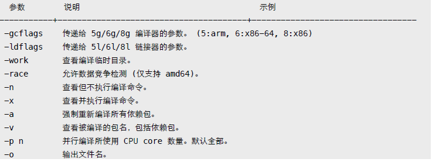

gcflags

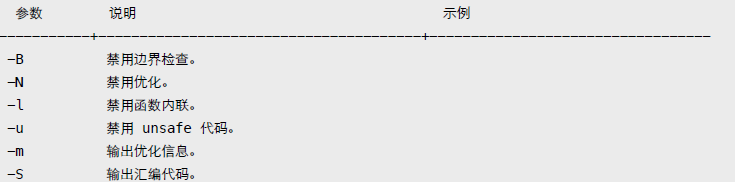

ldflags

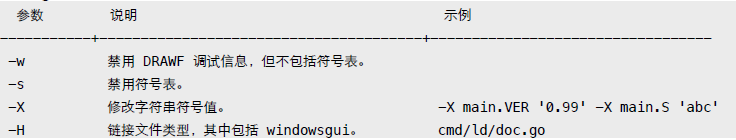

更多参数：

```
go tool 6g -h 或 [https://golang.org/cmd/gc/](https://golang.org/cmd/gc/)
go tool 6l -h 或 [https://golang.org/cmd/ld/](https://golang.org/cmd/ld/)
```

## 1.2 go install

和 go build 参数相同，将生成文件拷贝到 bin、pkg 目录。优先使用 GOBIN 环境变量所指定目录。

## 1.3 go clean

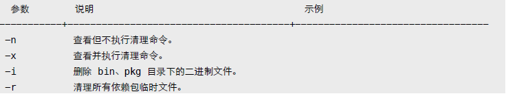

1.4 go get

下载并安装扩展包。默认保存到 GOPATH 指定的第一个工作空间。

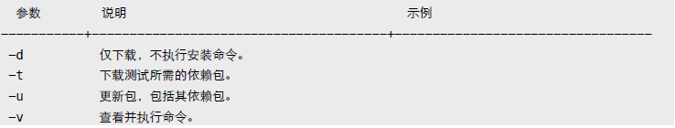

## 1.5 go tool objdump

反汇编可执行文件。

```
$ go tool objdump -s "main\.\w+" test
$ go tool objdump -s "main\.main" test
```

# 2. 条件编译

通过 runtime.GOOS/GOARCH 判断，或使用编译约束标记。

```
// +build darwin linux
						<--- 必须有空行，以区别包文档。
package main
```

在源文件 (.go, .h, .c, .s 等) 头部添加 "+build" 注释，指示编译器检查相关环境变量。多个约束标记会合并处理。其中空格表示 OR，逗号 AND，感叹号 NOT。

```
// +build darwin linux --> 合并结果 (darwin OR linux) AND (amd64 AND (NOT cgo))
// +build amd64,!cgo
```

如果 GOOS、GOARCH 条件不符合，则编译器会会忽略该文件。

还可使用文件名来表示编译约束，比如 test_darwin_amd64.go。使用文件名拆分多个不同平台源文件，更利于维护。

```
$ ls -l /usr/local/go/src/pkg/runtime

-rw-r--r--@ 1 yuhen admin 11545 11 29 05:38 os_darwin.c
-rw-r--r--@ 1 yuhen admin 1382 11 29 05:38 os_darwin.h
-rw-r--r--@ 1 yuhen admin 6990 11 29 05:38 os_freebsd.c
-rw-r--r--@ 1 yuhen admin 791 11 29 05:38 os_freebsd.h
-rw-r--r--@ 1 yuhen admin 644 11 29 05:38 os_freebsd_arm.c
-rw-r--r--@ 1 yuhen admin 8624 11 29 05:38 os_linux.c
-rw-r--r--@ 1 yuhen admin 1067 11 29 05:38 os_linux.h
-rw-r--r--@ 1 yuhen admin 861 11 29 05:38 os_linux_386.c
-rw-r--r--@ 1 yuhen admin 2418 11 29 05:38 os_linux_arm.c
```

```
支持：*_GOOS、*_GOARCH、*_GOOS_GOARCH、*_GOARCH_GOOS 格式。
```

可忽略某个文件，或指定编译器版本号。更多信息参考标准库 go/build 文档。

```
// +build ignore
// +build go1.2 <--- 最低需要 go 1.2 编译。
```

自定义约束条件，需使用 "go build -tags" 参数。

test.go

```
// +build beta,debug

package main

func init() {
	println("test.go init")
}
```

输出：

```
$ go build -tags "debug beta" && ./test
test.go init

$ go build -tags "debug" && ./test
$ go build -tags "debug \!cgo" && ./test
```

# 3. 跨平台编译

首先得生成与平台相关的工具和标准库。

```
$ cd /usr/local/go/src

$ GOOS=linux GOARCH=amd64 ./make.bash --no-clean

# Building C bootstrap tool.
cmd/dist

# Building compilers and Go bootstrap tool for host, darwin/amd64.

cmd/6l
cmd/6a
cmd/6c
cmd/6g
...
---
Installed Go for linux/amd64 in /usr/local/go
Installed commands in /usr/local/go/bin
```

```
说明：参数 no-clean 避免清除其他平台文件。
```

然后回到项目所在目录，设定 GOOS、GOARCH 环境变量即可编译目标平台文件。

```
$ GOOS=linux GOARCH=amd64 go build -o test

$ file test
learn: ELF 64-bit LSB executable, x86-64, version 1 (SYSV)

$ uname -a
Darwin Kernel Version 12.5.0: RELEASE_X86_64 x86_64
```

# 4. 预处理

简单点说，go generate 扫描源代码文件，找出所有 "//go:generate" 注释，提取并执行预处理命令。
- 命令必须放在 .go 文件。
- 每个文件里可以有多个 generate 指令。
- 必须显式用 go generate 执行。
- 命令行支持环境变量。
- 按文件名顺序依次提取执行。
- 串行执行，出错终止。
- 必须以 "//go:generate" 开头，双斜线后没有空格。

不属于 build 组成部分，设计目标是提供给包开发者使用，因为包用户可能不具备命令执行环境。

```
//go:generate ls -l
//go:generate du
```

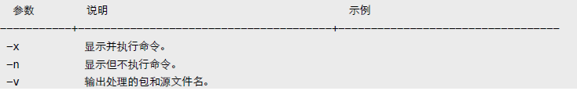

还可定义别名。须提前定义，仅在当前文件内有效。

```
//go:generate -command YACC go tool yacc
//go:generate YACC -o test.go -p parse test.y
```

可用条件编译，让 go build 忽略包含 generate 的文件。

```
// +build generate

$ go generate -tags generate
```

资源：[Design Document](https://docs.google.com/document/d/1V03LUfjSADDooDMhe-_K59EgpTEm3V8uvQRuNMAEnjg)  [Generating code](http://blog.golang.org/generate)

# B. 调试

# 1. GDB

默认情况下，编译的二进制文件已包含 DWARFv3 调试信息，只要 GDB 7.1 以上版本都可以调试。

相关选项：
- 调试: 禁用内联和优化 -gcflags "-N -l"。
- 发布: 删除调试信息和符号表 -ldflags "-w -s"。

除了使用 GDB 的断点命令外，还可以使用 runtime.Breakpoint 函数触发中断。另外，runtime/debug.PrintStack 可用来输出调用堆栈信息。

某些时候，需要手工载入 Go Runtime support (runtime-gdb.py)。

.gdbinit

```
define goruntime
	source /usr/local/go/src/runtime/runtime-gdb.py
end

set disassembly-flavor intel
set print pretty on
dir /usr/local/go/src/pkg/runtime
```

说明：OSX 环境下，可能需要以 sudo 方式启动 gdb。

# 2. Data Race

数据竞争 (data race) 是并发程序里不太容易发现的错误，且很难捕获和恢复错误现场。Go 运行时内置了竞争检测，允许我们使用编译器参数打开这个功能。它会记录和监测运行时内存访问状态，发出非同步访问警告信息。

```
func main() {
	var wg sync.WaitGroup
	wg.Add(2)
	x := 100

	go func() {
		defer wg.Done()

		for {
			x += 1
		}
	}()

	go func() {
		defer wg.Done()
		for {
			x += 100
		}
	}()
	
	wg.Wait()
}
```

输出：

```
$ GOMAXPROCS=2 go run -race main.go

==================
WARNING: DATA RACE
Write by goroutine 4:
	main.func·002()
		main.go:25 +0x59

Previous write by goroutine 3:
	main.func·001()
		main.go:18 +0x59

Goroutine 4 (running) created at:
	main.main()
		main.go:27 +0x16f
Goroutine 3 (running) created at:
	main.main()
		main.go:20 +0x100
==================
```

数据竞争检测会严重影响性能，不建议在生产环境中使用。

```
func main() {
	x := 100

	for i := 0; i < 10000; i++ {
		x += 1
	}

	fmt.Println(x)
}
```

输出：

```
$ go build && time ./test

10100

real" 0m0.060s
user" 0m0.001s
sys" 0m0.003s

$ go build -race && time ./test

10100

real" 0m1.025s
user" 0m0.003s
sys" 0m0.009s
```

通常作为非性能测试项启用。

```
$ go test -race
```

# C. 测试

自带代码测试、性能测试、覆盖率测试框架。

- 测试代码必须保存在 *_test.go 文件。
- 测试函数命名符合 TestName 格式，Name 以大写字母开头。

注: 不要将代码放在名为 main 的目录下，这会导致 go test "cannot import main" 错误。

# 1. Test

使用 testing.T 相关方法决定测试状态。

testing.T

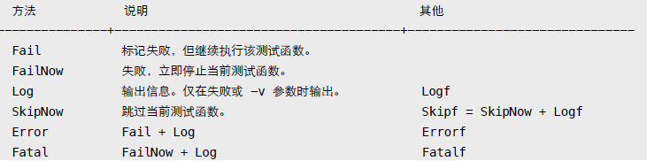

main_test.go

```
package main

import (
	"testing"
	"time"
)

func sum(n ...int) int {
	var c int
	for _, i := range n {
		c += i
	}

	return c
}

func TestSum(t *testing.T) {
	time.Sleep(time.Second * 2)
	if sum(1, 2, 3) != 6 {
		t.Fatal("sum error!")
	}
}

func TestTimeout(t *testing.T) {
	time.Sleep(time.Second * 5)
}
```

默认 go test 执行所有单元测试函数，支持 go build 参数。

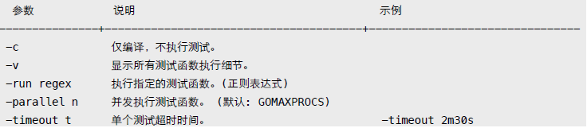

```
$ go test -v -timeout 3s

=== RUN TestSum
--- PASS: TestSum (2.00 seconds)
=== RUN TestTimeout
panic: test timed out after 3s
FAIL" test" 3.044s

$ go test -v -run "(i)sum"

=== RUN TestSum
--- PASS: TestSum (2.00 seconds)
PASS
ok " test" 2.044s
```

可重写 TestMain 函数，处理一些 setup/teardown 操作。

```
func TestMain(m *testing.M) {
	println("setup")
	code := m.Run()
	println("teardown")
	os.Exit(code)
}

func TestA(t *testing.T) {}
func TestB(t *testing.T) {}
func BenchmarkC(b *testing.B) {}
```

输出：

```
$ go test -v -test.bench .

setup
=== RUN TestA
--- PASS: TestA (0.00s)
=== RUN TestB
--- PASS: TestB (0.00s)
PASS
BenchmarkC" 2000000000" 0.00 ns/op
teardown
ok " test" 0.028s
```

# 2. Benchmark

性能测试需要运行足够多的次数才能计算单次执行平均时间。

```
func BenchmarkSum(b *testing.B) {
	for i := 0; i < b.N; i++ {
		if sum(1, 2, 3) != 6 {
			b.Fatal("sum")
		}
	}
}
```

默认情况下，go test 不会执行性能测试函数，须使用 "-bench" 参数。

go test

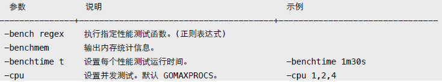

```
$ go test -v -bench .

=== RUN TestSum
--- PASS: TestSum (2.00 seconds)
=== RUN TestTimeout
--- PASS: TestTimeout (5.00 seconds)
PASS

BenchmarkSum 100000000 11.0 ns/op

ok " test" 8.358s

$ go test -bench . -benchmem -cpu 1,2,4 -benchtime 30s

BenchmarkSum 5000000000 11.1 ns/op 0 B/op 0 allocs/op
BenchmarkSum-2 5000000000 11.4 ns/op 0 B/op 0 allocs/op
BenchmarkSum-4 5000000000 11.3 ns/op 0 B/op 0 allocs/op

ok " test" 193.246s
```

# 3. Example

与 testing.T 类似，区别在于通过捕获 stdout 输出来判断测试结果。

```
func ExampleSum() {
	fmt.Println(sum(1, 2, 3))
	fmt.Println(sum(10, 20, 30))
	// Output:
	// 6
	// 60
}
```

不能使用内置函数 print/println，它们默认输出到 stderr。

```
$ go test -v

=== RUN: ExampleSum
--- PASS: ExampleSum (8.058us)
PASS

ok " test" 0.271s
```

Example 代码可输出到文档，详情参考包文档章节。

# 4. Cover

除显示代码覆盖率百分比外，还可输出详细分析记录文件。

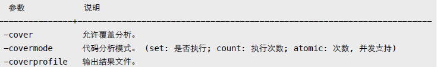

go test

```
$ go test -cover -coverprofile=cover.out -covermode=count

PASS
coverage: 80.0% of statements
ok " test" 0.043s

$ go tool cover -func=cover.out

test.go: Sum 100.0%
test.go: Add 0.0%
total:" (statements) 80.0%
```

用浏览器输出结果，能查看更详细直观的信息。包括用不同颜色标记覆盖、运行次数等。

```
$ go tool cover -html=cover.out
```

```
说明：将鼠标移到代码块，可以看到具体的执行次数。
```

# 5. PProf

监控程序执行，找出性能瓶颈。

```
import (
	"os"
	"runtime/pprof"
)

func main() {
	// CPU
	cpu, _ := os.Create("cpu.out")
	defer cpu.Close()
	pprof.StartCPUProfile(cpu)
	defer pprof.StopCPUProfile()

	// Memory
	mem, _ := os.Create("mem.out")
	defer mem.Close()
	defer pprof.WriteHeapProfile(mem)
}
```

除调用 runtime/pprof 相关函数外，还可直接用测试命令输出所需记录文件。

go test

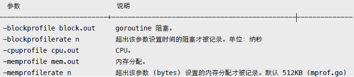

以 net/http 包为演示，先生成记录文件。

```
$ go test -v -test.bench "." -cpuprofile cpu.out -memprofile mem.out net/http
```

进入交互式查看模式。

```
$ go tool pprof http.test mem.out

(pprof) top5
2597.58kB of 2597.58kB total ( 100%)
Dropped 421 nodes (cum <= 12.99kB)
Showing top 5 nodes out of 28 (cum >= 1536.60kB)

	 flat  flat%    sum%       cum     cum%
1024.04kB 39.42%  39.42% 1024.04kB   39.42% encoding/asn1.parsePrintableString
 548.84kB 21.13%  60.55%  548.84kB   21.13% mime.setExtensionType
 512.56kB 19.73%  80.28% 1536.60kB   59.16% crypto/x509.parseCertificate
 512.14kB 19.72%    100%  512.14kB   19.72% mcommoninit
	  0        0%   100% 1536.60kB   59.16% crypto/tls.(*Conn).Handshake
```

- flat: 仅当前函数，不包括其调用的其他函数。
- sum: 列表前几行所占百分比总和。
- cum: 当前函数完整调用堆栈。

默认输出 inuse_space，可在命令行指定其他值，包括排序方式。

```
$ go tool pprof -alloc_space -cum http.test mem.out
```

可输出函数调用的列表统计信息。

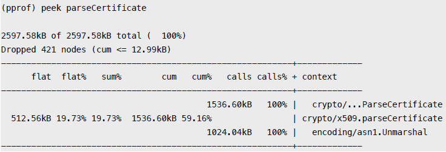

或者是更详细的源码模式。

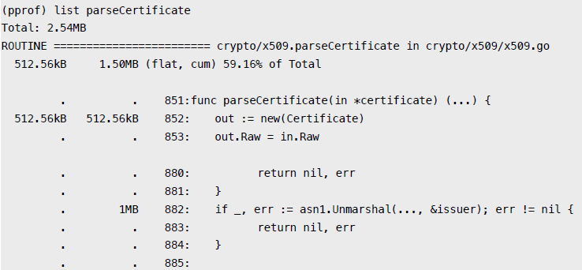

除交互模式外，还可直接输出统计结果。

```
$ go tool pprof -text http.test mem.out

2597.58kB of 2597.58kB total ( 100%)
Dropped 421 nodes (cum <= 12.99kB)

     flat  flat%   sum%       cum   cum%
1024.04kB 39.42% 39.42% 1024.04kB 39.42% encoding/asn1.parsePrintableString
 548.84kB 21.13% 60.55%  548.84kB 21.13% mime.setExtensionType
 512.56kB 19.73% 80.28% 1536.60kB 59.16% crypto/x509.parseCertificate
 512.14kB 19.72%   100%  512.14kB 19.72% mcommoninit
      0      0%    100% 1536.60kB 59.16% crypto/tls.(*Conn).Handshake
      0      0%    100% 1536.60kB 59.16% crypto/tls.(*Conn).clientHandshake
```

输出图形文件。

```
$ go tool pprof -web http.test mem.out
```

还可用 net/http/pprof 实时查看 runtime profiling 信息。

```
package main

import (
	_ "net/http/pprof"

	"net/http"
	"time"
)

func main() {
	go http.ListenAndServe("localhost:6060", nil)

	for {
		time.Sleep(time.Second)
	}
}
```

在浏览器中查看 [http://localhost:6060/debug/pprof/](http://localhost:6060/debug/pprof/) 。

附: 自定义统计数据，可用 expvar 导出，用浏览器访问 /debug/vars 查看。