# 第一部分 语言

# 第1章 类型

## 1.1 变量

Go 是静态类型语言，不能在运行期改变变量类型。使用关键字 var 定义变量，自动初始化为零值。如果提供初始化值，可省略变量类型，由编译器自动推断。

```
var x int
var f float32 = 1.6
var s = "abc"
```

在函数内部，可用更简略的 ":=" 方式定义变量。

```
func main() {
	x := 123 // 注意检查，是定义新局部变量，还是修改全局变量。该方式容易造成错误。
}
```

可一次定义多个变量。

```
var x, y, z int
var s, n = "abc", 123

var (
	a int
	b float32
)

func main() {
	n, s := 0x1234, "Hello, World!"
	println(x, s, n)
}
```

多变量赋值时，先计算所有相关值，然后再从左到右依次赋值。

```
data, i := [3]int{0, 1, 2}, 0
i, data[i] = 2, 100 // (i = 0) -> (i = 2), (data[0] = 100)
```

特殊只写变量 "_"，用于忽略值占位。

```
func test() (int, string) {
	return 1, "abc"
}
	
func main() {
	_, s := test()
	println(s)
}
```

编译器会将未使用的局部变量当做错误。

```
var s string // 全局变量没问题。

func main() {
	i := 0 // Error: i declared and not used。(可使用 "_ = i" 规避)
}
```

注意重新赋值与定义新同名变量的区别。

```
s := "abc"
println(&s)

s, y := "hello", 20 // 重新赋值: 与前 s 在同一层次的代码块中，且有新的变量被定义。
println(&s, y) // 通常函数多返回值 err 会被重复使用。

{
	s, z := 1000, 30 // 定义新同名变量: 不在同一层次代码块。
	println(&s, z)
}
```

输出：

```
0x2210230f30
0x2210230f30 20
0x2210230f18 30
```

## 1.2 常量

常量值必须是编译期可确定的数字、字符串、布尔值。

```
const x, y int = 1, 2 // 多常量初始化
const s = "Hello, World!" // 类型推断

const ( // 常量组
	a, b = 10, 100
	c bool = false
)

func main() {
	const x = "xxx" // 未使用局部常量不会引发编译错误。
}
```

不支持 1UL、2LL 这样的类型后缀。

在常量组中，如不提供类型和初始化值，那么视作与上一常量相同。

```
const (
	s = "abc"
	x // x = "abc"
)
```

常量值还可以是 len、cap、unsafe.Sizeof 等编译期可确定结果的函数返回值。

```
const (
	a = "abc"
	b = len(a)
	c = unsafe.Sizeof(b)
)
```

如果常量类型足以存储初始化值，那么不会引发溢出错误。

```
const (
	a byte = 100 // int to byte
	b int = 1e20 // float64 to int, overflows
)
```

**枚举**

关键字 iota 定义常量组中从0开始按行计数的自增枚举值。

```
const (
	Sunday = iota // 0
	Monday // 1，通常省略后续行表达式。
	Tuesday // 2
	Wednesday // 3
	Thursday // 4
	Friday // 5
	Saturday // 6
)

const (
	_ = iota // iota = 0
	KB int64 = 1 << (10 * iota) // iota = 1
	MB // 与 KB 表达式相同，但 iota = 2
	GB
	TB
)
```

在同一常量组中，可以提供多个 iota，它们各自增长。

```
const (
	A, B = iota, iota << 10 // 0, 0 << 10
	C, D // 1, 1 << 10
)
```

如果 iota 自增被打断，须显式恢复。

```
const (
	A = iota // 0
	B // 1
	C = "c" // c
	D // c，与上一行相同。
	E = iota // 4，显式恢复。注意计数包含了 C、D 两行。
	F // 5
)
```

可通过自定义类型来实现枚举类型限制。

```
type Color int

const (
	Black Color = iota
	Red
	Blue
)

func test(c Color) {}

func main() {
	c := Black
	test(c)

	x := 1
	test(x) // Error: cannot use x (type int) as type Color in function argument
	test(1) // 常量会被编译器自动转换。
}
```

## 1.3 基本类型

更明确的数字类型命名，支持 Unicode，支持常用数据结构。

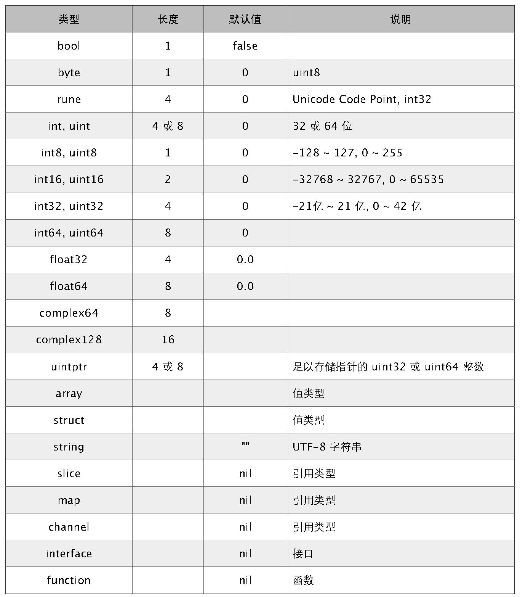

支持八进制、十六进制，以及科学记数法。标准库 math 定义了各数字类型取值范围。

```
a, b, c, d := 071, 0x1F, 1e9, math.MinInt16
```

空指针值 nil，而非 C/C++ NULL。

## 1.4 引用类型

引用类型包括 slice、map 和 channel。它们有复杂的内部结构，除了申请内存外，还需要初始化相关属性。

内置函数 new 计算类型大小，为其分配零值内存，返回指针。而 make 会被编译器翻译成具体的创建函数，由其分配内存和初始化成员结构，返回对象而非指针。

```
a := []int{0, 0, 0} // 提供初始化表达式。
a[1] = 10

b := make([]int, 3) // makeslice
b[1] = 10

c := new([]int)
c[1] = 10 // Error: invalid operation: c[1] (index of type *[]int)
```

有关引用类型具体的内存布局，可参考后续章节。

## 1.5 类型转换

不支持隐式类型转换，即便是从窄向宽转换也不行。

```
var b byte = 100
// var n int = b // Error: cannot use b (type byte) as type int in assignment
var n int = int(b) // 显式转换
```

使用括号避免优先级错误。

```
*Point(p) // 相当于 *(Point(p))
(*Point)(p)
<-chan int(c) // 相当于 <-(chan int(c))
(<-chan int)(c)
```

同样不能将其他类型当 bool 值使用。

```
a := 100
if a { // Error: non-bool a (type int) used as if condition
	println("true")
}
```

## 1.6 字符串

字符串是不可变值类型，内部用指针指向 UTF-8 字节数组。

- 默认值是空字符串 ""。
- 用索引号访问某字节，如 s[i]。
- 不能用序号获取字节元素指针，&s[i] 非法。
- 不可变类型，无法修改字节数组。
- 字节数组尾部不包含 NULL。
- 
runtime.h

```
struct String
{
	byte* str;
	intgo len;
};
```

使用索引号访问字符 (byte)。

```
s := "abc"
println(s[0] == '\x61', s[1] == 'b', s[2] == 0x63)
```

输出：

```
true true true
```

使用 "`" 定义不做转义处理的原始字符串，支持跨行。

```
s := `a
b\r\n\x00
c`

println(s)
```

输出:

```
a
b\r\n\x00
c
```

连接跨行字符串时，"+" 必须在上一行末尾，否则导致编译错误。

```
s := "Hello, " +
	"World!"

s2 := "Hello, "
	+ "World!" // Error: invalid operation: + untyped string
```

支持用两个索引号返回子串。子串依然指向原字节数组，仅修改了指针和长度属性。

```
s := "Hello, World!"

s1 := s[:5] // Hello
s2 := s[7:] // World!
s3 := s[1:5] // ello
```

单引号字符常量表示 Unicode Code Point，支持 \uFFFF、\U7FFFFFFF、\xFF 格式。对应 rune 类型，UCS-4。

```
func main() {
	fmt.Printf("%T\n", 'a')

	var c1, c2 rune = '\u6211', '们'
	println(c1 == '我', string(c2) == "\xe4\xbb\xac")
}
```

输出：

```
int32 // rune 是 int32 的别名
true true
```

要修改字符串，可先将其转换成 []rune 或 []byte，完成后再转换为 string。无论哪种转换，都会重新分配内存，并复制字节数组。

```
func main() {
	s := "abcd"
	bs := []byte(s)

	bs[1] = 'B'
	println(string(bs))

	u := "电脑"
	us := []rune(u)

	us[1] = '话'
	println(string(us))
}
```

输出:

```
aBcd
电话
```

用 for 循环遍历字符串时，也有 byte 和 rune 两种方式。

```
func main() {
	s := "abc汉字"

	for i := 0; i < len(s); i++ { // byte
		fmt.Printf("%c,", s[i])
	}

	fmt.Println()

	for _, r := range s { // rune
		fmt.Printf("%c,", r)
	}
}
```

输出：

```
a,b,c,,±,,,,,
a,b,c,汉,字,
```

## 1.7 指针

支持指针类型 *T，指针的指针 **T，以及包含包名前缀的 *<package>.T。

- 默认值 nil，没有 NULL 常量。
- 操作符 "&" 取变量地址，"*" 透过指针访问目标对象。
- 不支持指针运算，不支持 "->" 运算符，直接用 "." 访问目标成员。

```
func main() {
	type data struct{ a int }

	var d = data{1234}
	var p *data

	p = &d
	fmt.Printf("%p, %v\n", p, p.a) // 直接用指针访问目标对象成员，无须转换。
}
```

输出：

```
0x2101ef018, 1234
```

不能对指针做加减法等运算。

```
x := 1234
p := &x
p++ // Error: invalid operation: p += 1 (mismatched types *int and int)
```

可以在 unsafe.Pointer 和任意类型指针间进行转换。

```
func main() {
	x := 0x12345678

	p := unsafe.Pointer(&x) // *int -> Pointer
	n := (*[4]byte)(p) // Pointer -> *[4]byte

	for i := 0; i < len(n); i++ {
		fmt.Printf("%X ", n[i])
	}
}
```

输出：

```
78 56 34 12
```

返回局部变量指针是安全的，编译器会根据需要将其分配在 GC Heap 上。

```
func test() *int {
	x := 100
	return &x // 在堆上分配 x 内存。但在内联时，也可能直接分配在目标栈。
}
```

将 Pointer 转换成 uintptr，可变相实现指针运算。

```
func main() {
	d := struct {
		s string
		x int
	}{"abc", 100}

	p := uintptr(unsafe.Pointer(&d)) // *struct -> Pointer -> uintptr
	p += unsafe.Offsetof(d.x) // uintptr + offset
	p2 := unsafe.Pointer(p) // uintptr -> Pointer
	px := (*int)(p2) // Pointer -> *int
	*px = 200 // d.x = 200

	fmt.Printf("%#v\n", d)
}
```

输出：

```
struct { s string; x int }{s:"abc", x:200}
```

注意：GC 把 uintptr 当成普通整数对象，它无法阻止 "关联" 对象被回收。

## 1.8 自定义类型

可将类型分为命名和未命名两大类。命名类型包括 bool、int、string 等，而 array、slice、map 等和具体元素类型、长度等有关，属于未命名类型。

具有相同声明的未命名类型被视为同一类型。
- 具有相同基类型的指针。
- 具有相同元素类型和长度的 array。
- 具有相同元素类型的 slice。
- 具有相同键值类型的 map。
- 具有相同元素类型和传送方向的 channel。
- 具有相同字段序列 (字段名、类型、标签、顺序) 的匿名 struct。
- 签名相同 (参数和返回值，不包括参数名称) 的 function。
- 方法集相同 (方法名、方法签名相同，和次序无关) 的 interface。

```
var a struct { x int `a` }
var b struct { x int `ab` }

// cannot use a (type struct { x int "a" }) as type struct { x int "ab" } in assignment
b = a
```

可用 type 在全局或函数内定义新类型。

```
func main() {
	type bigint int64

	var x bigint = 100
	println(x)
}
```

新类型不是原类型的别名，除拥有相同数据存储结构外，它们之间没有任何关系，不会持有原类型任何信息。除非目标类型是未命名类型，否则必须显式转换。

```
x := 1234
var b bigint = bigint(x) // 必须显式转换，除非是常量。
var b2 int64 = int64(b)

var s myslice = []int{1, 2, 3} // 未命名类型，隐式转换。
var s2 []int = s
```

# 第2章 表达式

## 2.1 保留字

语言设计简练，保留字不多。

```
break    default     func   interface  select
case     defer       go     map        struct
chan     else        goto   package    switch
const    fallthrough if     range      type
continue for         import return     var
```

## 2.2 运算符

全部运算符、分隔符，以及其他符号。


运算符结合律全部从左到右。

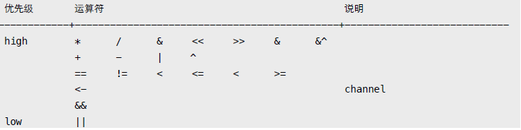

简单位运算演示。

```
0110 & 1011 = 0010 AND 都为1。
0110 | 1011 = 1111 OR 至少一个为1。
0110 ^ 1011 = 1101 XOR 只能一个为1。
0110 &^ 1011 = 0100 AND NOT 清除标志位。
```

标志位操作。

```
a := 0
a |= 1 << 2 // 0000100: 在 bit2 设置标志位。
a |= 1 << 6 // 1000100: 在 bit6 设置标志位
a = a &^ (1 << 6) // 0000100: 清除 bit6 标志位。
```

不支持运算符重载。尤其需要注意，"++"、"--" 是语句而非表达式。

```
n := 0
p := &n

// b := n++ // syntax error
// if n++ == 1 {} // syntax error
// ++n // syntax error

n++
*p++ // (*p)++
```

没有 "~"，取反运算也用 "^"。

```
x := 1
x, ^x // 0001, -0010
```

## 2.3 初始化

初始化复合对象，必须使用类型标签，且左大括号必须在类型尾部。

```
// var a struct { x int } = { 100 } // syntax error

// var b []int = { 1, 2, 3 } // syntax error

// c := struct {x int; y string} // syntax error: unexpected semicolon or newline
// {
// }

var a = struct{ x int }{100}
var b = []int{1, 2, 3}
```

初始化值以 "," 分隔。可以分多行，但最后一行必须以 "," 或 "}" 结尾。

```
a := []int{
	1,
	2 // Error: need trailing comma before newline in composite literal
}

a := []int{
	1,
	2, // ok
}

b := []int{
	1,
	2 } // ok
```

## 2.4 控制流

### 2.4.1 IF

很特别的写法：
- 可省略条件表达式括号。
- 支持初始化语句，可定义代码块局部变量。
- 代码块左大括号必须在条件表达式尾部。

```
x := 0

// if x > 10 // Error: missing condition in if statement
// {
// }

if n := "abc"; x > 0 { // 初始化语句未必就是定义变量，比如 println("init") 也是可以的。
	println(n[2])
} else if x < 0 { // 注意 else if 和 else 左大括号位置。
	println(n[1])
} else {
	println(n[0])
}
```

不支持三元操作符 "a > b  a : b"。

### 2.4.2 For

支持三种循环方式，包括类 while 语法。

```
s := "abc"

for i, n := 0, len(s); i < n; i++ { // 常见的 for 循环，支持初始化语句。
	println(s[i])
}

n := len(s)
for n > 0 { // 替代 while (n > 0) {}
	println(s[n]) // 替代 for (; n > 0;) {}
	n--
}

for { // 替代 while (true) {}
	println(s) // 替代 for (;;) {}
}
```

不要期望编译器能理解你的想法，在初始化语句中计算出全部结果是个好主意。

```
func length(s string) int {
	println("call length.")
	return len(s)
}

func main() {
	s := "abcd"

	for i, n := 0, length(s); i < n; i++ { // 避免多次调用 length 函数。
		println(i, s[i])
	}
}
```

输出：

```
call length.
0 97
1 98
2 99
3 100
```

### 2.4.3 Range

类似迭代器操作，返回 (索引, 值) 或 (键, 值)。

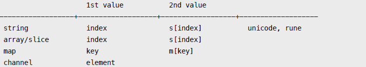

可忽略不想要的返回值，或用 "_" 这个特殊变量。

```
s := "abc"

for i := range s { // 忽略 2nd value，支持 string/array/slice/map。
	println(s[i])
}

for _, c := range s { // 忽略 index。
	println(c)
}

for range s { // 忽略全部返回值，仅迭代。
	...
}

m := map[string]int{"a": 1, "b": 2}

for k, v := range m { // 返回 (key, value)。
	println(k, v)
}
```

注意，range 会复制对象。

```
a := [3]int{0, 1, 2}

for i, v := range a { // index、value 都是从复制品中取出。

	if i == 0 { // 在修改前，我们先修改原数组。
		a[1], a[2] = 999, 999
		fmt.Println(a) // 确认修改有效，输出 [0, 999, 999]。
	}

	a[i] = v + 100 // 使用复制品中取出的 value 修改原数组。
}

fmt.Println(a) // 输出 [100, 101, 102]。
```

建议改用引用类型，其底层数据不会被复制。

```
s := []int{1, 2, 3, 4, 5}

for i, v := range s { // 复制 struct slice { pointer, len, cap }。

	if i == 0 {
		s = s[:3] // 对 slice 的修改，不会影响 range。
		s[2] = 100 // 对底层数据的修改。
	}

	println(i, v)
}
```

输出：

```
0 1
1 2
2 100
3 4
4 5
```

另外两种引用类型 map、channel 是指针包装，而不像 slice 是 struct。

### 2.4.4 Switch

分支表达式可以是任意类型，不限于常量。可省略 break，默认自动终止。

```
x := []int{1, 2, 3}
i := 2

switch i {
	case x[1]:
		println("a")
	case 1, 3:
		println("b")
	default:
		println("c")
}
```

输出：

```
a
```

如需要继续下一分支，可使用 fallthrough，但不再判断条件。

```
x := 10
switch x {
case 10:
	println("a")
	fallthrough
case 0:
	println("b")
}
```

输出：

```
a
b
```

省略条件表达式，可当 if...else if...else 使用。

```
switch {
	case x[1] > 0:
		println("a")
	case x[1] < 0:
		println("b")
	default:
		println("c")
}

switch i := x[2]; { // 带初始化语句
	case i > 0:
		println("a")
	case i < 0:
		println("b")
	default:
		println("c")
}
```

### 2.4.5 Goto, Break, Continue

支持在函数内 goto 跳转。标签名区分大小写，未使用标签引发错误。

```
func main() {
	var i int
	for {
		println(i)
		i++
		if i > 2 { goto BREAK }
	}
BREAK:
	println("break")

EXIT: // Error: label EXIT defined and not used
}
```

配合标签，break 和 continue 可在多级嵌套循环中跳出。

```
func main() {
L1:
	for x := 0; x < 3; x++ {
L2:
		for y := 0; y < 5; y++ {
			if y > 2 { continue L2 }
			if x > 1 { break L1 }

			print(x, ":", y, " ")
		}

		println()
	}
}
```

输出：

```
0:0 0:1 0:2
1:0 1:1 1:2
```

附：break 可用于 for、switch、select，而 continue 仅能用于 for 循环。

```
x := 100

switch {
case x >= 0:
	if x == 0 { break }
	println(x)
}
```

# 第3章 函数

## 3.1 函数定义

不支持 嵌套 (nested)、重载 (overload) 和 默认参数 (default parameter)。

- 无需声明原型。
- 支持不定长变参。
- 支持多返回值。
- 支持命名返回参数。
- 支持匿名函数和闭包。

使用关键字 func 定义函数，左大括号依旧不能另起一行。

```
func test(x, y int, s string) (int, string) { // 类型相同的相邻参数可合并。
	n := x + y // 多返回值必须用括号。
	return n, fmt.Sprintf(s, n)
}
```

函数是第一类对象，可作为参数传递。建议将复杂签名定义为函数类型，以便于阅读。

```
func test(fn func() int) int {
	return fn()
}

type FormatFunc func(s string, x, y int) string // 定义函数类型。

func format(fn FormatFunc, s string, x, y int) string {
	return fn(s, x, y)
}

func main() {
	s1 := test(func() int { return 100 }) // 直接将匿名函数当参数。

	s2 := format(func(s string, x, y int) string {
		return fmt.Sprintf(s, x, y)
	}, "%d, %d", 10, 20)
	
	println(s1, s2)
}
```

有返回值的函数，必须有明确的终止语句，否则会引发编译错误。

## 3.2 变参

变参本质上就是 slice。只能有一个，且必须是最后一个。

```
func test(s string, n ...int) string {
	var x int
	for _, i := range n {
		x += i
	}

	return fmt.Sprintf(s, x)
}

func main() {
	println(test("sum: %d", 1, 2, 3))
}
```

使用 slice 对象做变参时，必须展开。

```
func main() {
	s := []int{1, 2, 3}
	println(test("sum: %d", s...))
}
```

## 3.3 返回值

不能用容器对象接收多返回值。只能用多个变量，或 "_" 忽略。

```
func test() (int, int) {
	return 1, 2
}

func main() {
	// s := make([]int, 2)
	// s = test() // Error: multiple-value test() in single-value context

	x, _ := test()
	println(x)
}
```

多返回值可直接作为其他函数调用实参。

```
func test() (int, int) {
	return 1, 2
}

func add(x, y int) int {
	return x + y
}

func sum(n ...int) int {
	var x int
	for _, i := range n {
		x += i
	}

	return x
}

func main() {
	println(add(test()))
	println(sum(test()))
}
```

命名返回参数可看做与形参类似的局部变量，最后由 return 隐式返回。

```
func add(x, y int) (z int) {
	z = x + y
	return
}

func main() {
	println(add(1, 2))
}
```

命名返回参数可被同名局部变量遮蔽，此时需要显式返回。

```
func add(x, y int) (z int) {
	{ // 不能在一个级别，引发 "z redeclared in this block" 错误。
		var z = x + y
		// return // Error: z is shadowed during return
		return z // 必须显式返回。
	}
}
```

命名返回参数允许 defer 延迟调用通过闭包读取和修改。

```
func add(x, y int) (z int) {
	defer func() {
		z += 100
	}()

	z = x + y
	return
}

func main() {
	println(add(1, 2)) // 输出: 103
}
```

显式 return 返回前，会先修改命名返回参数。

```
func add(x, y int) (z int) {
	defer func() {
		println(z) // 输出: 203
	}()

	z = x + y
	return z + 200 // 执行顺序: (z = z + 200) -> (call defer) -> (ret)
}

func main() {
	println(add(1, 2)) // 输出: 203
}
```

## 3.4 匿名函数

匿名函数可赋值给变量，做为结构字段，或者在 channel 里传送。

```
// --- function variable ---

fn := func() { println("Hello, World!") }
fn()

// --- function collection ---
fns := [](func(x int) int){

	func(x int) int { return x + 1 },
	func(x int) int { return x + 2 },
}

println(fns[0](100))

// --- function as field ---

d := struct {
	fn func() string
}{
	fn: func() string { return "Hello, World!" },
}

println(d.fn())

// --- channel of function ---

fc := make(chan func() string, 2)
fc <- func() string { return "Hello, World!" }
println((<-fc)())
```

闭包复制的是原对象指针，这就很容易解释延迟引用现象。

```
func test() func() {
	x := 100
	fmt.Printf("x (%p) = %d\n", &x, x)

	return func() {
		fmt.Printf("x (%p) = %d\n", &x, x)
	}
}

func main() {
	f := test()
	f()
}
```

输出：

```
x (0x2101ef018) = 100
x (0x2101ef018) = 100
```

在汇编层面，test 实际返回的是 FuncVal 对象，其中包含了匿名函数地址、闭包对象指针。当调用匿名函数时，只需以某个寄存器传递该对象即可。

```
FuncVal { func_address, closure_var_pointer ... }
```

## 3.5 延迟调用

关键字 defer 用于注册延迟调用。这些调用直到 ret 前才被执行，通常用于释放资源或错误处理。

```
func test() error {
	f, err := os.Create("test.txt")
	if err != nil { return err }

	defer f.Close() // 注册调用，而不是注册函数。必须提供参数，哪怕为空。

	f.WriteString("Hello, World!")
	return nil
}
```

多个 defer 注册，按 FILO 次序执行。哪怕函数或某个延迟调用发生错误，这些调用依旧会被执行。

```
func test(x int) {
	defer println("a")
	defer println("b")

	defer func() {
		println(100 / x) // div0 异常未被捕获，逐步往外传递，最终终止进程。
	}()

	defer println("c")
}

func main() {
	test(0)
}
```

输出：

```
c
b
a
panic: runtime error: integer divide by zero
```

延迟调用参数在注册时求值或复制，可用指针或闭包 "延迟" 读取。

```
func test() {
	x, y := 10, 20

	defer func(i int) {
		println("defer:", i, y) // y 闭包引用
	}(x) // x 被复制

	x += 10
	y += 100
	println("x =", x, "y =", y)
}
```

输出：

```
x = 20 y = 120
defer: 10 120
```

滥用 defer 可能会导致性能问题，尤其是在一个 "大循环" 里。

```
var lock sync.Mutex

func test() {
	lock.Lock()
	lock.Unlock()
}

func testdefer() {
	lock.Lock()
	defer lock.Unlock()
}

func BenchmarkTest(b *testing.B) {
	for i := 0; i < b.N; i++ {
		test()
	}
}

func BenchmarkTestDefer(b *testing.B) {
	for i := 0; i < b.N; i++ {
		testdefer()
	}
}
```

输出:

```
BenchmarkTest" 50000000 43 ns/op
BenchmarkTestDefer 20000000 128 ns/op
```

## 3.6 错误处理

没有结构化异常，使用 panic 抛出错误，recover 捕获错误。

```
func test() {
	defer func() {
		if err := recover(); err != nil {
			println(err.(string)) // 将 interface{} 转型为具体类型。
		}
	}()

	panic("panic error!")
}
```

由于 panic、recover 参数类型为 interface{}，因此可抛出任何类型对象。

```
func panic(v interface{})
func recover() interface{}
```

延迟调用中引发的错误，可被后续延迟调用捕获，但仅最后一个错误可被捕获。

```
func test() {
	defer func() {
		fmt.Println(recover())
	}()

	defer func() {
		panic("defer panic")
	}()

	panic("test panic")
}

func main() {
	test()
}
```

输出：

```
defer panic
```

捕获函数 recover 只有在延迟调用内直接调用才会终止错误，否则总是返回 nil。任何未捕获的错误都会沿调用堆栈向外传递。

```
func test() {
	defer recover() // 无效！
	defer fmt.Println(recover()) // 无效！
	defer func() {
		func() {
			println("defer inner")
			recover() // 无效！
		}()
	}()

	panic("test panic")
}

func main() {
	test()
}
```

输出：

```
defer inner
<nil>
panic: test panic
```

使用延迟匿名函数或下面这样都是有效的。

```
func except() {
	recover()
}

func test() {
	defer except()
	panic("test panic")
}
```

如果需要保护代码片段，可将代码块重构成匿名函数，如此可确保后续代码被执行。

```
func test(x, y int) {
	var z int

	func() {
		defer func() {
			if recover() != nil { z = 0 }
		}()

	z = x / y
	return
	}()

	println("x / y =", z)
}
```

除用 panic 引发中断性错误外，还可返回 error 类型错误对象来表示函数调用状态。

```
type error interface {
	Error() string
}
```

标准库 errors.New 和 fmt.Errorf 函数用于创建实现 error 接口的错误对象。通过判断错误对象实例来确定具体错误类型。

```
var ErrDivByZero = errors.New("division by zero")

func div(x, y int) (int, error) {
	if y == 0 { return 0, ErrDivByZero }
	return x / y, nil
}

func main() {
	switch z, err := div(10, 0); err {
	case nil:
		println(z)
	case ErrDivByZero:
		panic(err)
	}
}
```

如何区别使用 panic 和 error 两种方式？惯例是：导致关键流程出现不可修复性错误的使用 panic，其他使用 error。

# 第4章 数据

## 4.1 Array

和以往认知的数组有很大不同。

- 数组是值类型，赋值和传参会复制整个数组，而不是指针。
- 数组长度必须是常量，且是类型的组成部分。[2]int 和 [3]int 是不同类型。
- 支持 "=="、"!=" 操作符，因为内存总是被初始化过的。
- 指针数组 [n]*T，数组指针 *[n]T。

可用复合语句初始化。

```
a := [3]int{1, 2} // 未初始化元素值为0。
b := [...]int{1, 2, 3, 4} // 通过初始化值确定数组长度。
c := [5]int{2: 100, 4:200} // 使用索引号初始化元素。

d := [...]struct {
	name string
	age uint8
}{
	{"user1", 10}, // 可省略元素类型。
	{"user2", 20}, // 别忘了最后一行的逗号。
}
```

支持多维数组。

```
a := [2][3]int{{1, 2, 3}, {4, 5, 6}}
b := [...][2]int{{1, 1}, {2, 2}, {3, 3}} // 第 2 纬度不能用 "..."。
```

值拷贝行为会造成性能问题，通常会建议使用 slice，或数组指针。

```
func test(x [2]int) {
	fmt.Printf("x: %p\n", &x)
	x[1] = 1000
}

func main() {
	a := [2]int{}
	fmt.Printf("a: %p\n", &a)
	test(a)
	fmt.Println(a)
}
```

输出：

```
a: 0x2101f9150
x: 0x2101f9170
[0 0]
```

内置函数 len 和 cap 都返回数组长度 (元素数量)。

```
a := [2]int{}
println(len(a), cap(a)) // 2, 2
```

## 4.2 Slice

需要说明，slice 并不是数组或数组指针。它通过内部指针和相关属性引用数组片段，以实现变长方案。

runtime.h

```
struct Slice
{ // must not move anything
byte* array; // actual data
uintgo len; // number of elements
uintgo cap; // allocated number of elements
};
```

- 引用类型。但自身是结构体，值拷贝传递。
- 属性 len 表示可用元素数量，读写操作不能超过该限制。
- 属性 cap 表示最大扩张容量，不能超出数组限制。
- 如果 slice == nil，那么 len、cap 结果都等于 0。

```
data := [...]int{0, 1, 2, 3, 4, 5, 6}
slice := data[1:4:5] // [low : high : max]
```
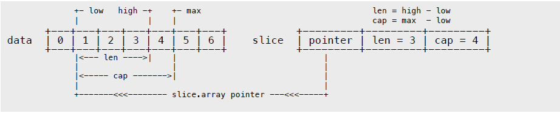

创建表达式使用的是元素索引号，而非数量。

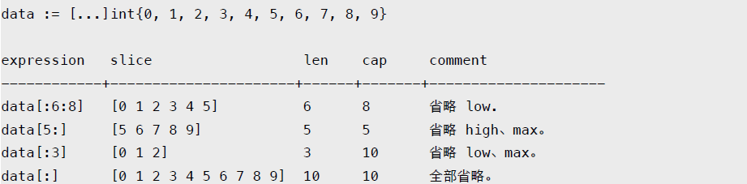

读写操作实际目标是底层数组，只需注意索引号的差别。

```
data := [...]int{0, 1, 2, 3, 4, 5}

s := data[2:4]
s[0] += 100
s[1] += 200

fmt.Println(s)
fmt.Println(data)
```

输出：

```
[102 203]
[0 1 102 203 4 5]
```

可直接创建 slice 对象，自动分配底层数组。

```
s1 := []int{0, 1, 2, 3, 8: 100} // 通过初始化表达式构造，可使用索引号。
fmt.Println(s1, len(s1), cap(s1))

s2 := make([]int, 6, 8) // 使用 make 创建，指定 len 和 cap 值。
fmt.Println(s2, len(s2), cap(s2))

s3 := make([]int, 6) // 省略 cap，相当于 cap = len。
fmt.Println(s3, len(s3), cap(s3))
```

输出：

```
[0 1 2 3 0 0 0 0 100] 9 9
[0 0 0 0 0 0] 6 8
[0 0 0 0 0 0] 6 6
```

使用 make 动态创建 slice，避免了数组必须用常量做长度的麻烦。还可用指针直接访问底层数组，退化成普通数组操作。

```
s := []int{0, 1, 2, 3}
p := &s[2] // *int, 获取底层数组元素指针。
*p += 100

fmt.Println(s)
```

输出：

```
[0 1 102 3]
```

至于 [][]T，是指元素类型为 []T 。

```
data := [][]int{
	[]int{1, 2, 3},
	[]int{100, 200},
	[]int{11, 22, 33, 44},
}
```

可直接修改 struct array/slice 成员。

```
d := [5]struct {
	x int
}{}

s := d[:]

d[1].x = 10
s[2].x = 20

fmt.Println(d)
fmt.Printf("%p, %p\n", &d, &d[0])
```

输出:

```
[{0} {10} {20} {0} {0}]
0x20819c180, 0x20819c180
```

### 4.2.1 reslice

所谓 reslice，是基于已有 slice 创建新 slice 对象，以便在 cap 允许范围内调整属性。

```
s := []int{0, 1, 2, 3, 4, 5, 6, 7, 8, 9}

s1 := s[2:5] // [2 3 4]
s2 := s1[2:6:7] // [4 5 6 7]
s3 := s2[3:6] // Error
```
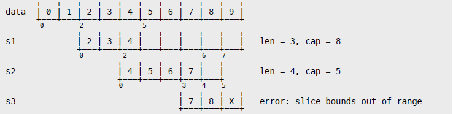

新对象依旧指向原底层数组。

```
s := []int{0, 1, 2, 3, 4, 5, 6, 7, 8, 9}

s1 := s[2:5] // [2 3 4]
s1[2] = 100

s2 := s1[2:6] // [100 5 6 7]
s2[3] = 200

fmt.Println(s)
```

输出：

```
[0 1 2 3 100 5 6 200 8 9]
```

### 4.2.2 append

向 slice 尾部添加数据，返回新的 slice 对象。

```
s := make([]int, 0, 5)
fmt.Printf("%p\n", &s)

s2 := append(s, 1)
fmt.Printf("%p\n", &s2)

fmt.Println(s, s2)
```

输出：

```
0x210230000
0x210230040
[] [1]
```

简单点说，就是在 array[slice.high] 写数据。

```
data := [...]int{0, 1, 2, 3, 4, 5, 6, 7, 8, 9}
s := data[:3]
s2 := append(s, 100, 200) // 添加多个值。

fmt.Println(data)
fmt.Println(s)
fmt.Println(s2)
```

输出：

```
[0 1 2 100 200 5 6 7 8 9]
[0 1 2]
[0 1 2 100 200]
```

一旦超出原 slice.cap 限制，就会重新分配底层数组，即便原数组并未填满。

```
data := [...]int{0, 1, 2, 3, 4, 10: 0}
s := data[:2:3]

s = append(s, 100, 200) // 一次 append 两个值，超出 s.cap 限制。

fmt.Println(s, data) // 重新分配底层数组，与原数组无关。
fmt.Println(&s[0], &data[0]) // 比对底层数组起始指针。
```

输出：

```
[0 1 100 200] [0 1 2 3 4 0 0 0 0 0 0]
0x20819c180 0x20817c0c0
```

从输出结果可以看出，append 后的 s 重新分配了底层数组，并复制数据。如果只追加一个值，则不会超过 s.cap 限制，也就不会重新分配。

通常以2倍容量重新分配底层数组。在大批量添加数据时，建议一次性分配足够大的空间，以减少内存分配和数据复制开销。或初始化足够长的 len 属性，改用索引号进行操作。及时释放不再使用的 slice 对象，避免持有过期数组，造成 GC 无法回收。

```
s := make([]int, 0, 1)
c := cap(s)

for i := 0; i < 50; i++ {
	s = append(s, i)
	if n := cap(s); n > c {
		fmt.Printf("cap: %d -> %d\n", c, n)
		c = n
	}
}
```

输出:

```
cap: 1 -> 2
cap: 2 -> 4
cap: 4 -> 8
cap: 8 -> 16
cap: 16 -> 32
cap: 32 -> 64
```

### 4.2.3 copy

函数 copy 在两个 slice 间复制数据，复制长度以 len 小的为准。两个 slice 可指向同一底层数组，允许元素区间重叠。

```
data := [...]int{0, 1, 2, 3, 4, 5, 6, 7, 8, 9}

s := data[8:]
s2 := data[:5]

copy(s2, s) // dst:s2, src:s

fmt.Println(s2)
fmt.Println(data)
```

输出：

```
[8 9 2 3 4]
[8 9 2 3 4 5 6 7 8 9]
```

应及时将所需数据 copy 到较小的 slice，以便释放超大号底层数组内存。

## 4.3 Map

引用类型，哈希表。键必须是支持相等运算符 (==、!=) 类型，比如 number、string、pointer、array、struct，以及对应的 interface。值可以是任意类型，没有限制。

```
m := map[int]struct {
	name string
	age int
}{
	1: {"user1", 10}, // 可省略元素类型。
	2: {"user2", 20},
}

println(m[1].name)
```

预先给 make 函数一个合理元素数量参数，有助于提升性能。因为事先申请一大块内存，可避免后续操作时频繁扩张。

```
m := make(map[string]int, 1000)
```

常见操作：

```
m := map[string]int{
	"a": 1,
}

if v, ok := m["a"]; ok { // 判断 key 是否存在。
	println(v)
}

println(m["c"]) // 对于不存在的 key，直接返回 \0，不会出错。

m["b"] = 2 // 新增或修改。

delete(m, "c") // 删除。如果 key 不存在，不会出错。

println(len(m)) // 获取键值对数量。cap 无效。

for k, v := range m { // 迭代，可仅返回 key。随机顺序返回，每次都不相同。
	println(k, v)
}
```

不能保证迭代返回次序，通常是随机结果，具体和版本实现有关。

从 map 中取回的是一个 value 临时复制品，对其成员的修改是没有任何意义的。

```
type user struct{ name string }

m := map[int]user{ // 当 map 因扩张而重新哈希时，各键值项存储位置都会发生改变。 因此，map
	1: {"user1"}, // 被设计成 not addressable。 类似 m[1].name 这种期望透过原 value
} // 指针修改成员的行为自然会被禁止。

m[1].name = "Tom" // Error: cannot assign to m[1].name
```

正确做法是完整替换 value 或使用指针。

```
u := m[1]
u.name = "Tom"
m[1] = u // 替换 value。
m2 := map[int]*user{
	1: &user{"user1"},
}

m2[1].name = "Jack" // 返回的是指针复制品。透过指针修改原对象是允许的。
```

可以在迭代时安全删除键值。但如果期间有新增操作，那么就不知道会有什么意外了。

```
for i := 0; i < 5; i++ {
	m := map[int]string{
		0: "a", 1: "a", 2: "a", 3: "a", 4: "a",
		5: "a", 6: "a", 7: "a", 8: "a", 9: "a",
	}

	for k := range m {
		m[k+k] = "x"
		delete(m, k)
	}

	fmt.Println(m)
}
```

输出：

```
map[12:x 16:x 2:x 6:x 10:x 14:x 18:x]
map[12:x 16:x 20:x 28:x 36:x]
map[12:x 16:x 2:x 6:x 10:x 14:x 18:x]
map[12:x 16:x 2:x 6:x 10:x 14:x 18:x]
map[12:x 16:x 20:x 28:x 36:x]
```

## 4.4 Struct

值类型，赋值和传参会复制全部内容。可用 "_" 定义补位字段，支持指向自身类型的指针成员。

```
type Node struct {
	_ int
	id int
	data *byte
	next *Node
}

func main() {
	n1 := Node{
		id: 1,
		data: nil,
	}

	n2 := Node{
		id: 2,
		data: nil,
		next: &n1,
	}
}
```

顺序初始化必须包含全部字段，否则会出错。

```
type User struct {
	name string
	age int
}

u1 := User{"Tom", 20}
u2 := User{"Tom"} // Error: too few values in struct initializer
```

支持匿名结构，可用作结构成员或定义变量。

```
type File struct {
	name string
	size int
	attr struct {
		perm int
		owner int
	}
}

f := File{
	name: "test.txt",
	size: 1025,
	// attr: {0755, 1}, // Error: missing type in composite literal
}

f.attr.owner = 1
f.attr.perm = 0755

var attr = struct {
	perm int
	owner int
}{2, 0755}

f.attr = attr
```

支持 "=="、"!=" 相等操作符，可用作 map 键类型。

```
type User struct {
	id int
	name string
}

m := map[User]int{
	User{1, "Tom"}: 100,
}
```

可定义字段标签，用反射读取。标签是类型的组成部分。

```
var u1 struct { name string "username" }
var u2 struct { name string }

u2 = u1 // Error: cannot use u1 (type struct { name string "username" }) as
	// type struct { name string } in assignment
```

空结构 "节省" 内存，比如用来实现 set 数据结构，或者实现没有 "状态" 只有方法的 "静态类"。

```
var null struct{}

set := make(map[string]struct{})
set["a"] = null
```

### 4.4.1 匿名字段

匿名字段不过是一种语法糖，从根本上说，就是一个与成员类型同名 (不含包名) 的字段。被匿名嵌入的可以是任何类型，当然也包括指针。

```
type User struct {
	name string
}

type Manager struct {
	User
	title string
}
m := Manager{
	User: User{"Tom"}, // 匿名字段的显式字段名，和类型名相同。
	title: "Administrator",
}
```

可以像普通字段那样访问匿名字段成员，编译器从外向内逐级查找所有层次的匿名字段，直到发现目标或出错。

```
type Resource struct {
	id int
}

type User struct {
	Resource
	name string
}

type Manager struct {
	User
	title string
}

var m Manager
m.id = 1
m.name = "Jack"
m.title = "Administrator"
```

外层同名字段会遮蔽嵌入字段成员，相同层次的同名字段也会让编译器无所适从。解决方法是使用显式字段名。

```
type Resource struct {
	id int
	name string
}

type Classify struct {
	id int
}

type User struct {
	Resource // Resource.id 与 Classify.id 处于同一层次。
	Classify
	name string // 遮蔽 Resource.name。
}

u := User{
	Resource{1, "people"},
	Classify{100},
	"Jack",
}

println(u.name) // User.name: Jack
println(u.Resource.name) // people

// println(u.id) // Error: ambiguous selector u.id
println(u.Classify.id) // 100
```

不能同时嵌入某一类型和其指针类型，因为它们名字相同。

```
type Resource struct {
	id int
}

type User struct {
	*Resource
	// Resource // Error: duplicate field Resource
	name string
}

u := User{
	&Resource{1},
	"Administrator",
}

println(u.id)
println(u.Resource.id)
```

### 4.4.2 面向对象

面向对象三大特征里，Go 仅支持封装，尽管匿名字段的内存布局和行为类似继承。没有 class 关键字，没有继承、多态等等。

```
type User struct {
	id int
	name string
}

type Manager struct {
	User
	title string
}

m := Manager{User{1, "Tom"}, "Administrator"}

// var u User = m // Error: cannot use m (type Manager) as type User in assignment
				 // 没有继承，自然也不会有多态。
var u User = m.User // 同类型拷贝。
```

内存布局和 C struct 相同，没有任何附加的 object 信息。

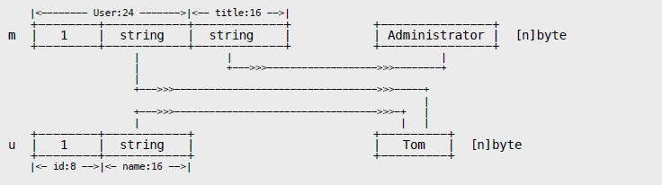

可用 unsafe 包相关函数输出内存地址信息。

```
m : 0x2102271b0, size: 40, align: 8
m.id : 0x2102271b0, offset: 0
m.name : 0x2102271b8, offset: 8
m.title: 0x2102271c8, offset: 24
```

# 第 5 章 方法

## 5.1 方法定义

方法总是绑定对象实例，并隐式将实例作为第一实参 (receiver)。

- 只能为当前包内命名类型定义方法。
- 参数 receiver 可任意命名。如方法中未曾使用，可省略参数名。
- 参数 receiver 类型可以是 T 或 *T。基类型 T 不能是接口或指针。
- 不支持方法重载，receiver 只是参数签名的组成部分。
- 可用实例 value 或 pointer 调用全部方法，编译器自动转换。

没有构造和析构方法，通常用简单工厂模式返回对象实例。

```
type Queue struct {
	elements []interface{}
}

func NewQueue() *Queue { // 创建对象实例。
	return &Queue{make([]interface{}, 10)}
}

func (*Queue) Push(e interface{}) error { // 省略 receiver 参数名。
	panic("not implemented")
}

// func (Queue) Push(e int) error { // Error: method redeclared: Queue.Push
// panic("not implemented")
// }

func (self *Queue) length() int { // receiver 参数名可以是 self、this 或其他。
	return len(self.elements)
}
```

方法不过是一种特殊的函数，只需将其还原，就知道 receiver T 和 *T 的差别。

```
type Data struct{
	x int
}

func (self Data) ValueTest() { // func ValueTest(self Data);
	fmt.Printf("Value: %p\n", &self)
}

func (self *Data) PointerTest() { // func PointerTest(self *Data);
	fmt.Printf("Pointer: %p\n", self)
}

func main() {
	d := Data{}
	p := &d
	fmt.Printf("Data: %p\n", p)

	d.ValueTest() // ValueTest(d)
	d.PointerTest() // PointerTest(&d)

	p.ValueTest() // ValueTest(*p)
	p.PointerTest() // PointerTest(p)
}
```

输出：

```
Data : 0x2101ef018
Value : 0x2101ef028
Pointer: 0x2101ef018
Value : 0x2101ef030
Pointer: 0x2101ef018
```

从1.4开始，不再支持多级指针查找方法成员。

```
type X struct{}

func (*X) test() {
	println("X.test")
}

func main() {
	p := &X{}
	p.test()

	// Error: calling method with receiver &p (type **X) requires explicit dereference
	// (&p).test()
}
```

## 5.2 匿名字段

可以像字段成员那样访问匿名字段方法，编译器负责查找。

```
type User struct {
	id int
	name string
}

type Manager struct {
	User
}

func (self *User) ToString() string { // receiver = &(Manager.User)
	return fmt.Sprintf("User: %p, %v", self, self)
}

func main() {
	m := Manager{User{1, "Tom"}}

	fmt.Printf("Manager: %p\n", &m)
	fmt.Println(m.ToString())
}
```

输出：

```
Manager: 0x2102281b0
User : 0x2102281b0, &{1 Tom}
```

通过匿名字段，可获得和继承类似的复用能力。依据编译器查找次序，只需在外层定义同名方法，就可以实现 "override"。

```
type User struct {
	id int
	name string
}

type Manager struct {
	User
	title string
}

func (self *User) ToString() string {
	return fmt.Sprintf("User: %p, %v", self, self)
}

func (self *Manager) ToString() string {
	return fmt.Sprintf("Manager: %p, %v", self, self)
}

func main() {
	m := Manager{User{1, "Tom"}, "Administrator"}

	fmt.Println(m.ToString())
	fmt.Println(m.User.ToString())
}
```

输出：

```
Manager: 0x2102271b0, &{{1 Tom} Administrator}
User : 0x2102271b0, &{1 Tom}
```

## 5.3 方法集

每个类型都有与之关联的方法集，这会影响到接口实现规则。

- 类型 T 方法集包含全部 receiver T 方法。
- 类型 *T 方法集包含全部 receiver T + *T 方法。
- 如类型 S 包含匿名字段 T，则 S 方法集包含 T 方法。
- 如类型 S 包含匿名字段 *T，则 S 方法集包含 T + *T 方法。
- 不管嵌入 T 或 *T，*S 方法集总是包含 T + *T 方法。

用实例 value 和 pointer 调用方法 (含匿名字段) 不受方法集约束，编译器总是查找全部方法，并自动转换 receiver 实参。

## 5.4 表达式

根据调用者不同，方法分为两种表现形式：

```
instance.method(args...) ---> <type>.func(instance, args...)
```

前者称为 method value，后者 method expression。

两者都可像普通函数那样赋值和传参，区别在于 method value 绑定实例，而 method expression 则须显式传参。

```
type User struct {
	id int
	name string
}

func (self *User) Test() {
	fmt.Printf("%p, %v\n", self, self)
}

func main() {
	u := User{1, "Tom"}
	u.Test()

	mValue := u.Test
	mValue() // 隐式传递 receiver

	mExpression := (*User).Test
	mExpression(&u) // 显式传递 receiver
}
```

输出：

```
0x210230000, &{1 Tom}
0x210230000, &{1 Tom}
0x210230000, &{1 Tom}
```

需要注意，method value 会复制 receiver。

```
type User struct {
	id int
	name string
}

func (self User) Test() {
	fmt.Println(self)
}

func main() {
	u := User{1, "Tom"}
	mValue := u.Test // 立即复制 receiver，因为不是指针类型，不受后续修改影响。

	u.id, u.name = 2, "Jack"
	u.Test()

	mValue()
}
```

输出：

```
{2 Jack}
{1 Tom}
```

在汇编层面，method value 和闭包的实现方式相同，实际返回 FuncVal 类型对象。

```
FuncVal { method_address, receiver_copy }
```

可依据方法集转换 method expression，注意 receiver 类型的差异。

```
type User struct {
	id int
	name string
}

func (self *User) TestPointer() {
	fmt.Printf("TestPointer: %p, %v\n", self, self)
}

func (self User) TestValue() {
	fmt.Printf("TestValue: %p, %v\n", &self, self)
}

func main() {
	u := User{1, "Tom"}
	fmt.Printf("User: %p, %v\n", &u, u)

	mv := User.TestValue
	mv(u)

	mp := (*User).TestPointer
	mp(&u)

	mp2 := (*User).TestValue // *User 方法集包含 TestValue。
	mp2(&u)					 // 签名变为 func TestValue(self *User)。
} 							 // 实际依然是 receiver value copy。
```

输出：

```
User : 0x210231000, {1 Tom}
TestValue : 0x210231060, {1 Tom}
TestPointer: 0x210231000, &{1 Tom}
TestValue : 0x2102310c0, {1 Tom}
```

将方法 "还原" 成函数，就容易理解下面的代码了。

```
type Data struct{}

func (Data) TestValue() {}
func (*Data) TestPointer() {}

func main() {
	var p *Data = nil
	p.TestPointer()

	(*Data)(nil).TestPointer() // method value
	(*Data).TestPointer(nil) // method expression

	// p.TestValue() // invalid memory address or nil pointer dereference
	// (Data)(nil).TestValue() // cannot convert nil to type Data
	// Data.TestValue(nil) // cannot use nil as type Data in function argument
}
```

# 第 6 章 接口

## 6.1 接口定义

接口是一个或多个方法签名的集合，任何类型的方法集中只要拥有与之对应的全部方法，就表示它 "实现" 了该接口，无须在该类型上显式添加接口声明。

所谓对应方法，是指有相同名称、参数列表 (不包括参数名) 以及返回值。当然，该类型还可以有其他方法。

- 接口命名习惯以 er 结尾，结构体。
- 接口只有方法签名，没有实现。
- 接口没有数据字段。
- 可在接口中嵌入其他接口。
- 类型可实现多个接口。

```
type Stringer interface {
	String() string
}

type Printer interface {
	Stringer // 接口嵌入。
	Print()
}

type User struct {
	id int
	name string
}

func (self *User) String() string {
	return fmt.Sprintf("user %d, %s", self.id, self.name)
}

func (self *User) Print() {
	fmt.Println(self.String())
}

func main() {
	var t Printer = &User{1, "Tom"} // *User 方法集包含 String、Print。
	t.Print()
}
```

输出：

```
user 1, Tom
```

空接口 interface{} 没有任何方法签名，也就意味着任何类型都实现了空接口。其作用类似面向对象语言中的根对象 object。

```
func Print(v interface{}) {
	fmt.Printf("%T: %v\n", v, v)
}

func main() {
	Print(1)
	Print("Hello, World!")
}
```

输出：

```
int: 1
string: Hello, World!
```

匿名接口可用作变量类型，或结构成员。

```
type Tester struct {
	s interface {
		String() string
	}
}

type User struct {
	id int
	name string
}

func (self *User) String() string {
	return fmt.Sprintf("user %d, %s", self.id, self.name)
}

func main() {
	t := Tester{&User{1, "Tom"}}
	fmt.Println(t.s.String())
}
```

输出：

```
user 1, Tom
```

## 6.2 执行机制

接口对象由接口表 (interface table) 指针和数据指针组成。

runtime.h

```
struct Iface
{
	Itab* tab;
	void* data;
};

struct Itab
{
	InterfaceType* inter;
	Type* type;
	void (*fun[])(void);
};
```

接口表存储元数据信息，包括接口类型、动态类型，以及实现接口的方法指针。无论是反射还是通过接口调用方法，都会用到这些信息。

数据指针持有的是目标对象的只读复制品，复制完整对象或指针。

```
type User struct {
	id int
	name string
}

func main() {
	u := User{1, "Tom"}
	var i interface{} = u

	u.id = 2
	u.name = "Jack"

	fmt.Printf("%v\n", u)
	fmt.Printf("%v\n", i.(User))
}
```

输出：

```
{2 Jack}
{1 Tom}
```

接口转型返回临时对象，只有使用指针才能修改其状态。

```
type User struct {
	id int
	name string
}

func main() {
	u := User{1, "Tom"}
	var vi, pi interface{} = u, &u

	// vi.(User).name = "Jack" // Error: cannot assign to vi.(User).name
	pi.(*User).name = "Jack"

	fmt.Printf("%v\n", vi.(User))
	fmt.Printf("%v\n", pi.(*User))
}
```

输出：

```
{1 Tom}
&{1 Jack}
```

只有 tab 和 data 都为 nil 时，接口才等于 nil。

```
var a interface{} = nil // tab = nil, data = nil
var b interface{} = (*int)(nil) // tab 包含 *int 类型信息, data = nil

type iface struct {
	itab, data uintptr
}

ia := *(*iface)(unsafe.Pointer(&a))
ib := *(*iface)(unsafe.Pointer(&b))

fmt.Println(a == nil, ia)
fmt.Println(b == nil, ib, reflect.ValueOf(b).IsNil())
```

输出:

```
true {0 0}
false {505728 0} true
```

## 6.3 接口转换

利用类型推断，可判断接口对象是否某个具体的接口或类型。

```
type User struct {
	id int
	name string
}

func (self *User) String() string {
	return fmt.Sprintf("%d, %s", self.id, self.name)
}

func main() {
	var o interface{} = &User{1, "Tom"}

	if i, ok := o.(fmt.Stringer); ok { // ok-idiom
		fmt.Println(i)
	}

	u := o.(*User)
	// u := o.(User) // panic: interface is *main.User, not main.User
	fmt.Println(u)
}
```

还可用 switch 做批量类型判断，不支持 fallthrough。

```
func main() {
	var o interface{} = &User{1, "Tom"}

	switch v := o.(type) {
	case nil: // o == nil
		fmt.Println("nil")
	case fmt.Stringer: // interface
		fmt.Println(v)
	case func() string: // func
		fmt.Println(v())
	case *User: // *struct
		fmt.Printf("%d, %s\n", v.id, v.name)
	default:
	fmt.Println("unknown")
	}
}
```

超集接口对象可转换为子集接口，反之出错。

```
type Stringer interface {
	String() string
}

type Printer interface {
	String() string
	Print()
}

type User struct {
	id int
	name string
}

func (self *User) String() string {
	return fmt.Sprintf("%d, %v", self.id, self.name)
}

func (self *User) Print() {
	fmt.Println(self.String())
}

func main() {
	var o Printer = &User{1, "Tom"}
	var s Stringer = o
	fmt.Println(s.String())
}
```

## 6.4 接口技巧

让编译器检查，以确保某个类型实现接口。

```
var _ fmt.Stringer = (*Data)(nil)
```

某些时候，让函数直接 "实现" 接口能省不少事。

```
type Tester interface {
	Do()
}

type FuncDo func()
func (self FuncDo) Do() { self() }

func main() {
	var t Tester = FuncDo(func() { println("Hello, World!") })
	t.Do()
}
```

# 第 7 章 并发

## 7.1 Goroutine

Go 在语言层面对并发编程提供支持，一种类似协程，称作 goroutine 的机制。

只需在函数调用语句前添加 go 关键字，就可创建并发执行单元。开发人员无需了解任何执行细节，调度器会自动将其安排到合适的系统线程上执行。goroutine 是一种非常轻量级的实现，可在单个进程里执行成千上万的并发任务。

事实上，入口函数 main 就以 goroutine 运行。另有与之配套的 channel 类型，用以实现 "以通讯来共享内存" 的 CSP 模式。相关实现细节可参考本书第二部分的源码剖析。

```
go func() {
	println("Hello, World!")
}()
```

调度器不能保证多个 goroutine 执行次序，且进程退出时不会等待它们结束。

默认情况下，进程启动后仅允许一个系统线程服务于 goroutine。可使用环境变量或标准库函数 runtime.GOMAXPROCS 修改，让调度器用多个线程实现多核并行，而不仅仅是并发。

```
func sum(id int) {
	var x int64
	for i := 0; i < math.MaxUint32; i++ {
		x += int64(i)
	}

	println(id, x)
}

func main() {
	wg := new(sync.WaitGroup)
	wg.Add(2)

	for i := 0; i < 2; i++ {
		go func(id int) {
			defer wg.Done()
			sum(id)
		}(i)
	}
	
	wg.Wait()
}
```

输出：

```
$ go build -o test

$ time -p ./test

0 9223372030412324865
1 9223372030412324865

real 7.70 // 程序开始到结束时间差 (非 CPU 时间)
user 7.66 // 用户态所使用 CPU 时间片 (多核累加)
sys 0.01 // 内核态所使用 CPU 时间片

$ GOMAXPROCS=2 time -p ./test

0 9223372030412324865
1 9223372030412324865

real 4.18
user 7.61 // 虽然总时间差不多，但由 2 个核并行，real 时间自然少了许多。
sys 0.02
```

调用 runtime.Goexit 将立即终止当前 goroutine 执行，调度器确保所有已注册 defer 延迟调用被执行。

```
func main() {
	wg := new(sync.WaitGroup)
	wg.Add(1)

	go func() {
		defer wg.Done()
		defer println("A.defer")

		func() {
			defer println("B.defer")
			runtime.Goexit() // 终止当前 goroutine
			println("B") // 不会执行
		}()

		println("A") // 不会执行
	}()

	wg.Wait()
}
```

输出：

```
B.defer
A.defer
```

和协程 yield 作用类似，Gosched 让出底层线程，将当前 goroutine 暂停，放回队列等待下次被调度执行。

```
func main() {
	wg := new(sync.WaitGroup)
	wg.Add(2)

	go func() {
		defer wg.Done()

		for i := 0; i < 6; i++ {
			println(i)
			if i == 3 { runtime.Gosched() }
		}
	}()

	go func() {
		defer wg.Done()
		println("Hello, World!")
	}()

	wg.Wait()
}
```

输出：

```
$ go run main.go
0
1
2
3
Hello, World!
4
5
```

## 7.2 Channel

引用类型 channel 是 CSP 模式的具体实现，用于多个 goroutine 通讯。其内部实现了同步，确保并发安全。

默认为同步模式，需要发送和接收配对。否则会被阻塞，直到另一方准备好后被唤醒。

```
func main() {
	data := make(chan int) // 数据交换队列
	exit := make(chan bool) // 退出通知

	go func() {
		for d := range data { // 从队列迭代接收数据，直到 close 。
			fmt.Println(d)
		}

		fmt.Println("recv over.")
		exit <- true // 发出退出通知。
	}()

	data <- 1 // 发送数据。
	data <- 2
	data <- 3
	close(data) // 关闭队列。

	fmt.Println("send over.")
	<-exit // 等待退出通知。
}
```

输出：

```
1
2
3
send over.
recv over.
```

异步方式通过判断缓冲区来决定是否阻塞。如果缓冲区已满，发送被阻塞；缓冲区为空，接收被阻塞。

通常情况下，异步 channel 可减少排队阻塞，具备更高的效率。但应该考虑使用指针规避大对象拷贝，将多个元素打包，减小缓冲区大小等。

```
func main() {
	data := make(chan int, 3) // 缓冲区可以存储 3 个元素
	exit := make(chan bool)

	data <- 1 // 在缓冲区未满前，不会阻塞。
	data <- 2
	data <- 3

	go func() {
		for d := range data { // 在缓冲区未空前，不会阻塞。
			fmt.Println(d)
		}

		exit <- true
	}()

	data <- 4 // 如果缓冲区已满，阻塞。
	data <- 5
	close(data)

	<-exit
}
```

缓冲区是内部属性，并非类型构成要素。

```
var a, b chan int = make(chan int), make(chan int, 3)
```

除用 range 外，还可用 ok-idiom 模式判断 channel 是否关闭。

```
for {
	if d, ok := <-data; ok {
		fmt.Println(d)
	} else {
		break
	}
}
```

向 closed channel 发送数据引发 panic 错误，接收立即返回零值。而 nil channel，无论收发都会被阻塞。

内置函数 len 返回未被读取的缓冲元素数量，cap 返回缓冲区大小。

```
d1 := make(chan int)
d2 := make(chan int, 3)

d2 <- 1

fmt.Println(len(d1), cap(d1)) // 0 0
fmt.Println(len(d2), cap(d2)) // 1 3
```

### 7.2.1 单向

可以将 channel 隐式转换为单向队列，只收或只发。

```
c := make(chan int, 3)

var send chan<- int = c // send-only
var recv <-chan int = c // receive-only

send <- 1
// <-send // Error: receive from send-only type chan<- int

<-recv
// recv <- 2 // Error: send to receive-only type <-chan int
```

不能将单向 channel 转换为普通 channel。

```
d := (chan int)(send) // Error: cannot convert type chan<- int to type chan int
d := (chan int)(recv) // Error: cannot convert type <-chan int to type chan int
```

### 7.2.2 选择

如果需要同时处理多个 channel，可使用 select 语句。它随机选择一个可用 channel 做收发操作，或执行 default case。

```
func main() {
	a, b := make(chan int, 3), make(chan int)

	go func() {
		v, ok, s := 0, false, ""

		for {
			select { // 随机选择可用 channel，接收数据。
			case v, ok = <-a: s = "a"
			case v, ok = <-b: s = "b"
			}

			if ok {
				fmt.Println(s, v)
			} else {
				os.Exit(0)
			}
		}
	}()

	for i := 0; i < 5; i++ {
		select { // 随机选择可用 channel，发送数据。
		case a <- i:
		case b <- i:
		}
	}

	close(a)
	select {} // 没有可用 channel，阻塞 main goroutine。
}
```

输出：

```
b 3
a 0
a 1
a 2
b 4
```

在循环中使用 select default case 需要小心，避免形成洪水。

### 7.2.3 模式

用简单工厂模式打包并发任务和 channel。

```
func NewTest() chan int {
	c := make(chan int)
	rand.Seed(time.Now().UnixNano())

	go func() {
		time.Sleep(time.Second)
		c <- rand.Int()
	}()

	return c
}

func main() {
	t := NewTest()
	println(<-t) // 等待 goroutine 结束返回。
}
```

用 channel 实现信号量 (semaphore)。

```
func main() {
	wg := sync.WaitGroup{}
	wg.Add(3)
	sem := make(chan int, 1)

	for i := 0; i < 3; i++ {
		go func(id int) {
			defer wg.Done()

			sem <- 1 // 向 sem 发送数据，阻塞或者成功。

			for x := 0; x < 3; x++ {
				fmt.Println(id, x)
			}

			<-sem // 接收数据，使得其他阻塞 goroutine 可以发送数据。
		}(i)
	}

	wg.Wait()
}
```

输出：

```
$ GOMAXPROCS=2 go run main.go
0 0
0 1
0 2
1 0
1 1
1 2
2 0
2 1
2 2
```

用 closed channel 发出退出通知。

```
func main() {
	var wg sync.WaitGroup
	quit := make(chan bool)

	for i := 0; i < 2; i++ {
		wg.Add(1)

		go func(id int) {
			defer wg.Done()

			task := func() {
				println(id, time.Now().Nanosecond())
				time.Sleep(time.Second)
			}
			
			for {
				select {
				case <-quit: // closed channel 不会阻塞，因此可用作退出通知。
					return
				default: // 执行正常任务。
					task()
				}
			}
		}(i)
	}

	time.Sleep(time.Second * 5) // 让测试 goroutine 运行一会。

	close(quit) // 发出退出通知。
	wg.Wait()
}
```

用 select 实现超时 (timeout)。

```
func main() {
	w := make(chan bool)
	c := make(chan int, 2)

	go func() {
		select {
		case v := <-c: fmt.Println(v)
		case <-time.After(time.Second * 3): fmt.Println("timeout.")
		}

		w <- true
	}()

	// c <- 1 // 注释掉，引发 timeout。
	<-w
}
```

channel 是第一类对象，可传参 (内部实现为指针) 或者作为结构成员。

```
type Request struct {
	data []int
	ret chan int
}

func NewRequest(data ...int) *Request {
	return &Request{ data, make(chan int, 1) }
}

func Process(req *Request) {
	x := 0
	for _, i := range req.data {
		x += i
	}

	req.ret <- x
}

func main() {
	req := NewRequest(10, 20, 30)
	Process(req)
	fmt.Println(<-req.ret)
}
```

# 第 8 章 包

## 8.1 工作空间

编译工具对源码目录有严格要求，每个工作空间 (workspace) 必须由 bin、pkg、src 三个目录组成。

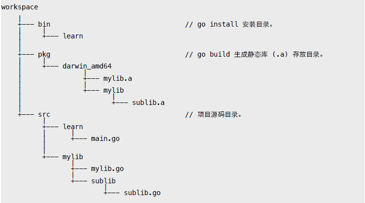

可在 GOPATH 环境变量列表中添加多个工作空间，但不能和 GOROOT 相同。

```
export GOPATH=$HOME/projects/golib:$HOME/projects/go
```

通常 go get 使用第一个工作空间保存下载的第三方库。

## 8.2 源文件

编码：源码文件必须是 UTF-8 格式，否则会导致编译器出错。
结束：语句以 ";" 结束，多数时候可以省略。
注释：支持 "//"、"/**/" 两种注释方式，不能嵌套。
命名：采用 camelCasing 风格，不建议使用下划线。

## 8.3 包结构

所有代码都必须组织在 package 中。
- 源文件头部以 "package <name>" 声明包名称。
- 包由同一目录下的多个源码文件组成。
- 包名类似 namespace，与包所在目录名、编译文件名无关。
- 目录名最好不用 main、all、std 这三个保留名称。
- 可执行文件必须包含 package main，入口函数 main。

```
说明：os.Args 返回命令行参数，os.Exit 终止进程。
	 要获取正确的可执行文件路径，可用 filepath.Abs(exec.LookPath(os.Args[0]))。
```

包中成员以名称首字母大小写决定访问权限。
- public: 首字母大写，可被包外访问。
- internal: 首字母小写，仅包内成员可以访问。
- 
该规则适用于全局变量、全局常量、类型、结构字段、函数、方法等。

### 8.3.1 导入包

使用包成员前，必须先用 import 关键字导入，但不能形成导入循环。

```
import "相对目录/包主文件名"
```

相对目录是指从 <workspace>/pkg/<os_arch> 开始的子目录，以标准库为例：

```
import "fmt" -> /usr/local/go/pkg/darwin_amd64/fmt.a
import "os/exec" -> /usr/local/go/pkg/darwin_amd64/os/exec.a
```

在导入时，可指定包成员访问方式。比如对包重命名，以避免同名冲突。

```
import "yuhen/test" // 默认模式: test.A
import M "yuhen/test" // 包重命名: M.A
import . "yuhen/test" // 简便模式: A
import _ "yuhen/test" // 非导入模式: 仅让该包执行初始化函数。
```

未使用的导入包，会被编译器视为错误 (不包括 "import _")。

```
./main.go:4: imported and not used: "fmt"
```

对于当前目录下的子包，除使用默认完整导入路径外，还可使用 local 方式。


main.go

```
import "learn/test" // 正常模式
import "./test" // 本地模式，仅对 go run main.go 有效。
```

### 8.3.2 自定义路径

可通过 meta 设置为代码库设置自定义路径。

server.go

```
package main

import (
	"fmt"
	"net/http"
)

func handler(w http.ResponseWriter, r *http.Request) {
	fmt.Fprint(w, `<meta name="go-import"
		content="test.com/qyuhen/test git https://github.com/qyuhen/test">`)
}

func main() {
	http.HandleFunc("/qyuhen/test", handler)
	http.ListenAndServe(":80", nil)
}
```

该示例使用自定义域名 test.com 重定向到 github。

```
$ go get -v test.com/qyuhen/test

Fetching https://test.com/qyuhen/testgo-get=1
https fetch failed.
Fetching http://test.com/qyuhen/testgo-get=1
Parsing meta tags from http://test.com/qyuhen/testgo-get=1 (status code 200)
get "test.com/qyuhen/test": found meta tag http://test.com/qyuhen/testgo-get=1
test.com/qyuhen/test (download)
test.com/qyuhen/test
```

如此，该库就有两个有效导入路径，可能会导致存储两个本地副本。为此，可以给库添加专门的 "import comment"。当 go get 下载完成后，会检查本地存储路径和该注释是否一致。

github.com/qyuhen/test/abc.go

```
package test // import "test.com/qyuhen/test"

func Hello() {
	println("Hello, Custom import path!")
}
```

如继续用 github 路径，会导致 go build 失败。

```
$ go get -v github.com/qyuhen/test

github.com/qyuhen/test (download)
package github.com/qyuhen/test
	" imports github.com/qyuhen/test
	" imports github.com/qyuhen/test: expects import "test.com/qyuhen/test"
```

这就强制包用户使用唯一路径，也便于日后将包迁移到其他位置。

资源：[Go 1.4 Custom Import Path Checking](https://docs.google.com/document/d/1jVFkZTcYbNLaTxXD9OcGfn7vYv5hWtPx9--lTx1gPMs/)

### 8.3.3 初始化

初始化函数：
- 每个源文件都可以定义一个或多个初始化函数。
- 编译器不保证多个初始化函数执行次序。
- 初始化函数在单一线程被调用，仅执行一次。
- 初始化函数在包所有全局变量初始化后执行。
- 在所有初始化函数结束后才执行 main.main。
- 无法调用初始化函数。
- 
因为无法保证初始化函数执行顺序，因此全局变量应该直接用 var 初始化。

```
var now = time.Now()

func init() {
	fmt.Printf("now: %v\n", now)
}

func init() {
	fmt.Printf("since: %v\n", time.Now().Sub(now))
}
```

可在初始化函数中使用 goroutine，可等待其结束。

```
var now = time.Now()

func main() {
	fmt.Println("main:", int(time.Now().Sub(now).Seconds()))
}

func init() {
	fmt.Println("init:", int(time.Now().Sub(now).Seconds()))
	w := make(chan bool)

	go func() {
		time.Sleep(time.Second * 3)
		w <- true
	}()

	<-w
}
```

输出：

```
init: 0
main: 3
```

不应该滥用初始化函数，仅适合完成当前文件中的相关环境设置。

## 8.4 文档

扩展工具 godoc 能自动提取注释生成帮助文档。
- 仅和成员相邻 (中间没有空行) 的注释被当做帮助信息。
- 相邻行会合并成同一段落，用空行分隔段落。
- 缩进表示格式化文本，比如示例代码。
- 自动转换 URL 为链接。
- 自动合并多个源码文件中的 package 文档。
- 无法显式 package main 中的成员文档。
 
### 8.4.1 Package

- 建议用专门的 doc.go 保存 package 帮助信息。
- 包文档第一整句 (中英文句号结束) 被当做 packages 列表说明。

### 8.4.2 Example

只要 Example 测试函数名称符合以下规范即可。

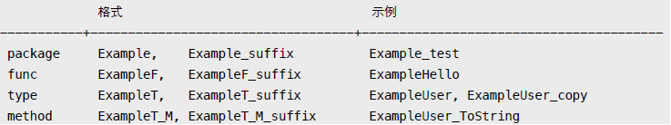

```
说明：使用 suffix 作为示例名称，其首字母必须小写。如果文件中仅有一个 Example 函数，且调用了该文件中的其他成员，那么示例会显示整个文件内容，而不仅仅是测试函数自己。
```

### 8.4.3 Bug

非测试源码文件中以 BUG(author) 开始的注释，会在帮助文档 Bugs 节点中显示。

```
// BUG(yuhen): memory leak.
```

# 第 9 章 进阶

## 9.1 内存布局

了解对象内存布局，有助于理解值传递、引用传递等概念。

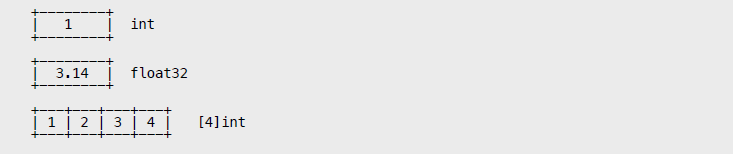

string

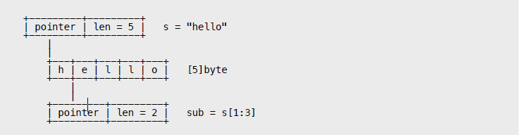

struct

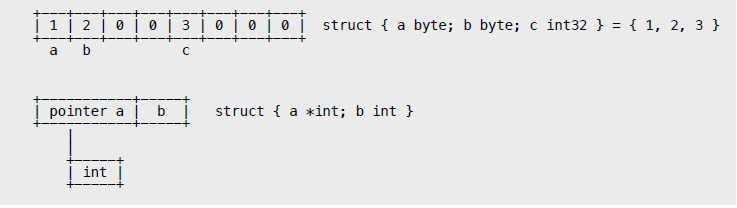

slice

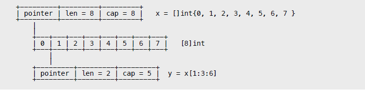

interface

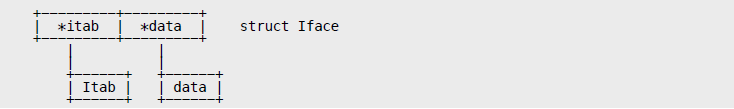

new

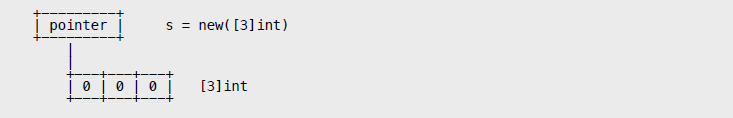

make

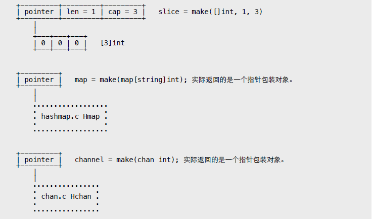

## 9.2 指针陷阱

对象内存分配会受编译参数影响。举个例子，当函数返回对象指针时，必然在堆上分配。

可如果该函数被内联，那么这个指针就不会跨栈帧使用，就有可能直接在栈上分配，以实现代码优化目的。因此，是否阻止内联对指针输出结果有很大影响。

允许指针指向对象成员，并确保该对象是可达状态。

除正常指针外，指针还有 unsafe.Pointer 和 uintptr 两种形态。其中 uintptr 被 GC 当做普通整数对象，它不能阻止所 "引用" 对象被回收。

```
type data struct {
	x [1024 * 100]byte
}

func test() uintptr {
	p := &data{}
	return uintptr(unsafe.Pointer(p))
}

func main() {
	const N = 10000
	cache := new([N]uintptr)

	for i := 0; i < N; i++ {
		cache[i] = test()
		time.Sleep(time.Millisecond)
	}
}
```

输出：

```
$ go build -o test && GODEBUG="gctrace=1" ./test

gc607(1): 0+0+0 ms, 0 -> 0 MB 50 -> 45 (3070-3025) objects
gc611(1): 0+0+0 ms, 0 -> 0 MB 50 -> 45 (3090-3045) objects
gc613(1): 0+0+0 ms, 0 -> 0 MB 50 -> 45 (3100-3055) objects
```

合法的 unsafe.Pointer 被当做普通指针对待。

```
func test() unsafe.Pointer {
	p := &data{}
	return unsafe.Pointer(p)
}

func main() {
	const N = 10000
	cache := new([N]unsafe.Pointer)

	for i := 0; i < N; i++ {
		cache[i] = test()
		time.Sleep(time.Millisecond)
	}
}
```

输出：

```
$ go build -o test && GODEBUG="gctrace=1" ./test
gc12(1): 0+0+0 ms, 199 -> 199 MB 2088 -> 2088 (2095-7) objects
gc13(1): 0+0+0 ms, 399 -> 399 MB 4136 -> 4136 (4143-7) objects
gc14(1): 0+0+0 ms, 799 -> 799 MB 8232 -> 8232 (8239-7) objects
```

指向对象成员的 unsafe.Pointer，同样能确保对象不被回收。

```
type data struct {
	x [1024 * 100]byte
	y int
}

func test() unsafe.Pointer {
	d := data{}
	return unsafe.Pointer(&d.y)
}

func main() {
	const N = 10000
	cache := new([N]unsafe.Pointer)

	for i := 0; i < N; i++ {
		cache[i] = test()
		time.Sleep(time.Millisecond)
	}
}
```

输出：

```
$ go build -o test && GODEBUG="gctrace=1" ./test

gc12(1): 0+0+0 ms, 207 -> 207 MB 2088 -> 2088 (2095-7) objects
gc13(1): 1+0+0 ms, 415 -> 415 MB 4136 -> 4136 (4143-7) objects
gc14(1): 3+1+0 ms, 831 -> 831 MB 8232 -> 8232 (8239-7) objects
```

由于可以用 unsafe.Pointer、uintptr 创建 "dangling pointer" 等非法指针，所以在使用时需要特别小心。另外，cgo C.malloc 等函数所返回指针，与 GC 无关。

指针构成的 "循环引用" 加上 runtime.SetFinalizer 会导致内存泄露。

```
type Data struct {
	d [1024 * 100]byte
	o *Data
}

func test() {
	var a, b Data
	a.o = &b
	b.o = &a

	runtime.SetFinalizer(&a, func(d *Data) { fmt.Printf("a %p final.\n", d) })
	runtime.SetFinalizer(&b, func(d *Data) { fmt.Printf("b %p final.\n", d) })
}

func main() {
	for {
		test()
		time.Sleep(time.Millisecond)
	}
}
```

输出：

```
$ go build -gcflags "-N -l" && GODEBUG="gctrace=1" ./test

gc11(1): 2+0+0 ms, 104 -> 104 MB 1127 -> 1127 (1180-53) objects
gc12(1): 4+0+0 ms, 208 -> 208 MB 2151 -> 2151 (2226-75) objects
gc13(1): 8+0+1 ms, 416 -> 416 MB 4198 -> 4198 (4307-109) objects
```

垃圾回收器能正确处理 "指针循环引用"，但无法确定 Finalizer 依赖次序，也就无法调用Finalizer 函数，这会导致目标对象无法变成不可达状态，其所占用内存无法被回收。

## 9.3 cgo

通过 cgo，可在 Go 和 C/C++ 代码间相互调用。受 CGO_ENABLED 参数限制。

```
package main

/*
	#include <stdio.h>
	#include <stdlib.h>

	void hello() {
		printf("Hello, World!\n");
	}
*/
import "C"

func main() {
C.hello()
}
```

调试 cgo 代码是件很麻烦的事，建议单独保存到 .c 文件中。这样可以将其当做独立的 C 程序进行调试。

test.h

```
#ifndef __TEST_H__
#define __TEST_H__

void hello();

#endif
```

test.c

```
#include <stdio.h>
#include "test.h"

void hello() {
	printf("Hello, World!\n");
}

#ifdef __TEST__ // 避免和 Go bootstrap main 冲突。

int main(int argc, char *argv[]) {
	hello();
	return 0;
}

#endif
```

main.go

```
package main

/*
	#include "test.h"
*/
import "C"

func main() {
	C.hello()
}
```

编译和调试 C，只需在命令行提供宏定义即可。

```
$ gcc -g -D__TEST__ -o test test.c
```

由于 cgo 仅扫描当前目录，如果需要包含其他 C 项目，可在当前目录新建一个 C 文件，然后用 #include 指令将所需的 .h、.c 都包含进来，记得在 CFLAGS 中使用 "-I" 参数指定原路径。某些时候，可能还需指定 "-std" 参数。

### 9.3.1 Flags

可使用 #cgo 命令定义 CFLAGS、LDFLAGS 等参数，自动合并多个设置。

```
/*
	#cgo CFLAGS: -g
	#cgo CFLAGS: -I./lib -D__VER__=1
	#cgo LDFLAGS: -lpthread

	#include "test.h"
*/
import "C"
```

可设置 GOOS、GOARCH 编译条件，空格表示 OR，逗号 AND，感叹号 NOT。

```
#cgo windows,386 CFLAGS: -I./lib -D__VER__=1
```

### 9.3.2 DataType

数据类型对应关系。

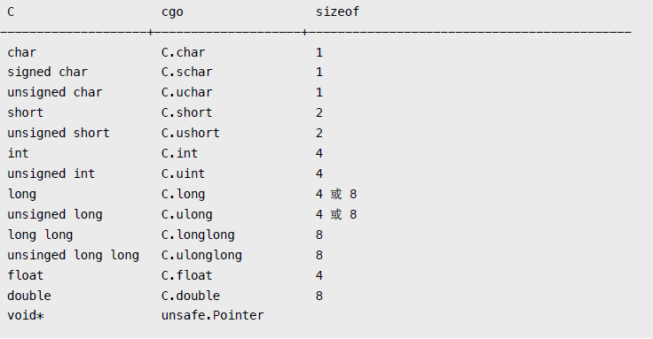

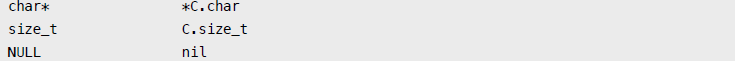

可将 cgo 类型转换为标准 Go 类型。

```
/*
	int add(int x, int y) {
		return x + y;
	}
*/
import "C"

func main() {
	var x C.int = C.add(1, 2)
	var y int = int(x)
	fmt.Println(x, y)
}
```

### 9.3.3 String

字符串转换函数。

```
/*
	#include <stdio.h>
	#include <stdlib.h>

	void test(char *s) {
		printf("%s\n", s);
	}

	char* cstr() {
		return "abcde";
	}
*/
import "C"

func main() {
	s := "Hello, World!"

	cs := C.CString(s) // 该函数在 C heap 分配内存，需要调用 free 释放。
	defer C.free(unsafe.Pointer(cs)) // #include <stdlib.h>

	C.test(cs)
	cs = C.cstr()

	fmt.Println(C.GoString(cs))
	fmt.Println(C.GoStringN(cs, 2))
	fmt.Println(C.GoBytes(unsafe.Pointer(cs), 2))
}
```

输出：

```
Hello, World!
abcde
ab
[97 98]
```

用 C.malloc/free 分配 C heap 内存。

```
/*
	#include <stdlib.h>
*/
import "C"

func main() {
	m := unsafe.Pointer(C.malloc(4 * 8))
	defer C.free(m) // 注释释放内存。

	p := (*[4]int)(m) // 转换为数组指针。
	for i := 0; i < 4; i++ {
		p[i] = i + 100
	}

	fmt.Println(p)
}
```

输出：

```
&[100 101 102 103]
```

### 9.3.4 Struct/Enum/Union

对 struct、enum 支持良好，union 会被转换成字节数组。如果没使用 typedef 定义，那么必须添加 struct_、enum_、union_ 前缀。

struct

```
/*
	#include <stdlib.h>

	struct Data {
		int x;
	};

	typedef struct {
		int x;
	} DataType;

	struct Data* testData() {
		return malloc(sizeof(struct Data));
	}

	DataType* testDataType() {
		return malloc(sizeof(DataType));
	}
*/
import "C"

func main() {
	var d *C.struct_Data = C.testData()
	defer C.free(unsafe.Pointer(d))

	var dt *C.DataType = C.testDataType()
	defer C.free(unsafe.Pointer(dt))

	d.x = 100
	dt.x = 200

	fmt.Printf("%#v\n", d)
	fmt.Printf("%#v\n", dt)
}
```

输出：

```
&main._Ctype_struct_Data{x:100}
&main._Ctype_DataType{x:200}
```

enum

```
/*
	enum Color { BLACK = 10, RED, BLUE };
	typedef enum { INSERT = 3, DELETE } Mode;
*/
import "C"

func main() {
	var c C.enum_Color = C.RED
	var x uint32 = c
	fmt.Println(c, x)

	var m C.Mode = C.INSERT
	fmt.Println(m)
}
```

union

```
/*
	#include <stdlib.h>

	union Data {
		char x;
		int y;
	};

	union Data* test() {
		union Data* p = malloc(sizeof(union Data));
		p->x = 100;
		return p;
	}
*/
import "C"

func main() {
	var d *C.union_Data = C.test()
	defer C.free(unsafe.Pointer(d))

	fmt.Println(d)
}
```

输出：

```
&[100 0 0 0]
```

### 9.3.5 Export

导出 Go 函数给 C 调用，须使用 "//export" 标记。建议在独立头文件中声明函数原型，避免 "duplicate symbol" 错误。

main.go

```
package main

import "fmt"

/*
	#include "test.h"
*/
import "C"

//export hello

func hello() {
	fmt.Println("Hello, World!\n")
}

func main() {
	C.test()
}
```

test.h

```
#ifndef __TEST_H__
#define __TEST_H__

extern void hello();
void test();

#endif
```

test.c

```
#include <stdio.h>
#include "test.h"

void test() {
	hello();
}
```

### 9.3.6 Shared Library

在 cgo 中使用 C 共享库。

test.h

```
#ifndef __TEST_HEAD__
#define __TEST_HEAD__

int sum(int x, int y);

#endif
```

test.c

```
#include <stdio.h>
#include <stdlib.h>
#include "test.h"

int sum(int x, int y)
{
	return x + y + 100;
}
```

编译成 .so 或 .dylib。

```
$ gcc -c -fPIC -o test.o test.c
$ gcc -dynamiclib -o libtest.dylib test.o
```

将共享库和头文件拷贝到 Go 项目目录。

main.go

```
package main

/*
	#cgo CFLAGS: -I.
	#cgo LDFLAGS: -L. -ltest
	#include "test.h"
*/
import "C"

func main() {
	println(C.sum(10, 20))
}
```

输出：

```
$ go build -o test && ./test
130
```

编译成功后可用 ldd 或 otool 查看动态库使用状态。 静态库使用方法类似。

## 9.4 Reflect

没有运行期类型对象，实例也没有附加字段用来表明身份。只有转换成接口时，才会在其 itab 内部存储与该类型有关的信息，Reflect 所有操作都依赖于此。

### 9.4.1 Type

以 struct 为例，可获取其全部成员字段信息，包括非导出和匿名字段。

```
type User struct {
	Username string
}

type Admin struct {
	User
	title string
}

func main() {
	var u Admin
	t := reflect.TypeOf(u)

	for i, n := 0, t.NumField(); i < n; i++ {
		f := t.Field(i)
		fmt.Println(f.Name, f.Type)
	}
}
```

输出：

```
User main.User // 可进一步递归。
title string
```

如果是指针，应该先使用 Elem 方法获取目标类型，指针本身是没有字段成员的。

```
func main() {
	u := new(Admin)

	t := reflect.TypeOf(u)
	if t.Kind() == reflect.Ptr {
		t = t.Elem()
	}

	for i, n := 0, t.NumField(); i < n; i++ {
		f := t.Field(i)
		fmt.Println(f.Name, f.Type)
	}
}
```

同样，value-interface 和 pointer-interface 也会导致方法集存在差异。

```
type User struct {
}

type Admin struct {
	User
}

func (*User) ToString() {}
func (Admin) test() {}

func main() {

	var u Admin
	
	methods := func(t reflect.Type) {
		for i, n := 0, t.NumMethod(); i < n; i++ {
			m := t.Method(i)
			fmt.Println(m.Name)
		}
	}

	fmt.Println("--- value interface ---")
	methods(reflect.TypeOf(u))

	fmt.Println("--- pointer interface ---")
	methods(reflect.TypeOf(&u))
}
```

输出：

```
--- value interface ---
test
--- pointer interface ---
ToString
test
```

可直接用名称或序号访问字段，包括用多级序号访问嵌入字段成员。

```
type User struct {
	Username string
	age int
}

type Admin struct {
	User
	title string
}

func main() {
	var u Admin
	t := reflect.TypeOf(u)

	f, _ := t.FieldByName("title")
	fmt.Println(f.Name)

	f, _ = t.FieldByName("User") // 访问嵌入字段。
	fmt.Println(f.Name)
	f, _ = t.FieldByName("Username") // 直接访问嵌入字段成员，会自动深度查找。
	fmt.Println(f.Name)

	f = t.FieldByIndex([]int{0, 1}) // Admin[0] -> User[1] -> age
	fmt.Println(f.Name)
}
```

输出：

```
title
User
Username
age
```

字段标签可实现简单元数据编程，比如标记 ORM Model 属性。

```
type User struct {
	Name string `field:"username" type:"nvarchar(20)"`
	Age int `field:"age" type:"tinyint"`
}

func main() {
	var u User

	t := reflect.TypeOf(u)
	f, _ := t.FieldByName("Name")

	fmt.Println(f.Tag)
	fmt.Println(f.Tag.Get("field"))
	fmt.Println(f.Tag.Get("type"))
}
```

输出：

```
field:"username" type:"nvarchar(20)"
username
nvarchar(20)
```

可从基本类型获取所对应复合类型。

```
var (
	Int = reflect.TypeOf(0)
	String = reflect.TypeOf("")
)

func main() {
	c := reflect.ChanOf(reflect.SendDir, String)
	fmt.Println(c)

	m := reflect.MapOf(String, Int)
	fmt.Println(m)

	s := reflect.SliceOf(Int)
	fmt.Println(s)

	t := struct{ Name string }{}
	p := reflect.PtrTo(reflect.TypeOf(t))
	fmt.Println(p)
}
```

输出:

```
chan<- string
map[string]int
[]int
*struct { Name string }
```

与之对应，方法 Elem 可返回复合类型的基类型。

```
func main() {
	t := reflect.TypeOf(make(chan int)).Elem()
	fmt.Println(t)
}
```

方法 Implements 判断是否实现了某个具体接口，AssignableTo、ConvertibleTo 用于赋值和转换判断。

```
type Data struct {
}

func (*Data) String() string {
	return ""
}

func main() {
	var d *Data
	t := reflect.TypeOf(d)

	// 没法直接获取接口类型，好在接口本身是个 struct，创建
	// 一个空指针对象，这样传递给 TypeOf 转换成 interface{}
	// 时就有类型信息了。。
	it := reflect.TypeOf((*fmt.Stringer)(nil)).Elem()

	// 为啥不是 t.Implements(fmt.Stringer)，完全可以由编译器生成。
	fmt.Println(t.Implements(it))
}
```

某些时候，获取对齐信息对于内存自动分析是很有用的。

```
type Data struct {
	b byte
	x int32
}

func main() {
	var d Data

	t := reflect.TypeOf(d)
	fmt.Println(t.Size(), t.Align()) // sizeof，以及最宽字段的对齐模数。

	f, _ := t.FieldByName("b")
	fmt.Println(f.Type.FieldAlign()) // 字段对齐。
}
```

输出：

```
8 4
1
```

### 9.4.2 Value

Value 和 Type 使用方法类似，包括使用 Elem 获取指针目标对象。

```
type User struct {
	Username string
	age int
}

type Admin struct {
	User
	title string
}

func main() {
	u := &Admin{User{"Jack", 23}, "NT"}
	v := reflect.ValueOf(u).Elem()

	fmt.Println(v.FieldByName("title").String()) // 用转换方法获取字段值
	fmt.Println(v.FieldByName("age").Int()) // 直接访问嵌入字段成员
	fmt.Println(v.FieldByIndex([]int{0, 1}).Int()) // 用多级序号访问嵌入字段成员
}
```

输出：

```
NT

23
23
```

除具体的 Int、String 等转换方法，还可返回 interface{}。只是非导出字段无法使用，需用 CanInterface 判断一下。

```
type User struct {
	Username string
	age int
}

func main() {
	u := User{"Jack", 23}
	v := reflect.ValueOf(u)

	fmt.Println(v.FieldByName("Username").Interface())
	fmt.Println(v.FieldByName("age").Interface())
}
```

输出：

```
Jack

panic: reflect.Value.Interface: cannot return value obtained from unexported field or
method
```

当然，转换成具体类型不会引发 panic。

```
func main() {
	u := User{"Jack", 23}
	v := reflect.ValueOf(u)

	f := v.FieldByName("age")

	if f.CanInterface() {
		fmt.Println(f.Interface())
	} else {
		fmt.Println(f.Int())
	}
}
```

除 struct，其他复合类型 array、slice、map 取值示例。

```
func main() {
	v := reflect.ValueOf([]int{1, 2, 3})
	for i, n := 0, v.Len(); i < n; i++ {
		fmt.Println(v.Index(i).Int())
	}

	fmt.Println("---------------------------")

	v = reflect.ValueOf(map[string]int{"a": 1, "b": 2})
	for _, k := range v.MapKeys() {
		fmt.Println(k.String(), v.MapIndex(k).Int())
	}
}
```

输出:

```
1
2
3
---------------------------
a 1
b 2
```

需要注意，Value 某些方法没有遵循 "comma ok" 模式，而是返回 ZeroValue，因此需要用 IsValid 判断一下是否可用。

```
func (v Value) FieldByName(name string) Value {
	v.mustBe(Struct)
	if f, ok := v.typ.FieldByName(name); ok {
		return v.FieldByIndex(f.Index)
	}
	return Value{}
}
```

```
type User struct {
	Username string
	age int
}

func main() {
	u := User{}
	v := reflect.ValueOf(u)

	f := v.FieldByName("a")
	fmt.Println(f.Kind(), f.IsValid())
}
```

输出：

```
invalid false
```

另外，接口是否为 nil，需要 tab 和 data 都为空。可使用 IsNil 方法判断 data 值。

```
func main() {
	var p *int

	var x interface{} = p
	fmt.Println(x == nil)

	v := reflect.ValueOf(p)
	fmt.Println(v.Kind(), v.IsNil())
}
```

输出：

```
false
ptr true
```

将对象转换为接口，会发生复制行为。该复制品只读，无法被修改。所以要通过接口改变目标对象状态，必须是 pointer-interface。

就算是指针，我们依然没法将这个存储在 data 的指针指向其他对象，只能透过它修改目标对象。因为目标对象并没有被复制，被复制的只是指针。

```
type User struct {
	Username string
	age int
}

func main() {
	u := User{"Jack", 23}

	v := reflect.ValueOf(u)
	p := reflect.ValueOf(&u)

	fmt.Println(v.CanSet(), v.FieldByName("Username").CanSet())
	fmt.Println(p.CanSet(), p.Elem().FieldByName("Username").CanSet())
}
```

输出：

```
false false
false true
```

非导出字段无法直接修改，可改用指针操作。

```
type User struct {
	Username string
	age int
}

func main() {
	u := User{"Jack", 23}
	p := reflect.ValueOf(&u).Elem()

	p.FieldByName("Username").SetString("Tom")

	f := p.FieldByName("age")
	fmt.Println(f.CanSet())

	// 判断是否能获取地址。
	if f.CanAddr() {
		age := (*int)(unsafe.Pointer(f.UnsafeAddr()))
		// age := (*int)(unsafe.Pointer(f.Addr().Pointer())) // 等同
		*age = 88
	}

	// 注意 p 是 Value 类型，需要还原成接口才能转型。
	fmt.Println(u, p.Interface().(User))
}
```

输出:

```
false
{Tom 88} {Tom 88}
```

复合类型修改示例。

```
func main() {
	s := make([]int, 0, 10)
	v := reflect.ValueOf(&s).Elem()

	v.SetLen(2)
	v.Index(0).SetInt(100)
	v.Index(1).SetInt(200)

	fmt.Println(v.Interface(), s)

	v2 := reflect.Append(v, reflect.ValueOf(300))
	v2 = reflect.AppendSlice(v2, reflect.ValueOf([]int{400, 500}))

	fmt.Println(v2.Interface())

	fmt.Println("----------------------")

	m := map[string]int{"a": 1}
	v = reflect.ValueOf(&m).Elem()

	v.SetMapIndex(reflect.ValueOf("a"), reflect.ValueOf(100)) // update
	v.SetMapIndex(reflect.ValueOf("b"), reflect.ValueOf(200)) // add
	fmt.Println(v.Interface(), m)
}
```

输出:

```
[100 200] [100 200]
[100 200 300 400 500]
----------------------
map[a:100 b:200] map[a:100 b:200]
```

### 9.4.3 Method

可获取方法参数、返回值类型等信息。

```
type Data struct {
}

func (*Data) Test(x, y int) (int, int) {
	return x + 100, y + 100
}

func (*Data) Sum(s string, x ...int) string {
	c := 0
	for _, n := range x {
		c += n
	}

	return fmt.Sprintf(s, c)
}

func info(m reflect.Method) {
	t := m.Type

	fmt.Println(m.Name)

	for i, n := 0, t.NumIn(); i < n; i++ {
		fmt.Printf(" in[%d] %v\n", i, t.In(i))
	}

	for i, n := 0, t.NumOut(); i < n; i++ {
		fmt.Printf(" out[%d] %v\n", i, t.Out(i))
	}
}

func main() {
	d := new(Data)
	t := reflect.TypeOf(d)
	test, _ := t.MethodByName("Test")
	info(test)

	sum, _ := t.MethodByName("Sum")
	info(sum)
}
```

输出:

```
Test
	in[0] *main.Data // receiver
	in[1] int
	in[2] int
	out[0] int
	out[1] int
Sum
	in[0] *main.Data
	in[1] string
	in[2] []int
	out[0] string
```

动态调用方法很简单，按 In 列表准备好所需参数即可 (不包括 receiver)。

```
func main() {
	d := new(Data)
	v := reflect.ValueOf(d)

	exec := func(name string, in []reflect.Value) {
		m := v.MethodByName(name)
		out := m.Call(in)

		for _, v := range out {
			fmt.Println(v.Interface())
		}
	}

	exec("Test", []reflect.Value{
	reflect.ValueOf(1),
	reflect.ValueOf(2),
	})

	fmt.Println("-----------------------")

	exec("Sum", []reflect.Value{
		reflect.ValueOf("result = %d"),
		reflect.ValueOf(1),
		reflect.ValueOf(2),
	})
}
```

输出:

```
101
102
-----------------------
result = 3
```

如改用 CallSlice，只需将变参打包成 slice 即可。

```
func main() {
	d := new(Data)
	v := reflect.ValueOf(d)

	m := v.MethodByName("Sum")

	in := []reflect.Value{
		reflect.ValueOf("result = %d"),
		reflect.ValueOf([]int{1, 2}), // 将变参打包成 slice。
	}

	out := m.CallSlice(in)

	for _, v := range out {
		fmt.Println(v.Interface())
	}
}
```

非导出方法无法调用，甚至无法透过指针操作，因为接口类型信息中没有该方法地址。

### 9.4.4 Make

利用 Make、New 等函数，可实现近似泛型操作。

```
var (
	Int = reflect.TypeOf(0)
	String = reflect.TypeOf("")
)

func Make(T reflect.Type, fptr interface{}) {

	// 实际创建 slice 的包装函数。
	swap := func(in []reflect.Value) []reflect.Value {

		// --- 省略算法内容 --- //
		// 返回和类型匹配的 slice 对象。
		return []reflect.Value{
			reflect.MakeSlice(
				reflect.SliceOf(T), // slice type
				int(in[0].Int()), // len
				int(in[1].Int()) // cap
			),
		}
	}

	// 传入的是函数变量指针，因为我们要将变量指向 swap 函数。
	fn := reflect.ValueOf(fptr).Elem()

	// 获取函数指针类型，生成所需 swap function value。
	v := reflect.MakeFunc(fn.Type(), swap)

	// 修改函数指针实际指向，也就是 swap。
	fn.Set(v)
}

func main() {
	var makeints func(int, int) []int
	var makestrings func(int, int) []string

	// 用相同算法，生成不同类型创建函数。
	Make(Int, &makeints)
	Make(String, &makestrings)

	// 按实际类型使用。
	x := makeints(5, 10)
	fmt.Printf("%#v\n", x)

	s := makestrings(3, 10)
	fmt.Printf("%#v\n", s)
}
```

输出：

```
[]int{0, 0, 0, 0, 0}
[]string{"", "", ""}
```

原理并不复杂。

1. 核心是提供一个 swap 函数，其中利用 reflect.MakeSlice 生成最终 slice 对象，
因此需要传入 element type、len、cap 参数。
2. 接下来，利用 MakeFunc 函数生成 swap value，并修改函数变量指向，以达到调
用 swap 的目的。
3. 当调用具体类型的函数变量时，实际内部调用的是 swap，相关代码会自动转换参
数列表，并将返回结果还原成具体类型返回值。

如此，在共享算法的前提下，无须用 interface{}，无须做类型转换，颇有泛型的效果。