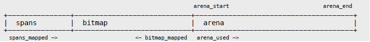
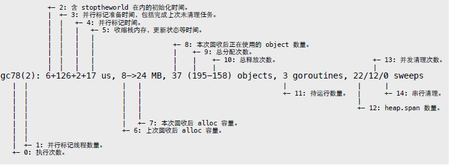
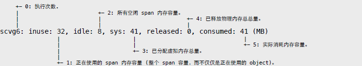
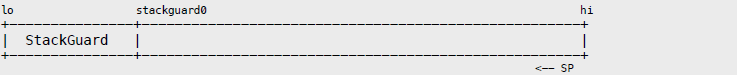
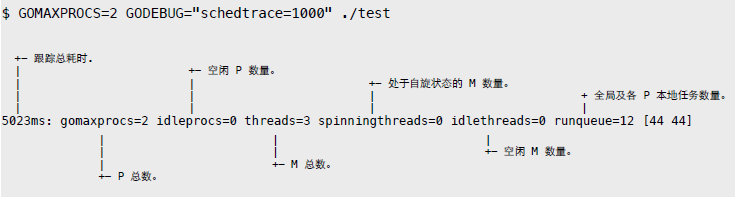

# 第二部分 源码

基于 Go 1.4，相关文件位于 src/runtime 目录。文章忽略了 32bit 代码，有兴趣的可自行查看源码文件。为便于阅读，示例代码做过裁剪。

# 1. Memory Allocator

Go 内存分配器基于 tcmalloc 模型，这在 malloc.h 头部注释中有明确说明。

```
Memory allocator, based on tcmalloc.
http://goog-perftools.sourceforge.net/doc/tcmalloc.html
```

核心目标很简单：

- 从 mmap 申请大块内存，自主管理，减少系统调用。
- 基于块的内存复用体系，加快内存分配和回收操作。

分配器以页为单位向操作系统申请大块内存。这些大块内存由 n 个地址连续的页组成，并用名为 span 的对象进行管理。

malloc.h

```
PageShift" = 13,
PageSize" = 1<<PageShift, // 8192 bytes
```

当需要时，span 所管理内存被切分成多个大小相等的小块，每个小块可存储一个对象，故称作 object。

分配器以 32KB 为界，将对象分为大小两种。

malloc.h

```
MaxSmallSize = 32<<10,
```

大对象直接找一个大小合适的 span，这个无需多言。小对象则以 8 的倍数分为不同大小等级 (size class)。比如 class1 为 8 字节，可存储 1 ~ 8 字节大小的对象。

```
NumSizeClasses = 67,
```

当然，实际的对应规则并不是连续和固定的，会根据一些经验和测试结果进行调整，以获得最佳的性能和内存利用率。

malloc.h

```
// Size classes. Computed and initialized by InitSizes.
//
// SizeToClass(0 <= n <= MaxSmallSize) returns the size class,
//" 1 <= sizeclass < NumSizeClasses, for n.
//" Size class 0 is reserved to mean "not small".
//
// class_to_size[i] = largest size in class i
// class_to_allocnpages[i] = number of pages to allocate when
//" making new objects in class i

int32" runtime·SizeToClass(int32);

extern"int32" runtime·class_to_size[NumSizeClasses];
extern"int32" runtime·class_to_allocnpages[NumSizeClasses];
extern"int8" runtime·size_to_class8[1024/8 + 1];
extern"int8" runtime·size_to_class128[(MaxSmallSize-1024)/128 + 1];
```

为了管理好内存，分配器使用三级组件来完成不同操作。

- heap: 全局根对象。负责向操作系统申请内存，管理由垃圾回收器收回的空闲 span 内存块。
- central: 从 heap 获取空闲 span，并按需要将其切分成 object 块。heap 管理着多个central 对象，每个 central 负责处理一种等级的内存分配需求。
- cache: 运行期，每个 cache 都与某个具体线程相绑定，实现无锁内存分配操作。其内部有个以等级为序号的数组，持有多个切分好的 span 对象。缺少空间时，向等级对应的 central 获取新的 span 即可。

简单描述一下内存分配和回收流程。

分配流程：

- 通过 size class 反查表计算待分配对象等级。
- 从 cache.alloc[sizeclass] 找到等级相同的 span。
- 从 span 切分好的链表中提取可用 object。
- 如 span 没剩余空间，则从 heap.central[sizeclass] 找到对应 central，获取 span。
- 如 central 没可用 span，则向 heap 申请，并切割成所需等级的 object 链表。
- 如 heap 也没有多余 span，那么就向操作系统申请新的内存。

回收流程：

- 垃圾回收器或其他行为引发内存回收操作。
- 将可回收 object 交还给所属 span。
- 将 span 交给对应 central 管理，以便某个 cache 重新获取。
- 如 span 内存全部收回，那么将其返还给 heap，以便被重新切分复用。
- 垃圾回收器定期扫描 heap 所管理的空闲 spans，释放超期不用的物理内存。

从 heap 申请和回收 span 的过程中，分配器会尝试合并地址相邻的 span 块，以形成更大内存块，减少碎片。

## 1.1 初始化

分配器管理算法依赖连续内存地址。因此，在初始化时，分配器会预留一块巨大的虚拟地址空间。该空间被成三个部分：

- arena: 用户内存实际分配范围。
- bitmap: 为每个地址提供 4bit 标记位，用于垃圾回收操作。
- spans: 记录每个页所对应 span 地址，用于反查和合并操作。



在 64 位系统下，arena 最大容量是 128GB，bitmap 8GB，spans 128MB。这些内存并非一次性分配，而是随着 arena 线性增加，每个区域都有指针标记当前分配位置。

malloc.h

```
struct MHeap
{
	// span lookup
	MSpan** spans;
	uintptr spans_mapped;

	// range of addresses we might see in the heap
	byte *bitmap;
	uintptr bitmap_mapped;
	byte *arena_start;
	byte *arena_used;
	byte *arena_end;
	bool arena_reserved;
};
```

虚拟地址预留操作并非物理内存分配，因此看到 “Hello, World” 消耗上百 GB “内存”，无需大惊小怪。

在运行时初始化时，会调用内存分配器初始化函数。

proc.c

```
void runtime·schedinit(void)
{
	runtime·mallocinit();
}
```

malloc.c

```
void runtime·mallocinit(void)
{
	// 初始化 size class 反查表。
	runtime·InitSizes();

	// 64-bit
	if(sizeof(void*) == 8 && (limit == 0 || limit > (1<<30))) {
		arena_size = MaxMem; // 128GB
		bitmap_size = arena_size / (sizeof(void*)*8/4); // 8GB
		spans_size = arena_size / PageSize * sizeof(runtime·mheap.spans[0]);
		spans_size = ROUND(spans_size, PageSize); // 128MB

		// 尝试从 0xc000000000 开始设置保留地址。
		// 如果失败，则尝试 0x1c000000000 ~ 0x7fc000000000。
		for(i = 0; i <= 0x7f; i++) {
			p = (void*)(i<<40 | 0x00c0ULL<<32);
			p_size = bitmap_size + spans_size + arena_size + PageSize;
			p = runtime·SysReserve(p, p_size, &reserved);
			if(p != nil)
				break;
		}
	}
	
	// 32-bit
	if (p == nil) {
		// 忽略
	}

	// 按 PageSize 对齐地址。
	// 分配器使用 Address<<PageShift 作为 PageID。
	p1 = (byte*)ROUND((uintptr)p, PageSize);

	// 设定不同区域的起始地址。
	runtime·mheap.spans = (MSpan**)p1;
	runtime·mheap.bitmap = p1 + spans_size;
	runtime·mheap.arena_start = p1 + spans_size + bitmap_size;
	runtime·mheap.arena_used = runtime·mheap.arena_start;
	runtime·mheap.arena_end = p + p_size;
	runtime·mheap.arena_reserved = reserved;

	// 初始化 heap 和当前 cache。
	runtime·MHeap_Init(&runtime·mheap);
	g->m->mcache = runtime·allocmcache();
}
```

内存地址预留操作通过 mmap PORT_NONE 实现。不过，在 darwin/OSX 中，并未使用 MAP_FIXED 参数，因此未必从 0xc000000000 开始。

mem_darwin.c

```
void* runtime·SysReserve(void *v, uintptr n, bool *reserved)
{
	void *p;

	*reserved = true;
	p = runtime·mmap(v, n, PROT_NONE, MAP_ANON|MAP_PRIVATE, -1, 0);
	if(p < (void*)4096)
		return nil;
	return p;
}
```

分配器根对象 heap 的初始化工作，主要是几个 span 管理链表和 central 数组的创建。

malloc.h

```
MaxMHeapList = 1<<(20 - PageShift), // Maximum page length for fixed-size list in MHeap.

struct MHeap
{
	MSpan free[MaxMHeapList]; // free lists of given length
	MSpan busy[MaxMHeapList]; // busy lists of large objects of given length

	MSpan freelarge; // free lists length >= MaxMHeapList
	MSpan busylarge; // busy lists of large objects length >= MaxMHeapList

	struct MHeapCentral {
		MCentral mcentral;
		byte pad[CacheLineSize];
	} central[NumSizeClasses];
};
```

其中，free 和 busy 数组以 span 页数为序号管理多个链表。当 central 有需要时，只需从 free 找到页数合适的链表，从中提取可用 span 即可。busy 记录的自然是已经被使用的 span。

至于 large 链表，用于保存所有超出 free/busy 页数限制的 span。

mheap.c

```
void runtime·MHeap_Init(MHeap *h)
{
	uint32 i;

	// 初始化一些管理类型的固定分配器。
	runtime·FixAlloc_Init(&h->spanalloc, sizeof(MSpan), RecordSpan, ...);
	runtime·FixAlloc_Init(&h->cachealloc, sizeof(MCache), ...);
	runtime·FixAlloc_Init(&h->specialfinalizeralloc, sizeof(SpecialFinalizer), ...);
	runtime·FixAlloc_Init(&h->specialprofilealloc, sizeof(SpecialProfile), ...);

	// 初始化 free/busy 数组。
	for(i=0; i<nelem(h->free); i++) {
		runtime·MSpanList_Init(&h->free[i]);
		runtime·MSpanList_Init(&h->busy[i]);
	}

	// 初始化 large 链表。
	runtime·MSpanList_Init(&h->freelarge);
	runtime·MSpanList_Init(&h->busylarge);

	// 创建所有等级的 central 对象。
	for(i=0; i<nelem(h->central); i++)
		runtime·MCentral_Init(&h->central[i].mcentral, i);
}
```

像 span、cache 这类管理对象，并不从 arena 区域分配，而是使用专门的 FixAlloc 分配器单独管理。其具体实现细节可参考后续章节。

在 span 内部有两个指针，用于将多个对象串成双向链表。

malloc.h

```
struct MSpan
{
	MSpan *next; // in a span linked list
	MSpan *prev; // in a span linked list

	pageID start; // starting page number
	uintptr npages; // number of pages in span
	MLink *freelist; // list of free objects

	uint8 sizeclass; // size class
	uint8 state; // MSpanInUse etc
	uintptr elemsize; // computed from sizeclass or from npages
};
```

mheap.c

```
void runtime·MSpanList_Init(MSpan *list)
{
	list->state = MSpanListHead;
	list->next = list;
	list->prev = list;
}
```

至于 central，同样是完成两个 span 管理链表的初始化操作。其中 nonempty 链表保存有剩余 object 空间，等待被 cache 获取的 span。而 empty 则保存没有剩余空间或已被 cache 获取的 span。

malloc.h

```
struct MCentral
{
	int32 sizeclass;
	MSpan nonempty; // list of spans with a free object
	MSpan empty; // list of spans with no free objects (or cached in an MCache)
};
```

mcentral.c

```
void runtime·MCentral_Init(MCentral *c, int32 sizeclass)
{
	c->sizeclass = sizeclass;
	runtime·MSpanList_Init(&c->nonempty);
	runtime·MSpanList_Init(&c->empty);
}
```

最后，用固定分配器创建 cache 对象，并初始化其 alloc 数组。

malloc.h

```
struct MCache
{
	MSpan* alloc[NumSizeClasses]; // spans to allocate from
};
```

mcache.c

```
// dummy MSpan that contains no free objects.
MSpan runtime·emptymspan;

MCache* runtime·allocmcache(void)
{
	// 使用固定分配器创建 cache 对象。
	c = runtime·FixAlloc_Alloc(&runtime·mheap.cachealloc);

	// 初始化内存。
	runtime·memclr((byte*)c, sizeof(*c));

	// 初始化 alloc 数组，用来保存从 central 获取的不同等级 span 对象。
	for(i = 0; i < NumSizeClasses; i++)
		c->alloc[i] = &runtime·emptymspan;

	return c;
}
```

## 1.2 分配流程

相关包装函数，最终通过 mallocgc 函数完成内存分配操作。

malloc.go

```
func newobject(typ *_type) unsafe.Pointer {
	return mallocgc(uintptr(typ.size), typ, flags)
}

func newarray(typ *_type, n uintptr) unsafe.Pointer {
	return mallocgc(uintptr(typ.size)*n, typ, flags)
}
```

在分配过程中，需要判断大小对象，还有对小于 16 字节的微小对象做额外处理。

malloc.h

```
MaxSmallSize = 32<<10,

TinySize = 16,
TinySizeClass = 2,
```

malloc.go

```
func mallocgc(size uintptr, typ *_type, flags uint32) unsafe.Pointer {
	// 当前 cache 对象。
	c := gomcache()

	var s *mspan
	var x unsafe.Pointer

	// 判断是否小对象。
	if size <= maxSmallSize {
		// 对于小于 16 字节的微小对象，做额外处理。
		if flags&flagNoScan != 0 && size < maxTinySize {
			// 获取当前 cache tiny 块剩余大小。
			tinysize := uintptr(c.tinysize)

			// 如果 tiny 块空间足够...
			if size <= tinysize {
				tiny := unsafe.Pointer(c.tiny)

				// 地址对齐。
				if size&7 == 0 {
					tiny = roundup(tiny, 8)
				} else if size&3 == 0 {
					tiny = roundup(tiny, 4)
				} else if size&1 == 0 {
					tiny = roundup(tiny, 2)
				}

				// 实际大小 = 对象大小 + 对齐所需大小(对齐后地址 - 原地址)。
				size1 := size + (uintptr(tiny) - uintptr(unsafe.Pointer(c.tiny)))

				// 再次判断空间是否足够...
				if size1 <= tinysize {
					// x = 对齐后地址
					x = tiny

					// 调整剩余空间记录。
					c.tiny = (*byte)(add(x, size))
					c.tinysize -= uintptr(size1)
					c.local_tinyallocs++

					return x
				}
			}

			// 如果 tiny 块空间不足，则从 alloc[2] 获取新的 tiny/object 块。
			s = c.alloc[tinySizeClass]
			v := s.freelist
			
			// 如果该 span 没有可用 object ...
			if v == nil {
			// 从 central 获取新的 span。
			mp := acquirem()
			mp.scalararg[0] = tinySizeClass
			onM(mcacheRefill_m)
			releasem(mp)

			// 获取 tiny/object 块。
			s = c.alloc[tinySizeClass]
			v = s.freelist
		}

		// 提取 tiny 块后，调整 span.freelist 链表。
		s.freelist = v.next
		s.ref++

		// 初始化 tiny 块内存。
		x = unsafe.Pointer(v)
		(*[2]uint64)(x)[0] = 0
		(*[2]uint64)(x)[1] = 0

		// 如果新 tiny 块剩余空间大于原 tiny 块，那么就换一下。
		if maxTinySize-size > tinysize {
			// 调整剩余位置指针和大小。
			c.tiny = (*byte)(add(x, size))
			c.tinysize = uintptr(maxTinySize - size)
		}
		size = maxTinySize
	} else { // 普通小对象
		var sizeclass int8

		// 计算对应的等级。
		if size <= 1024-8 {
			sizeclass = size_to_class8[(size+7)>>3]
		} else {
			sizeclass = size_to_class128[(size-1024+127)>>7]
		}
		size = uintptr(class_to_size[sizeclass])

		// 从 alloc 数组获取对应的 span。
		s = c.alloc[sizeclass]

		// 从 span 链表提取 object。
		v := s.freelist

		// 如果 span 没有剩余 object，则从 central 获取新的 span。
		if v == nil {
			mp := acquirem()
			mp.scalararg[0] = uintptr(sizeclass)
			onM(mcacheRefill_m)
			releasem(mp)
			s = c.alloc[sizeclass]
			v = s.freelist
		}

		// 调整 span 链表。
		s.freelist = v.next
		s.ref++

		// 初始化内存。
		x = unsafe.Pointer(v)
		if flags&flagNoZero == 0 {
			v.next = nil
			if size > 2*ptrSize && ((*[2]uintptr)(x))[1] != 0 {
				memclr(unsafe.Pointer(v), size)
			}
		}
	}
	c.local_cachealloc += intptr(size)
} else { // 大对象
	mp := acquirem()
	mp.scalararg[0] = uintptr(size)
	mp.scalararg[1] = uintptr(flags)

	// 直接从 heap 分配一个适用的 span。
	// onM 是切换到 M.g0 栈执行函数，相关细节参考后续章节。
	onM(largeAlloc_m)

	s = (*mspan)(mp.ptrarg[0])
	mp.ptrarg[0] = nil
	releasem(mp)
	x = unsafe.Pointer(uintptr(s.start << pageShift))
	size = uintptr(s.elemsize)
}

// 在 bitmap 做标记。
{
	arena_start := uintptr(unsafe.Pointer(mheap_.arena_start))
	off := (uintptr(x) - arena_start) / ptrSize
	xbits := (*uint8)(unsafe.Pointer(arena_start - off/wordsPerBitmapByte - 1))
	shift := (off % wordsPerBitmapByte) * gcBits

	// ...
}

marked:
	// 检查分配计数器，以决定是否触发垃圾回收操作。
	if memstats.heap_alloc >= memstats.next_gc {
		gogc(0)
	}

	return x
}
```

函数虽然有点长，但不算太复杂。

- 尽可能将微小对象组合到一个 16 字节的 tiny 块中，据说可提高性能。
- 小对象从 cache.alloc[] 找到等级相同的 span，并从其 freelist 链表获取 object。
- 大对象直接从 heap 分配。

malloc.h

```
struct MCache
{
	// Allocator cache for tiny objects w/o pointers.
	byte* tiny;
	uintptr tinysize;

	MSpan* alloc[NumSizeClasses]; // spans to allocate from
};
```

除基本的分配操作外，还需要关注内存不足时的 “扩张” 过程。这需要一点耐心和细心。

首先，当 cache.alloc[] 中对应的 span 没有剩余 object 时，会触发从 central 获取新span 操作。

malloc.c

```
void runtime·mcacheRefill_m(void)
{
	runtime·MCache_Refill(g->m->mcache, (int32)g->m->scalararg[0]);
}
```

mcache.c

```
MSpan* runtime·MCache_Refill(MCache *c, int32 sizeclass)
{
	MSpan *s;

	// 当前没有剩余空间的 span。
	s = c->alloc[sizeclass];
	if(s->freelist != nil)
		runtime·throw("refill on a nonempty span");

	// 取消 incache 标记。
	if(s != &runtime·emptymspan)
		s->incache = false;
	
	// 从 heap.central[] 数组找到对应的 central，并获取新的 span。
	s = runtime·MCentral_CacheSpan(&runtime·mheap.central[sizeclass].mcentral);

	// 保存到 cache.alloc 数组。
	c->alloc[sizeclass] = s;

	return s;
}
```

从 central 新获取的 span 会替代原有对象，被保存到 alloc 数组中。

需要提前说明一点背景知识：从 Go 1.3 开始，垃圾回收算法就有很大变动。其中标记阶段需要执行 StopTheWorld，然后用多线程并发执行标记操作。待标记结束后，立即恢复StartTheWorld，用单独的 goroutine 执行清理操作。

因此在执行 CacheSpan 时，某些 span 可能还未完成清理。此时主动触发回收操作，有助于提高内存复用率，避免向操作系统过度申请内存。

malloc.h

```
sweep generation:
if sweepgen == h->sweepgen - 2, the span needs sweeping
if sweepgen == h->sweepgen - 1, the span is currently being swept
if sweepgen == h->sweepgen, the span is swept and ready to use
h->sweepgen is incremented by 2 after every GC
```

mcentral.c

```
MSpan* runtime·MCentral_CacheSpan(MCentral *c)
{
	// 当前垃圾回收代龄 (随每次回收操作递增)。
	sg = runtime·mheap.sweepgen;
retry:
	// 尝试从 nonempty 链表中获取可用 span。
	for(s = c->nonempty.next; s != &c->nonempty; s = s->next) {
		// 如果 span 标记为等待回收，那么主动执行清理操作。
		if(s->sweepgen == sg-2 && runtime·cas(&s->sweepgen, sg-2, sg-1)) {
			// 将 span 移动到链表尾部。
			runtime·MSpanList_Remove(s);
			runtime·MSpanList_InsertBack(&c->empty, s);
			// 执行垃圾清理。
			runtime·MSpan_Sweep(s, true);
			goto havespan;
		}

		// 如果正在后台回收，则跳过。
		if(s->sweepgen == sg-1) {
			// the span is being swept by background sweeper, skip
			continue;
		}

		// 可用 span，将其转移到 empty 链表。
		runtime·MSpanList_Remove(s);
		runtime·MSpanList_InsertBack(&c->empty, s);
		goto havespan;
	}

	// 尝试从 emtpy 链表获取 span，目标是那些等待清理的 span。
	for(s = c->empty.next; s != &c->empty; s = s->next) {
		// 如果是等待回收的 span，主动执行回收操作。
		if(s->sweepgen == sg-2 && runtime·cas(&s->sweepgen, sg-2, sg-1)) {
			// 将该 span 移到 empty 链表尾部。
			runtime·MSpanList_Remove(s);
			runtime·MSpanList_InsertBack(&c->empty, s);

			// 执行垃圾清理操作。
			runtime·MSpan_Sweep(s, true);

			// 如果回收后 freelist 链表不为空，表示有可用空间。
			if(s->freelist != nil)
				goto havespan;
		
			goto retry;
		}

		// 如果正在后台回收，跳过。
		if(s->sweepgen == sg-1) {
			continue;
		}

		// 处理过的 span，其代龄都已经标记为 sg，终止尝试。
		break;
	}

	// 如果 central 中没有找到可用 span，则向 heap 获取新的 span。
	s = MCentral_Grow(c);
	if(s == nil)
		return nil;

	// 将 span 插入到 empty 链表。
	runtime·MSpanList_InsertBack(&c->empty, s);

havespan:
	// 设置待返回 span 的相关属性。
	cap = (s->npages << PageShift) / s->elemsize;
	n = cap - s->ref;

	// 标记被 cache 使用。
	s->incache = true;

	return s;
}
```

相比 Go 1.3，cache 部分又做了很大的改进。代码更加简洁，流程也更加清晰。

而当 central 空间不足时，就需要从 heap 获取新 span 来完成扩张操作。这其中就包括对 span 所管理内存进行切分，形成 object freelist 链表。

mcentral.c

```
static MSpan* MCentral_Grow(MCentral *c)
{
	MLink **tailp, *v;
	byte *p;
	MSpan *s;

	// 计算所需 span 的大小信息。
	npages = runtime·class_to_allocnpages[c->sizeclass];
	size = runtime·class_to_size[c->sizeclass];
	n = (npages << PageShift) / size;

	// 从 heap 获取 span。
	s = runtime·MHeap_Alloc(&runtime·mheap, npages, c->sizeclass, 0, 1);
	if(s == nil)
		return nil;

	// 将 span 所管理的内存切分成 freelist/object 链表。
	tailp = &s->freelist;
	p = (byte*)(s->start << PageShift); // 起始地址。PageID(start) = p >> PageShift
	s->limit = p + size*n;
	for(i=0; i<n; i++) {
		v = (MLink*)p;
		*tailp = v;
		tailp = &v->next;
		p += size;
	}
	*tailp = nil;

	// 标记。
	runtime·markspan((byte*)(s->start<<PageShift), size, n, ...));

	return s;
}
```

前面在 mallocgc 中提及的大对象分配，也是用的 MHeap_Alloc 函数。

malloc.c

```
void runtime·largeAlloc_m(void)
{
	size = g->m->scalararg[0];
	npages = size >> PageShift;

	s = runtime·MHeap_Alloc(&runtime·mheap, npages, 0, 1, !(flag & FlagNoZero));
	g->m->ptrarg[0] = s;
}
```

mheap.c

```
MSpan* runtime·MHeap_Alloc(MHeap *h, uintptr npage, int32 sizeclass, bool large, ...)
{
	// 判断是否在 g0 栈执行。
	if(g == g->m->g0) {
		s = mheap_alloc(h, npage, sizeclass, large);
	} else {
		...
	}

	return s;
}

static MSpan* mheap_alloc(MHeap *h, uintptr npage, int32 sizeclass, bool large)
{
	MSpan *s;

	// 如果垃圾回收操作未结束，那么尝试主动收回一些空间，以避免内存过度增长。
	// we need to sweep and reclaim at least n pages.
	if(!h->sweepdone)
		MHeap_Reclaim(h, npage);

	// 返回可用 span。
	s = MHeap_AllocSpanLocked(h, npage);
	if(s != nil) {
		// 标记代龄等状态。
		runtime·atomicstore(&s->sweepgen, h->sweepgen);
		s->state = MSpanInUse;
		s->freelist = nil;
		s->ref = 0;
		s->sizeclass = sizeclass;
		s->elemsize = (sizeclass==0 
		s->npages<<PageShift : runtime·class_to_size[sizeclass]);

		// 如果是大对象...
		if(large) {
			mstats.heap_objects++;
			mstats.heap_alloc += npage<<PageShift;

			// 根据页数，插入到合适的 busy 链表。
			if(s->npages < nelem(h->free))
				runtime·MSpanList_InsertBack(&h->busy[s->npages], s);
			else
				runtime·MSpanList_InsertBack(&h->busylarge, s);
		}
	}

	return s;
}
```

从 heap 获取 span 算法：

- 以页数为序号，从 free[] 提取链表，从中返回可用 span。
- 如链表为空，则继续从页数更大的链表中查找。
- 如 free[] 所有链表均没找到可用 span，就从 freelarge 链表中提取。
- 直到向操作系统申请新的 span 块。

mheap.c

```
static MSpan* MHeap_AllocSpanLocked(MHeap *h, uintptr npage)
{
	uintptr n;
	MSpan *s, *t;
	pageID p;

	// 以页数为序号，从 heap.free[] 中查找链表。
	// 如果当前链表没有可用 span，则从页数更大的链表中提取。
	for(n=npage; n < nelem(h->free); n++) {
		if(!runtime·MSpanList_IsEmpty(&h->free[n])) {
			s = h->free[n].next;
			goto HaveSpan;
		}
	}

	// 如果 free 所有链表都没找到合适的 span，则尝试更大的 large 链表。
	if((s = MHeap_AllocLarge(h, npage)) == nil) {
		// 还没找到，就只能新申请内存了。
		if(!MHeap_Grow(h, npage))
			return nil;

		// 重新查找合适的 span。
		// 每次向操作系统申请内存最少 1MB/128Pages，而 heap.free 最大下标 127，
		// 因此 FreeSpanLocked 函数会将其放到 freelarge 链表中。
		if((s = MHeap_AllocLarge(h, npage)) == nil)
			return nil;
	}

HaveSpan:
	// 将找到的 span 从 free 链表中移除。
	runtime·MSpanList_Remove(s);

	// 如果该 span 曾释放过物理内存，那么重新映射。
	if(s->npreleased > 0) {
		runtime·SysUsed((void*)(s->start<<PageShift), s->npages<<PageShift);
		mstats.heap_released -= s->npreleased<<PageShift;
		s->npreleased = 0;
	}

	// 如果返回的 span 页数多于需要 ...
	if(s->npages > npage) {
		// 新建一个 span 对象 t，用来管理尾部多余内存空间。
		t = runtime·FixAlloc_Alloc(&h->spanalloc);
		runtime·MSpan_Init(t, s->start + npage, s->npages - npage);

		// 调整实际所需的内存大小。
		s->npages = npage;
		p = t->start;
		p -= ((uintptr)h->arena_start>>PageShift);

		// 在 spans 区域标记 span 指针。
		if(p > 0)
			h->spans[p-1] = s;
		h->spans[p] = t;
		h->spans[p+t->npages-1] = t;

		// 将切出来的多余 span，重新放回 heap 管理链表中。
		MHeap_FreeSpanLocked(h, t, false, false);
		s->state = MSpanFree;
	}

	// 在 spans 中标记待所有页对应指针。
	p = s->start;
	p -= ((uintptr)h->arena_start>>PageShift);
	for(n=0; n<npage; n++)
		h->spans[p+n] = s;
	
	return s;
}
```

当找到的 span 大小超出预期时，分配器会执行切割操作，将多余的内存做成新 span 放回 heap 管理链表中。

从 large 里查找 span 的算法被称作 BestFit。很简单，通过循环遍历，找到大小最合适的目标。

mheap.c

```
MHeap_AllocLarge(MHeap *h, uintptr npage)
{
	return BestFit(&h->freelarge, npage, nil);
}

static MSpan* BestFit(MSpan *list, uintptr npage, MSpan *best)
{
	MSpan *s;

	for(s=list->next; s != list; s=s->next) {
		if(s->npages < npage)
			continue;
		if(best == nil
		|| s->npages < best->npages
		|| (s->npages == best->npages && s->start < best->start))
			best = s;
	}
	return best;
}
```

接着看看将 span 放回 heap 管理链表的 FreeSpanLocked 操作。

mheap.c

```
static void MHeap_FreeSpanLocked(MHeap *h, MSpan *s, bool acctinuse, bool acctidle)
{
	MSpan *t;
	pageID p;
	// 修正状态标记。
	s->state = MSpanFree;

	// 从当前链表中移除。
	runtime·MSpanList_Remove(s);

	// 这两个参数会影响垃圾回收的物理内存释放操作。
	s->unusedsince = runtime·nanotime();
	s->npreleased = 0;

	// 实际地址。
	p = s->start;
	p -= (uintptr)h->arena_start >> PageShift;

	// 通过 heap.spans 检查左侧相邻 span。
	// 如果左侧相邻 span 也是空闲状态，则合并。
	if(p > 0 && (t = h->spans[p-1]) != nil && t->state != MSpanInUse &&
			t->state != MSpanStack) {
		// 修正属性。
		s->start = t->start;
		s->npages += t->npages;
		s->npreleased = t->npreleased; // absorb released pages
		s->needzero |= t->needzero;

		// 新起始地址。
		p -= t->npages;

		// 重新标记 spans。
		h->spans[p] = s;

		// 释放左侧 span 原对象。
		runtime·MSpanList_Remove(t);
		t->state = MSpanDead;
		runtime·FixAlloc_Free(&h->spanalloc, t);
	}

	// 尝试合并右侧 span。
	if((p+s->npages)*sizeof(h->spans[0]) < h->spans_mapped &&
		(t = h->spans[p+s->npages]) != nil &&
		t->state != MSpanInUse && t->state != MSpanStack) {
	s->npages += t->npages;
	s->npreleased += t->npreleased;
	s->needzero |= t->needzero;
	h->spans[p + s->npages - 1] = s;
	runtime·MSpanList_Remove(t);
	t->state = MSpanDead;
	runtime·FixAlloc_Free(&h->spanalloc, t);
}
	// 根据 span 页数，插入到合适的链表中。
	if(s->npages < nelem(h->free))
		runtime·MSpanList_Insert(&h->free[s->npages], s);
	else
		runtime·MSpanList_Insert(&h->freelarge, s);
}
```

在此，我们看到了 heap.spans 的作用。合并零散内存块，以提供更大复用空间，这有助于减少内存碎片，是内存管理算法的一个重要设计目标。

最后，就是剩下如何向操作系统申请新的内存了。

malloc.h

```
HeapAllocChunk = 1<<20," " // Chunk size for heap growth
```

mheap.c

```
static bool MHeap_Grow(MHeap *h, uintptr npage)
{
	// 每次申请的内存总是 64KB 的倍数，最小 1MB。
	npage = ROUND(npage, (64<<10)/PageSize);
	ask = npage<<PageShift;
	if(ask < HeapAllocChunk)
		ask = HeapAllocChunk;

	// 申请内存。
	v = runtime·MHeap_SysAlloc(h, ask);

	// 创建新的 span 对象进行管理。
	s = runtime·FixAlloc_Alloc(&h->spanalloc);
	runtime·MSpan_Init(s, (uintptr)v>>PageShift, ask>>PageShift);
	p = s->start;
	p -= ((uintptr)h->arena_start>>PageShift);

	// 在 heap.spans 中标记地址。
	h->spans[p] = s;
	h->spans[p + s->npages - 1] = s;

	// 设置状态。
	runtime·atomicstore(&s->sweepgen, h->sweepgen);
	s->state = MSpanInUse;

	// 放回 heap 的管理链表，尝试执行合并操作。
	MHeap_FreeSpanLocked(h, s, false, true);
	return true;
}
```

申请时，需判断目标地址是否在 arena 范围内，且必须从 arena_used 开始。

malloc.c

```
void* runtime·MHeap_SysAlloc(MHeap *h, uintptr n)
{
	// 在 arena 范围内。
	if(n <= h->arena_end - h->arena_used) {
		// 使用 arena_used 地址。
		p = h->arena_used;
		runtime·SysMap(p, n, h->arena_reserved, &mstats.heap_sys);

		// 调整下一次分配位置。
		h->arena_used += n;

		// 同步增加 spans、bitmap 管理内存。
		runtime·MHeap_MapBits(h);
		runtime·MHeap_MapSpans(h);

		return p;
	}

	...
}
```

mem_linux.c

```
void runtime·SysMap(void *v, uintptr n, bool reserved, uint64 *stat)
{
	p = runtime·mmap(v, n, PROT_READ|PROT_WRITE, MAP_ANON|MAP_FIXED|MAP_PRIVATE, -1, 0);
}
```

mem_darwin.c

```
void runtime·SysMap(void *v, uintptr n, bool reserved, uint64 *stat)
{
	p = runtime·mmap(v, n, PROT_READ|PROT_WRITE, MAP_ANON|MAP_FIXED|MAP_PRIVATE, -1, 0);
}
```

至此，对象内存分配和内存扩展的步骤结束。

## 1.3 释放流程

垃圾回收器通过调用 MSpan_Sweep 函数完成内存回收操作。

mgc0.c

```
bool runtime·MSpan_Sweep(MSpan *s, bool preserve)
{
	// 当前垃圾回收代龄。
	sweepgen = runtime·mheap.sweepgen;

	arena_start = runtime·mheap.arena_start;

	// 获取 span 相关信息。
	cl = s->sizeclass;
	size = s->elemsize;
	if(cl == 0) {
		// 大对象。
		n = 1;
	} else {
		// 小对象。
		npages = runtime·class_to_allocnpages[cl];
		n = (npages << PageShift) / size;
	}

	res = false;
	nfree = 0;
	end = &head;
	c = g->m->mcache;
	sweepgenset = false;

	// 标记 freelist 里的 object，这些对象未被使用，无需再次检查。
	for(link = s->freelist; link != nil; link = link->next) {
		off = (uintptr*)link - (uintptr*)arena_start;
		bitp = arena_start - off/wordsPerBitmapByte - 1;
		shift = (off % wordsPerBitmapByte) * gcBits;
		*bitp |= bitMarked<<shift;
	}

	// 释放 finalizer、profiler 关联对象。
	specialp = &s->specials;
	special = *specialp;
	while(special != nil) {
		// ...
	}

	// 计算标记位开始位置。
	p = (byte*)(s->start << PageShift);
	off = (uintptr*)p - (uintptr*)arena_start;
	bitp = arena_start - off/wordsPerBitmapByte - 1;
	shift = 0;
	step = size/(PtrSize*wordsPerBitmapByte);
	bitp += step;
	if(step == 0) {
		// 8-byte objects.
		bitp++;
		shift = gcBits;
	}

	// 遍历该 span 所有 object。
	for(; n > 0; n--, p += size) {
		// 获取标记位。
		bitp -= step;
		if(step == 0) {
			if(shift != 0)
				bitp--;
			shift = gcBits - shift;
		}

	xbits = *bitp;
	bits = (xbits>>shift) & bitMask;

	// 如果 object 对象标记为可达 (Marked)，则跳过。
	// 包括 freelist 里的未使用对象。
	if((bits&bitMarked) != 0) {
		*bitp &= ~(bitMarked<<shift);
		continue;
	}

	// 重置标记位。
	*bitp = (xbits & ~((bitMarked|(BitsMask<<2))<<shift)) |
			((uintptr)BitsDead<<(shift+2));
	if(cl == 0) { // 大对象。
		// 清除全部标记位。
		runtime·unmarkspan(p, s->npages<<PageShift);

		// 重置代龄。
		runtime·atomicstore(&s->sweepgen, sweepgen);
		sweepgenset = true;

		if(runtime·debug.efence) {
			// ...
		} else
			// 将大对象所使用的 span 归还给 heap。
			runtime·MHeap_Free(&runtime·mheap, s, 1);

			// 调整 next_gc 阈值。
			runtime·xadd64(&mstats.next_gc,
				-(uint64)(size * (runtime·gcpercent + 100)/100));
			res = true;
		} else { // 小对象。
			// 将可回收对象添加到一个链表中。
			end->next = (MLink*)p;
			end = (MLink*)p;
			nfree++;
		}
	}

	// 如可回收小对象数量大于0。
	if(nfree > 0) {
		// 调整 next_gc 阈值。
		runtime·xadd64(&mstats.next_gc,
						-(uint64)(nfree * size * (runtime·gcpercent + 100)/100));

	// 释放收集的 object 链表。
	res = runtime·MCentral_FreeSpan(&runtime·mheap.central[cl].mcentral, s, nfree,head.next, end, preserve);
	}

	return res;
}
```

该回收函数在分配流程 CacheSpan 中也曾提及过。

大对象释放很简单，调用 FreeSpanLocked 将 span 重新放回 heap 管理链表即可。

mheap.c

```
void runtime·MHeap_Free(MHeap *h, MSpan *s, int32 acct)
{
	mheap_free(h, s, acct);
}

static void mheap_free(MHeap *h, MSpan *s, int32 acct)
{
	MHeap_FreeSpanLocked(h, s, true, true);
}
```

至于收集的所有小对象，会被追加到 span.freelist 链表。如该 span 收回全部 object，则也将其归还给 heap。

mcentral.c

```
bool runtime·MCentral_FreeSpan(MCentral *c, MSpan *s, int32 n, MLink *start, ...)
{
	// span 不能是 cache 正在使用的对象。
	if(s->incache)
		runtime·throw("freespan into cached span");

	// 将收集的 object 链表追加到 span.freelist。
	wasempty = s->freelist == nil;
	end->next = s->freelist;
	s->freelist = start;
	s->ref -= n;

	// 将 span 转移到 central.nonempty 链表。
	if(wasempty) {
		runtime·MSpanList_Remove(s);
		runtime·MSpanList_Insert(&c->nonempty, s);
	}

	// 重置回收代龄。
	runtime·atomicstore(&s->sweepgen, runtime·mheap.sweepgen);

	if(s->ref != 0) {
		return false;
	}

	// 如果 span 收回全部 object (span.ref == 0)，从 central 管理链表移除。
	runtime·MSpanList_Remove(s);
	s->needzero = 1;
	s->freelist = nil;

	// 清除标记位。
	runtime·unmarkspan((byte*)(s->start<<PageShift), s->npages<<PageShift);

	// 将 span 交还给 heap。
	runtime·MHeap_Free(&runtime·mheap, s, 0);
	return true;
}
```

释放操作最终结果，仅仅是将可回收对象归还给 span.freelist 或 heap.free 链表，以便后续分配操作复用。至于物理内存释放，则由垃圾回收器的特殊定时操作完成。

## 1.4 其他

除了用户内存，分配器还需额外的 span、cache 等对象来维持系统运转。这些管理对象所需内存不从 arena 区域分配，不占用与 GC Heap 分配算法有关的内存地址。

系统为每种管理对象初始化一个固定分配器 FixAlloc。

malloc.h

```
struct FixAlloc
{
	uintptr size; // 固定分配长度。
	void (*first)(void *arg, byte *p); // 关联函数。
	void* arg; // first 函数调用参数。
	MLink* list; // 可复用空间链表。
	byte* chunk; // 后备内存块当前分配指针。
	uint32 nchunk; // 后备内存块可用长度。
	uintptr inuse; // 后备内存块已使用长度。
};
```

mheap.c

```
void runtime·MHeap_Init(MHeap *h)
{
	runtime·FixAlloc_Init(&h->spanalloc, sizeof(MSpan), RecordSpan, ...);
	runtime·FixAlloc_Init(&h->cachealloc, sizeof(MCache), nil, ...);
	runtime·FixAlloc_Init(&h->specialfinalizeralloc, sizeof(SpecialFinalizer), ...);
	runtime·FixAlloc_Init(&h->specialprofilealloc, sizeof(SpecialProfile), ...);
}
```

FixAlloc 初始化过程很简单。

mfixalloc.c

```
void runtime·FixAlloc_Init(FixAlloc *f, uintptr size,
			void (*first)(void*, byte*), void *arg, uint64 *stat)
{
	f->size = size;
	f->first = first;
	f->arg = arg;
	f->list = nil;
	f->chunk = nil;
	f->nchunk = 0;
	f->inuse = 0;
	f->stat = stat;
}
```

分配算法和 cache 类似。首先从复用链表提取，如果没找到，就从后备内存块截取。

malloc.h

```
FixAllocChunk = 16<<10," " // Chunk size for FixAlloc
```

mfixalloc.c

```
void* runtime·FixAlloc_Alloc(FixAlloc *f)
{
	void *v;

	// 如果空闲链表不为空，直接从链表提取。
	if(f->list) {
		v = f->list;
		f->list = *(void**)f->list;
		f->inuse += f->size;
		return v;
	}

	// 如果后备内存块空间不足...
	if(f->nchunk < f->size) {
		// 重新申请 16KB 后备内存。
		f->chunk = runtime·persistentalloc(FixAllocChunk, 0, f->stat);
		f->nchunk = FixAllocChunk;
	}

	// 从后备内存块截取。
	v = f->chunk;

	// 执行 first 函数。
	if(f->first)
		f->first(f->arg, v);

	// 调整剩余后备块参数。
	f->chunk += f->size;
	f->nchunk -= f->size;
	f->inuse += f->size;

	return v;
}
```

后备内存块策略有点类似 heap span，申请大块内存以减少系统调用开销。实际上，不同类别的 FixAlloc 会共享一个超大块内存，称之为 persistent。

malloc.go

```
var persistent struct { // 全局变量，为全部 FixAlloc 提供后备内存块。
	lock mutex
	pos unsafe.Pointer
	end unsafe.Pointer
}

func persistentalloc(size, align uintptr, stat *uint64) unsafe.Pointer {
	const (
	chunk = 256 << 10
	maxBlock = 64 << 10 // VM reservation granularity is 64K on windows
	)

	// 如果需要 64KB 以上，直接从 mmap 返回。
	if size >= maxBlock {
		return sysAlloc(size, stat)
	}

	// 对齐分配地址。
	persistent.pos = roundup(persistent.pos, align)

	// 如果剩余空间不足 ...
	if uintptr(persistent.pos)+size > uintptr(persistent.end) {
		// 重新从 mmap 申请 256KB 内存，保存到 persistent。
		persistent.pos = sysAlloc(chunk, &memstats.other_sys)
		persistent.end = add(persistent.pos, chunk)
	}

	// 截取内存，调整下次分配地址。
	p := persistent.pos
	persistent.pos = add(persistent.pos, size)

	return p
}
```

mem_linux.c

```
void* runtime·sysAlloc(uintptr n, uint64 *stat)
{
	p = runtime·mmap(nil, n, PROT_READ|PROT_WRITE, MAP_ANON|MAP_PRIVATE, -1, 0);
	return p;
}
```

释放操作仅仅是将对象收回到复用链表。

mfixalloc.c

```
void runtime·FixAlloc_Free(FixAlloc *f, void *p)
{
	f->inuse -= f->size;
	*(void**)p = f->list;
	f->list = p;
}
```

另外，在 FixAlloc 初始化时，还可额外提供一个 first 函数作为参数，比如 spanalloc 中的 RecordSpan。

该函数为 heap.allspans 分配内存，其内存储了所有 span 指针，GC Sweep 和 Heap Dump 操作都会用到这些信息。

mheap.c

```
static void RecordSpan(void *vh, byte *p)
{
	MHeap *h;
	MSpan *s;
	MSpan **all;
	uint32 cap;

	h = vh;
	s = (MSpan*)p;
	
	// 如果空间不足 ...
	if(h->nspan >= h->nspancap) {
		// 计算新容量。
		cap = 64*1024/sizeof(all[0]);
		if(cap < h->nspancap*3/2)
			cap = h->nspancap*3/2;

		// 分配新空间。
		all = (MSpan**)runtime·sysAlloc(cap*sizeof(all[0]), &mstats.other_sys);
		if(h->allspans) {
			// 将数据拷贝到新分配空间。
			runtime·memmove(all, h->allspans, h->nspancap*sizeof(all[0]));

			// 释放原内存。
			if(h->allspans != runtime·mheap.gcspans)
				runtime·SysFree(h->allspans, h->nspancap*sizeof(all[0]),
					&mstats.other_sys);
		}

		// 指向新内存空间。
		h->allspans = all;
		h->nspancap = cap;
	}

	// 存储 span 指针。
	h->allspans[h->nspan++] = s;
}
```

# 2. Garbage Collector

精确垃圾回收，很经典的 Mark-and-Sweep 算法。

当分配 (malloc) 总量超出预设阈值，就会引发垃圾回收。操作前，须暂停用户逻辑执行(StopTheWorld)，然后启用多个线程执行并行扫描工作，直到标记出所有可回收对象。

从 Go 1.3 开始，默认采用并发内存清理模式。也就是说，标记结束后，立即恢复逻辑执行 (StartTheWorld)。用一个专门的 goroutine 在后台清理内存。这缩短了暂停时间，在一定程度上改善了垃圾回收所引发的问题。

完成清理后，新阈值通常是存活对象所用内存的 2 倍。需要注意的是，清理操作只是调用内存分配器的相关方法，收回不可达对象内存进行复用，并未释放物理内存。

物理内存释放由专门线程定期执行。它检查最后一次垃圾回收时间，如超过 2 分钟，则执行强制回收。还会让操作系统收回闲置超过 5 分钟的 span 物理内存。

## 2.1 初始化

初始化函数创建并行标记状态对象 markfor，读取 GOGC 环境变量值。

proc.c

```
void runtime·schedinit(void)
{
	runtime·gcinit();
}
```

mgc0.c

```
void runtime·gcinit(void)
{
	runtime·work.markfor = runtime·parforalloc(MaxGcproc);
	runtime·gcpercent = runtime·readgogc();
}

int32 runtime·readgogc(void)
{
	byte *p;

	p = runtime·getenv("GOGC");
	// 默认值 100。
	if(p == nil || p[0] == '\0')
		return 100;

	// 关闭垃圾回收。
	if(runtime·strcmp(p, (byte*)"off") == 0)
		return -1;
	
	return runtime·atoi(p);
}
```

## 2.2 垃圾回收

在内存分配器中提到过，函数 mallocgc 会检查已分配内存是否超过阈值，并以此触发垃圾回收操作。

malloc.go

```
func mallocgc(size uintptr, typ *_type, flags uint32) unsafe.Pointer {
	if memstats.heap_alloc >= memstats.next_gc {
		gogc(0)
	}
}
```

启动垃圾回收有三种不同方式。
- 0: 检查阈值来决定是否触发回收操作。
- 1: 强制回收。标记完成后，立即恢复用户逻辑执行，在后台并发执行清理操作。
- 2: 强制回收。在完成标记和清理操作前，不恢复用户逻辑执行。

malloc.go

```
func gogc(force int32) {
	// 如果 GOGC < 0，禁用垃圾回收，直接返回。
	if gp := getg(); gp == mp.g0 || mp.locks > 1 || !memstats.enablegc ||
					panicking != 0 || gcpercent < 0 {
		return
	}

	semacquire(&worldsema, false)

	// 普通回收，会再次检查是否达到回收阈值。
	if force == 0 && memstats.heap_alloc < memstats.next_gc {
		semrelease(&worldsema)
		return
	}

	// 准备回收 ...
	startTime := nanotime()
	mp = acquirem()
	mp.gcing = 1

	// 停止用户逻辑执行。
	onM(stoptheworld)

	// 清理 sync.Pool 的相关缓存对象，这个后面有专门的剖析章节。
	clearpools()

	// 如果设置环境变量 GODEBUG=gctrace=2，那么会引发两次回收操作。
	n := 1
	if debug.gctrace > 1 {
		n = 2
	}
	for i := 0; i < n; i++ {
		if i > 0 {
			startTime = nanotime()
		}

		// 将 64-bit 开始时间保存到 scalararg 。
		mp.scalararg[0] = uintptr(uint32(startTime)) // low 32 bits
		mp.scalararg[1] = uintptr(startTime >> 32) // high 32 bits

		// 清理行为标记。
		if force >= 2 {
			mp.scalararg[2] = 1 // eagersweep
		} else {
			mp.scalararg[2] = 0
		}

		// 在 g0 栈执行垃圾回收操作。
		onM(gc_m)
	}

	// 回收结束。
	mp.gcing = 0
	semrelease(&worldsema)

	// 恢复用户逻辑执行。
	onM(starttheworld)
}
```

总体逻辑倒不复杂，StopTheWorld -> GC -> StartTheWorld。暂时抛开周边细节，看看垃圾回收流程。

mgc0.c

```
void runtime·gc_m(void)
{
	a.start_time = (uint64)(g->m->scalararg[0]) | ((uint64)(g->m->scalararg[1]) << 32);
	a.eagersweep = g->m->scalararg[2];
	gc(&a);
}

static void gc(struct gc_args *args)
{
	// 如果前次回收的清理操作未完成，那么先把这事结束了。
	while(runtime·sweepone() != -1)
		runtime·sweep.npausesweep++;

	// 为回收操作准备相关环境状态。
	runtime·mheap.gcspans = runtime·mheap.allspans;
	runtime·work.spans = runtime·mheap.allspans;
	runtime·work.nspan = runtime·mheap.nspan;
	
	runtime·work.nwait = 0;
	runtime·work.ndone = 0;
	runtime·work.nproc = runtime·gcprocs();

	// 初始化并行标记状态对象 markfor。
	// 使用 nproc 个线程执行并行标记任务。
	// 任务总数 = 固定内存段(RootCount) + 当前 goroutine G 的数量。
	// 标记函数 markroot。
	runtime·parforsetup(runtime·work.markfor, runtime·work.nproc,
		RootCount + runtime·allglen, nil, false, markroot);
	if(runtime·work.nproc > 1) {
		// 重置结束标记。
		runtime·noteclear(&runtime·work.alldone);
		// 唤醒 nproc - 1 个线程准备执行 markroot 函数，因为当前线程也会参与标记工作。
		runtime·helpgc(runtime·work.nproc);
	}

	// 让当前线程也开始执行标记任务。
	gchelperstart();
	runtime·parfordo(runtime·work.markfor);
	scanblock(nil, 0, nil);

	if(runtime·work.nproc > 1)
		// 休眠，等待标记全部结束。
		runtime·notesleep(&runtime·work.alldone);

	// 收缩 stack 内存。
	runtime·shrinkfinish();

	// 更新所有 cache 统计参数。
	cachestats();

	// 计算上一次回收后 heap_alloc 大小。
	// 当前 next_gc = heap0 + heap0 * (gcpercent/100)
	// 那么 heap0 = next_gc / (1 + gcpercent/100)
	heap0 = mstats.next_gc*100/(runtime·gcpercent+100);

	// 计算下一次 next_gc 阈值。
	// 这个值只是预估，会随着清理操作而改变。
	mstats.next_gc = mstats.heap_alloc+mstats.heap_alloc*runtime·gcpercent/100;
	runtime·atomicstore64(&mstats.last_gc, runtime·unixnanotime());

	// 目标是 heap.allspans 里的所有 span 对象。
	runtime·mheap.gcspans = runtime·mheap.allspans;
	// GC 使用递增的代龄来表示 span 当前回收状态。
	runtime·mheap.sweepgen += 2;
	runtime·mheap.sweepdone = false;
	runtime·work.spans = runtime·mheap.allspans;
	runtime·work.nspan = runtime·mheap.nspan;
	runtime·sweep.spanidx = 0;

	if(ConcurrentSweep && !args->eagersweep) { // 并发清理
		// 新建或唤醒用于清理操作的 goroutine。
		if(runtime·sweep.g == nil)
			runtime·sweep.g = runtime·newproc1(&bgsweepv, nil, 0, 0, gc);
		else if(runtime·sweep.parked) {
			runtime·sweep.parked = false;
			runtime·ready(runtime·sweep.g); // 唤醒
		}
	} else { // 串行回收
		// 立即执行清理操作。
		while(runtime·sweepone() != -1)
			runtime·sweep.npausesweep++;
	}
}
```

算法的核心是并行回收和是否启用一个 goroutine 来执行清理操作。这个 goroutine 在清理操作结束后被冻结，再次使用前必须唤醒。

如果用专门的 goroutine 执行清理操作，那么 gc 函数不等清理操作结束就立即返回，上级的 gogc 会立即调用 StartTheWorld 恢复用户逻辑执行，这就是并发回收的关键。

我们回过头，看看一些中间环节的实现细节。

在设置并行回收状态对象 markfor 里提到过两个参数：任务总数和标记函数。

mgc0.c

```
enum {
	RootCount = 5
}
```

任务总数其实是 5 个根内存段 RootData、RootBBS、RootFinalizers、RootSpans、RootFlushCaches，外加所有 goroutine stack 的总和。

mgc0.c

```
static void markroot(ParFor *desc, uint32 i)
{
	switch(i) {
	case RootData:
		...
		break;
	
	case RootBss:
		...
		break;

	case RootFinalizers:
		...
		break;

	case RootSpans:
		...
		break;

	case RootFlushCaches:
		flushallmcaches(); // 清理 cache、stack。
		break;
	
	default:
		gp = runtime·allg[i - RootCount];
		runtime·shrinkstack(gp); // 收缩 stack。
		scanstack(gp);
		...
		break;
	}
}
```

核心算法 scanblock 函数通过扫描内存块，找出存活对象和可回收对象，并在 bitmap 区域进行标记。具体实现细节，本文不做详述，有兴趣可自行阅读源码或相关论文。

那么 parfor 是如何实现并行回收的呢？

这里面有个很大误导。其实 parfor 实现非常简单，仅是一个状态对象，核心是将要执行的多个任务序号平均分配个多个线程。

parfor.c

```
struct ParForThread
{
	// the thread's iteration space [32lsb, 32msb)
	uint64 pos;
};

void runtime·parforsetup(ParFor *desc, uint32 nthr, uint32 n, void *ctx, bool wait,
						void (*body)(ParFor*, uint32))
{
	uint32 i, begin, end;
	uint64 *pos;

	desc->body = body; // 任务函数
	desc->nthr = nthr; // 并发线程数量
	desc->thrseq = 0;
	desc->cnt = n; // 任务总数

	// 为线程平均分配任务编号。
	// 比如 10 个任务分配给 5 个线程，那么 thr[0] 就是 [0,2)，也就是 0 和 1 这两个任务。
	// 起始和结束编号分别保存在 ParForThread.pos 字段的高低位。
	for(i=0; i<nthr; i++) {
		begin = (uint64)n*i / nthr;
		end = (uint64)n*(i+1) / nthr;
		pos = &desc->thr[i].pos;
		*pos = (uint64)begin | (((uint64)end)<<32);
	}
}
```

现在任务被平均分配，并保存到全局变量 markfor 里。接下来的操作，其实是由被唤醒的线程主动完成，如同当前 GC 主线程主动调用 parfordo 一样。

执行标记任务的多个线程由 helpgc 函数唤醒，其中的关键就是设置 M.helpgc 标记。

proc.c

```
void runtime·helpgc(int32 nproc)
{
	pos = 0;

	// 从 1 开始，因为当前线程也会参与标记任务。
	for(n = 1; n < nproc; n++) {
		// 检查 P 是否被当前线程使用，如果是就跳过。
		if(runtime·allp[pos]->mcache == g->m->mcache)
			pos++;
	
		// 获取空闲线程。
		mp = mget();

		// 这是关键，线程唤醒后会检查该标记。
		mp->helpgc = n;

		// 为线程分配用户执行的 P.cache。
		mp->mcache = runtime·allp[pos]->mcache;
		pos++;

		// 唤醒线程。
		runtime·notewakeup(&mp->park);
	}
}
```

如果你熟悉线程 M 的工作方式，那么就会知道它通过 stopm 完成休眠操作。

proc.c

```
static void stopm(void)
{
	// 放回空闲队列。
	mput(g->m);
	// 休眠，直到被唤醒。
	runtime·notesleep(&g->m->park);

	// 被唤醒后，清除休眠标记。
	runtime·noteclear(&g->m->park);

	// 检查 helpgc 标记，执行 gchelper 函数。
	if(g->m->helpgc) {
		runtime·gchelper();
		g->m->helpgc = 0;
		g->m->mcache = nil;
		goto retry;
	}
}
```

mgc0.c

```
void runtime·gchelper(void)
{
	gchelperstart();
	runtime·parfordo(runtime·work.markfor);
	scanblock(nil, 0, nil);

	// 检查标记是否全部结束。
	nproc = runtime·work.nproc;
	if(runtime·xadd(&runtime·work.ndone, +1) == nproc-1)
		// 唤醒 GC 主线程。
		runtime·notewakeup(&runtime·work.alldone);

	g->m->traceback = 0;
}
```

最终和 GC 主线程调用过程一致。当 alldone 被唤醒后，GC 主线程恢复后续步骤执行。

至于被线程调用的 parfordo，其实也很简单。

parfor.c

```
void runtime·parfordo(ParFor *desc)
{
	// 每次调用，都会递增 thrseq 值。
	tid = runtime·xadd(&desc->thrseq, 1) - 1;

	// 如果任务线程数量为 1，那么没什么好说的，直接循环执行 body，也就是 markroot。
	if(desc->nthr==1) {
		for(i=0; i<desc->cnt; i++)
			desc->body(desc, i);
		return;
	}

	body = desc->body;

	// 用 tid 作为当前线程的编号，以此提取任务范围值。
	me = &desc->thr[tid];
	mypos = &me->pos;

	for(;;) {
		// 先完成自己的任务。
		for(;;) {
			// 递增当前任务范围的开始编号。
			pos = runtime·xadd64(mypos, 1);
			// 注意：只有低32位被修改，高32位结束编号不变。
			begin = (uint32)pos-1;
			end = (uint32)(pos>>32);

			// 如果小于结束编号，循环。
			if(begin < end) {
				// 执行 markroot 标记函数。
				body(desc, begin);
				continue;
			}
			break;
		}

		// 尝试从其他线程偷点任务过来，以便尽快完成所有标记操作。
		idle = false;
		for(try=0;; try++) {
			// 如果长时间没有偷到任务，设置结束标记。
			// increment the done counter...
			if(try > desc->nthr*4 && !idle) {
				idle = true;
				runtime·xadd(&desc->done, 1);
			}

			// 如果所有线程都结束，那么退出。
			if(desc->done + !idle == desc->nthr) {
				if(!idle)
					runtime·xadd(&desc->done, 1);
				goto exit;
			}

			// 随机选择一个线程任务。
			victim = runtime·fastrand1() % (desc->nthr-1);
			if(victim >= tid)
				victim++;
			victimpos = &desc->thr[victim].pos;

			for(;;) {
				// 偷取任务。
				pos = runtime·atomicload64(victimpos);
				begin = (uint32)pos;
				end = (uint32)(pos>>32);
				if(begin+1 >= end) {
					begin = end = 0;
					break;
				}
				if(idle) {
					runtime·xadd(&desc->done, -1);
					idle = false;
				}
				begin2 = begin + (end-begin)/2;
				newpos = (uint64)begin | (uint64)begin2<<32;
				if(runtime·cas64(victimpos, pos, newpos)) {
					begin = begin2;
					break;
				}
			}

			// 成功偷到任务...
			if(begin < end) {
				// 添加到自己的任务列表中。
				runtime·atomicstore64(mypos, (uint64)begin | (uint64)end<<32);
				// 返回外层循环，上面的任务处理代码再次被激活。
				break;
			}

			// ...
		}
	}
exit:
	// ...
}
```

每个线程调用 parfordo 的时候，都拿到一个递增的唯一 thrseq 编号，并以此获得事先由 parforsetup 分配好的任务段。接下来，自然是该线程循环执行分配给自己的所有任务，任务编号被传递给 markroot 作为选择目标的判断条件。

在完成自己的任务后，尝试分担其他线程任务，以尽快完成全部任务。这种 steal 算法，在运行时的很多地方都有体现，算是并行开发的一个 “标准” 做法了。

至此，并行标记的所有秘密被揭开，我们继续探究清理操作过程。

不管是并发还是串行清理，最终都是调用 sweepone 函数。

mgc0.c

```
static FuncVal bgsweepv = {runtime·bgsweep};
```

mgc0.go

```
func bgsweep() {
	for {
		for gosweepone() != ^uintptr(0) {
			sweep.nbgsweep++
			Gosched()
		}

		if !gosweepdone() {
			continue
		}

		// 设置休眠标志。
		sweep.parked = true

		// 休眠当前清理 goroutine。
		goparkunlock(&gclock, "GC sweep wait")
	}
}
```

mgc0.c

```
uintptr runtime·gosweepone(void)
{
	void (*fn)(void);

	fn = sweepone_m;
	runtime·onM(&fn);
	return g->m->scalararg[0];
}

static void sweepone_m(void)
{
	g->m->scalararg[0] = runtime·sweepone();
}
```

清理函数实现很简洁，每次找到一个待清理的 span，然后调用 span_sweep 收回对应的内存，这在内存分配器的释放过程中已经说得很清楚了。

mgc0.c

```
uintptr runtime·sweepone(void)
{
	// 当前代龄，清理前 += 2。
	sg = runtime·mheap.sweepgen;

	// 循环扫描所有 spans。
	for(;;) {
		idx = runtime·xadd(&runtime·sweep.spanidx, 1) - 1;

		// 结束判断。
		if(idx >= runtime·work.nspan) {
			runtime·mheap.sweepdone = true;
			return -1;
		}

		// 获取 span。
		s = runtime·work.spans[idx];

		// 如果不是正在使用的 span，无需清理。
		if(s->state != MSpanInUse) {
			s->sweepgen = sg;
			continue;
		}

		// 如果不是待清理 span，跳过。
		if(s->sweepgen != sg-2 || !runtime·cas(&s->sweepgen, sg-2, sg-1))
continue;

		npages = s->npages;

		// 清理。
		if(!runtime·MSpan_Sweep(s, false))
			npages = 0;

		return npages;
	}
}
```

最后剩下的，就是 StopTheWorld 和 StartTheWorld 如何停止和恢复用户逻辑执行。因这会涉及一些 Goroutine Scheduler 知识，您可以暂时跳过，等看完后面的相关章节再回头研究。

proc.c

```
void runtime·stoptheworld(void)
{
	runtime·lock(&runtime·sched.lock);

	// 计数器。
	runtime·sched.stopwait = runtime·gomaxprocs;

	// 设置关键停止标记。
	runtime·atomicstore((uint32*)&runtime·sched.gcwaiting, 1);

	// 在所有运行的 goroutine 上设置抢占标志。
	preemptall();

	// 设置当前 P 的状态。
	g->m->p->status = Pgcstop; // Pgcstop is only diagnostic.
	runtime·sched.stopwait--;

	// 设置所有处理系统调用 P 的状态。
	for(i = 0; i < runtime·gomaxprocs; i++) {
		p = runtime·allp[i];
		s = p->status;
		if(s == Psyscall && runtime·cas(&p->status, s, Pgcstop))
			runtime·sched.stopwait--;
	}

	// 设置所有空闲 P 状态。
	while(p = pidleget()) {
		p->status = Pgcstop;
		runtime·sched.stopwait--;
	}

	wait = runtime·sched.stopwait > 0;
	runtime·unlock(&runtime·sched.lock);

	// 等待所有 P 停止。
	if(wait) {
		for(;;) {
			// 等待 100us，直到休眠标记被唤醒。
			if(runtime·notetsleep(&runtime·sched.stopnote, 100*1000)) {
				// 清除休眠标记。
				runtime·noteclear(&runtime·sched.stopnote);
				break;
			}
			// 再次发出抢占标记。
			preemptall();
		}
	}
}
```

从代码上来看，StopTheWorld 只是设置了一些标记，包括抢占行为也不过是在在运行的 goroutine 上设置抢占标记。具体这些标记是如何让正在运行的 goroutine 暂停的呢？

如果了解 goroutine 运行机制，必然知道它总是循环执行 schedule 函数，在这个函数头部会检查 gcwaiting 标记，并以此停止当前任务执行。

proc.c

```
static void schedule(void)
{
	// 检查 gcwaiting 标记，停止当前任务执行。
	if(runtime·sched.gcwaiting) {
		gcstopm();
	}
	...
}

static void gcstopm(void)
{
	// 释放关联的 P。
	p = releasep();
	runtime·lock(&runtime·sched.lock);
	p->status = Pgcstop;

	// 递减计数器，直到唤醒.
	if(--runtime·sched.stopwait == 0)
		runtime·notewakeup(&runtime·sched.stopnote);
	
	runtime·unlock(&runtime·sched.lock);
	stopm();
}
```

这样一来，所有正在执行的 goroutine 会被放回队列，相关任务线程也被休眠。至于发出抢占标记，是为了让一直处于忙碌状态的 goroutine 有机会检查停止标记。

反过来，StartTheWorld 就是恢复这些被停止的任务，并唤醒线程继续执行。

proc.c

```
void runtime·starttheworld(void)
{
	...

	// 重置标记。
	runtime·sched.gcwaiting = 0;

	p1 = nil;

	// 循环所有 P。
	while(p = pidleget()) {
		// 如果该 P 没有任务，那么放回空闲队列。
		// 因为没有任务的 P 被放在列表尾部，故无需继续遍历。
		if(p->runqhead == p->runqtail) {
			pidleput(p);
			break;
		}

		// 关联一个空闲 M 线程。
		p->m = mget();

		// 将准备工作的 P 串成链表。
		p->link = p1;
		p1 = p;
	}

	// 唤醒 sysmon。
	if(runtime·sched.sysmonwait) {
		runtime·sched.sysmonwait = false;
		runtime·notewakeup(&runtime·sched.sysmonnote);
	}

	runtime·unlock(&runtime·sched.lock);

	// 遍历准备工作的 P。
	while(p1) {
		p = p1;
		p1 = p1->link;

		// 检查并唤醒关联线程 M。
		if(p->m) {
			mp = p->m;
			runtime·notewakeup(&mp->park);
		} else {
			// 如果没有关联线程，新建。
			newm(nil, p);
			add = false;
		}
	}

	// ...
}
```

垃圾回收操作虽然关联很多东西，但我们基本理清了它的运作流程。如同在分配器一章中所说，垃圾回收只是将回收内存，并没有释放空闲的物理内存。

## 2.3 内存释放

在 main goroutine 入口，运行时使用一个专用线程运行 sysmon 操作。

proc.go

```
// The main goroutine.
func main() {
	...

	onM(newsysmon)
	...

	main_init()
	main_main()
}
```

proc.c

```
void runtime·newsysmon(void)
{
	newm(sysmon, nil);
}
```

在 sysmon 里面会定时启动强制垃圾回收和物理内存释放操作。

proc.c

```
static void sysmon(void)
{
	// 如果超过 2 分钟没有运行 gc，则强制回收。
	forcegcperiod = 2*60*1e9;

	// 如果空闲 span 超过 5 分钟未被使用，则释放其关联物理内存。
	scavengelimit = 5*60*1e9;

	for(;;) {
		runtime·usleep(delay);

		// 启动强制垃圾回收。
		lastgc = runtime·atomicload64(&mstats.last_gc);
		if(lastgc != 0 && unixnow - lastgc > forcegcperiod && ...) {
			runtime·forcegc.idle = 0;
			runtime·forcegc.g->schedlink = nil;

			// 将强制垃圾回收 goroutine 放回任务队列。
			injectglist(runtime·forcegc.g);
		}

		// 启动物理内存释放操作。
		if(lastscavenge + scavengelimit/2 < now) {
			runtime·MHeap_Scavenge(nscavenge, now, scavengelimit);
			lastscavenge = now;
			nscavenge++; // 计数器。
		}
	}
}
```

先说强制垃圾回收操作，这个神秘的 forcegc.g 从何而来？

proc.go

```
// start forcegc helper goroutine
func init() {
	go forcegchelper()
}
```

依照 Go 语言规则，这个 init 初始化函数会被 main goroutine 执行，它创建了一个用来执行强制回收操作的 goroutine。

proc.go

```
func forcegchelper() {
	forcegc.g = getg()
	forcegc.g.issystem = true

	for {
		// 休眠该 goroutine。
		// park 会暂停 goroutine，但不会放回待运行队列。
		goparkunlock(&forcegc.lock, "force gc (idle)")

		// 唤醒后，执行强制垃圾回收。
		gogc(1)
	}
}
```

这个 forcegc.g 会循环执行，每次完成后休眠，直到被 sysmon 重新返回任务队列。

为什么要定期运行强制回收？试想一下，假设回收后已分配内存是 1GB，那么下次回收阈值就是 2GB，这可能导致很长时间无法触发回收操作。这就存在很大的内存浪费，所以强制回收是非常必要的。

接下来看看如何释放物理内存，这是另外一个关注焦点。

heap.c

```
void runtime·MHeap_Scavenge(int32 k, uint64 now, uint64 limit)
{
	h = &runtime·mheap;

	// 保存本次释放的物理内存数量。
	sumreleased = 0;

	// 循环处理 heap.free 里的空闲 span。
	for(i=0; i < nelem(h->free); i++)
		sumreleased += scavengelist(&h->free[i], now, limit);

	// 处理 heap.freelarge 里的空闲 span。
	sumreleased += scavengelist(&h->freelarge, now, limit);
}
```

释放操作的目标自然是 heap 里的那些空闲 span 内存块。

mheap.c

```
static uintptr scavengelist(MSpan *list, uint64 now, uint64 limit)
{
	sumreleased = 0;

	// 遍历 span 链表。
	for(s=list->next; s != list; s=s->next) {
		// 条件:
		// 未使用时间超过 5 分钟;
		// 已释放物理内存页数不等于 span 总页数 (未释放或部分释放);
		if((now - s->unusedsince) > limit && s->npreleased != s->npages) {
			// 待释放页数。为什么不是全部？
			released = (s->npages - s->npreleased) << PageShift;

			mstats.heap_released += released;
			sumreleased += released;

			// 现在整个 span.npages 都会被释放。
			s->npreleased = s->npages;

			runtime·SysUnused((void*)(s->start << PageShift), s->npages << PageShift);
		}
	}

	return sumreleased;
}
```

至于 npreleased != npages 的问题，先得看看 SysUnused 做了什么。

mem_linux.c

```
void runtime·SysUnused(void *v, uintptr n)
{
	runtime·madvise(v, n, MADV_DONTNEED);
}
```

mem_darwin.c

```
void runtime·SysUnused(void *v, uintptr n)
{
	// Linux's MADV_DONTNEED is like BSD's MADV_FREE.
	runtime·madvise(v, n, MADV_FREE);
}
```

对 Linux、darwin 等系统而言，MADV_DONTNEED、MADV_FREE 告诉操作系统，这段物理内存暂时不用，可解除 MMU 映射。再次使用时，由操作系统重新建立映射。

注意，尽管物理内存被释放了，但这个 span 管理对象依旧存活，它所占用的虚拟内存并未释放，依然会和左右相邻进行合并。这就是 npreleased 可能不等于 npages 的关键。

另外，在 Windows 系统下，事情有点特殊，它不支持类似 MADV_DONTNEED 行为。

mem_windows.c

```
void runtime·SysUnused(void *v, uintptr n)
{
	r = runtime·stdcall3(runtime·VirtualFree, (uintptr)v, n, MEM_DECOMMIT);
}
```

显然，VirtualFree 会释放掉 span 管理的虚拟内存。因此，从 heap 获取 span 时需要重新分配内存。

mheap.c

```
static MSpan* MHeap_AllocSpanLocked(MHeap *h, uintptr npage)
{
	if(s->npreleased > 0) {
		runtime·SysUsed((void*)(s->start<<PageShift), s->npages<<PageShift);
		mstats.heap_released -= s->npreleased<<PageShift;
		s->npreleased = 0;
	}
}
```

mem_windows.c

```
void runtime·SysUsed(void *v, uintptr n)
{
	r = runtime·stdcall4(runtime·VirtualAlloc, (uintptr)v, n, MEM_COMMIT,
						PAGE_READWRITE);
}
```

除了 Windows 系统，其他 Unix-Like 系统的 SysUsed 什么都不做。

mem_linux.c

```
void runtime·SysUsed(void *v, uintptr n)
{
	USED(v);
	USED(n);
}
```

mem_darwin.c

```
void runtime·SysUsed(void *v, uintptr n)
{
	USED(v);
	USED(n);
}
```

除自动回收外，还可手工调用 debug/FreeOSMemory 释放物理内存。

mgc0.go

```
func freeOSMemory() {
	gogc(2) // force GC and do eager sweep
	onM(scavenge_m)
}
```

mheap.c

```
void runtime·scavenge_m(void)
{
	runtime·MHeap_Scavenge(-1, ~(uintptr)0, 0); // ~(uintptr)0 = 18446744073709551615
}
```

这个调用的参数，now 是比当前实际时间大得多的整数，而 limit 是 0。这意味这所有的空闲 span 都过期，都会被释放物理内存。

## 2.4 状态输出

与内存和垃圾回收相关的状态对象。

malloc.h

```
struct MStats
{
	// General statistics.
	uint64 alloc; // 正在使用的 object 容量 (malloc)。
	uint64 total_alloc; // 历史分配总量，含已释放内存。
	uint64 sys; // 当前消耗的内存总量，包括 heap、fixalloc 等。
	uint64 nmalloc; // 分配操作次数。
	uint64 nfree; // 释放操作次数。

	// Statistics about malloc heap.
	uint64 heap_alloc; // 同 alloc，在使用的 object 容量。
	uint64 heap_sys; // 当前消耗的 heap 内存总量 (mmap-munmap, inuse+idle)。
	uint64 heap_idle; // 空闲 span 容量。
	uint64 heap_inuse; // 正在使用 span 容量。
	uint64 heap_released; // 交还给操作系统的物理内存容量。
	uint64 heap_objects; // 正在使用的 object 数量。

	// Statistics about garbage collector.
	uint64 next_gc; // 下次垃圾回收阈值。
	uint64 last_gc; // 上次垃圾回收结束时间。
	uint32 numgc; // 垃圾回收次数。
};
```

统计状态更新函数。

mgc0.c

```
void runtime·updatememstats(GCStats *stats)
{
	// 重置状态对象。
	if(stats)
		runtime·memclr((byte*)stats, sizeof(*stats));
	
	for(mp=runtime·allm; mp; mp=mp->alllink) {
		if(stats) {
			src = (uint64*)&mp->gcstats;
			dst = (uint64*)stats;
			for(i=0; i<sizeof(*stats)/sizeof(uint64); i++)
				dst[i] += src[i];
			runtime·memclr((byte*)&mp->gcstats, sizeof(mp->gcstats));
		}
	}

	// FixAlloc 正在使用内存统计。
	mstats.mcache_inuse = runtime·mheap.cachealloc.inuse;
	mstats.mspan_inuse = runtime·mheap.spanalloc.inuse;

	// 从系统获取的内存总量 (mmap-munmap)。
	mstats.sys = mstats.heap_sys + mstats.stacks_sys + mstats.mspan_sys +
		mstats.mcache_sys + mstats.buckhash_sys + mstats.gc_sys + mstats.other_sys;

	mstats.alloc = 0;
	mstats.total_alloc = 0;
	mstats.nmalloc = 0;
	mstats.nfree = 0;
	for(i = 0; i < nelem(mstats.by_size); i++) {
		mstats.by_size[i].nmalloc = 0;
		mstats.by_size[i].nfree = 0;
	}

	// 将所有 P.cache.alloc 所持有的 spans 归还给 central。
	if(g == g->m->g0)
		flushallmcaches();
	else {
		fn = flushallmcaches_m;
		runtime·mcall(&fn);
	}

	// 更新 cache 统计。
	cachestats();

	// 统计所有 spans 里正在使用的 object。
	for(i = 0; i < runtime·mheap.nspan; i++) {
		s = runtime·mheap.allspans[i];
		if(s->state != MSpanInUse)
			continue;

		// 统计活跃的 object。
		if(s->sizeclass == 0) {
			mstats.nmalloc++;
			mstats.alloc += s->elemsize;
		} else {
			mstats.nmalloc += s->ref;
			mstats.by_size[s->sizeclass].nmalloc += s->ref;
			mstats.alloc += s->ref*s->elemsize;
		}
	}

	// 按 size class 统计累计分配和释放次数。
	smallfree = 0;
	mstats.nfree = runtime·mheap.nlargefree;
	for(i = 0; i < nelem(mstats.by_size); i++) {
		mstats.nfree += runtime·mheap.nsmallfree[i];
		mstats.by_size[i].nfree = runtime·mheap.nsmallfree[i];
		mstats.by_size[i].nmalloc += runtime·mheap.nsmallfree[i];
		smallfree += runtime·mheap.nsmallfree[i] * runtime·class_to_size[i];
	}
	mstats.nfree += mstats.tinyallocs;
	mstats.nmalloc += mstats.nfree;

	// 总分配容量 = 正在使用 object + 已释放容量。
	mstats.total_alloc = mstats.alloc + runtime·mheap.largefree + smallfree;
	mstats.heap_alloc = mstats.alloc;
	mstats.heap_objects = mstats.nmalloc - mstats.nfree;
}
```

标准库 runtime.ReadMemStats 函数可刷新并读取该状态数据。

启用环境变量 GODEBUG="gotrace=1" 可输出垃圾回收相关状态信息，这有助于对程序运行状态进行监控，是常见的一种测试手段。

第一类输出信息来自垃圾回收函数。

mgc0.c

```
static void gc(struct gc_args *args)
{
	t0 = args->start_time;

	// 第 1 阶段: 包括 stoptheworld、clearpools 在内的初始化时间。

	if(runtime·debug.gctrace)
		t1 = runtime·nanotime();

	// 第 2 阶段: 标记前的准备时间。包括完成上次未结束的清理操作，准备并行标记环境等。

	if(runtime·debug.gctrace)
		t2 = runtime·nanotime();

	// 第 3 阶段: 并行标记。

	if(runtime·debug.gctrace)
		t3 = runtime·nanotime();

	// 第 4 阶段: 收缩栈内存，更新统计信息。

	t4 = runtime·nanotime();

	if(runtime·debug.gctrace) {
		heap1 = mstats.heap_alloc;
		runtime·updatememstats(&stats);
		obj = mstats.nmalloc - mstats.nfree;

		runtime·printf(
			"gc%d(%d):" // 0, 1
			" %D+%D+%D+%D us," // 2, 3, 4, 5
			" %D -> %D MB," // 6, 7
			" %D (%D-%D) objects," // 8, 9, 10
			" %d goroutines," // 11
			" %d/%d/%d sweeps," // 12, 13, 14
			...,
			mstats.numgc, // 0: GC 执行次数。
			runtime·work.nproc, // 1: 并行标记线程数量。
			(t1-t0)/1000, // 2: 含 StopTheWorld 在内的初始化时间。
			(t2-t1)/1000, // 3: 并行标记准备时间，包括上次未完成清理任务。
			(t3-t2)/1000, // 4: 并行标记时间。
			(t4-t3)/1000, // 5: 收缩栈内存，更新状态等时间。
			heap0>>20, // 6: 上次回收后 alloc 容量。
			heap1>>20, // 7: 本次回收后 alloc 容量。
			obj, // 8: 本次回收后正在使用的 object 数量。
			mstats.nmalloc, // 9: 总分配次数。
			mstats.nfree, // 10: 总释放次数。
			runtime·gcount(), // 11: 待运行 Goroutine 任务数量。
			runtime·work.nspan, // 12: heap.spans 数量。
			runtime·sweep.nbgsweep, // 13: 本次并发清理 span 次数。
			runtime·sweep.npausesweep, // 14: 本次串行清理 span 次数。
			...
		);
	}
}
```


		
在并发清理模式下，信息输出时，清理工作尚未完成，因此标出的容量信息并不准确，只能通过多次输出结果进行大概评估。

第二类信息来自物理内存释放函数。

mheap.c

```
void runtime·MHeap_Scavenge(int32 k, uint64 now, uint64 limit)
{
	if(runtime·debug.gctrace > 0) {
		// 本次释放的物理内存容量。
		if(sumreleased > 0)
			runtime·printf("scvg%d: %D MB released\n", k, (uint64)sumreleased>>20);
		runtime·printf(
			"scvg%d: " // 0
			"inuse: %D, " // 1
			"idle: %D, " // 2
			"sys: %D, " // 3
			"released: %D, " // 4
			"consumed: %D (MB)\n", // 5

		k, // 0: 释放次数。
		mstats.heap_inuse>>20, // 1: 正在使用的 spans 容量。
		mstats.heap_idle>>20, // 2: 空闲 spans 容量。
		mstats.heap_sys>>20, // 3: 当前 heap 虚拟内存总容量。
		mstats.heap_released>>20, // 4: 已释放物理内存总容量。
		(mstats.heap_sys - mstats.heap_released)>>20 // 5: 实际消耗内存容量。
		);
	}
}
```




现代操作系统通常会采用机会主义分配策略。内核虽然承诺分配内存，但实际并不会立即分配物理内存。只有在发生读写操作时，内核才会把之前承诺的内存转换为物理内存。而且也不是一次性完成，而是以页的方式逐步分配，按需执行页面请求调度和写入时复制。

所以，相关输出结果更多表示虚拟内存分配值，且和具体操作系统也有很大关系。

# 3. Goroutine Scheduler

调度器是运行时最核心的内容，其基本理论建立在三种基本对象上。

首先，每次 go 关键词调用都会创建一个 goroutine 对象，代表 G 并发任务。其次，所有 G 任务都由系统线程执行，这些线程被称作 M。

每个 G 对象都有自己的独立栈内存。当 M 执行任务时，从 G 用来保存执行现场的字段中恢复相关寄存器值即可。当 M 需要切换任务时，将寄存器值保存回当前 G 对象，然后从另一 G 对象中恢复，如此实现线程多路复用。

G 初始化栈内存只有几 KB 大小，按需扩张、收缩。这种轻量级设计开销极小，可轻松创建成千上万的并发任务。

除此之外，还有抽象处理器 P，其数量决定了 G 并发任务数量。每个运行 M 都必须获取并绑定一个 P 对象，如同线程必须被调度到某个 CPU Core 才能执行。P 还为 M 提供内存分配器缓存和 G 任务队列等执行资源。

通常情况下，P 数量在初始化时确定，运行时基本固定，但 M 的数量未必和 P 对应。例如，某 M 因系统调用长时间阻塞，其关联 P 就会被运行时收回。然后，调度器会唤醒或新建 M 去执行其他排队任务。失去 P 的 M 被休眠，直到被重新唤醒。

## 3.1 初始化

由汇编代码实现的 bootstrap 过程。

rt0_linux_amd64.s

```
TEXT _rt0_amd64_linux(SB),NOSPLIT,$-8
	LEAQ 8(SP), SI // argv
	MOVQ 0(SP), DI // argc
	MOVQ $main(SB), AX
	JMP AX

TEXT main(SB),NOSPLIT,$-8
	MOVQ $runtime·rt0_go(SB), AX
	JMP AX
```

要确定这个很简单，随便找个可执行文件，然后反汇编 entry point 即可。

```
(gdb) info files
Local exec file:
	Entry point: 0x437940

(gdb) disass 0x437940
Dump of assembler code for function _rt0_amd64_linux:
```

现在可以确定初始化调用由 rt0_go 汇编完成。

amd_asm64.s

```
TEXT runtime·rt0_go(SB),NOSPLIT,$0
	LEAQ runtime·g0(SB), CX
	LEAQ runtime·m0(SB), AX

	MOVQ CX, m_g0(AX) // save m->g0 = g0
	MOVQ AX, g_m(CX) // save m0 to g0->m

	CALL runtime·args(SB)
	CALL runtime·osinit(SB)
	CALL runtime·schedinit(SB)

	// create a new goroutine to start program
	MOVQ $runtime·main·f(SB), BP // entry
	PUSHQ BP
	PUSHQ $0 // arg size
	CALL runtime·newproc(SB)
	POPQ AX
	POPQ AX

	// start this M
	CALL runtime·mstart(SB)

	MOVL $0xf1, 0xf1 // crash
	RET
```

按图索骥，可以看到初始化过程相关的几个函数都做了什么。

runtime.h

```
MaxGomaxprocs = 1<<8, // The max value of GOMAXPROCS.
```

proc.c

```
void runtime·schedinit(void)
{
	// 设置最大 M 线程数，超出会导致进程崩溃。
	runtime·sched.maxmcount = 10000;

	// 初始化内存分配器。
	runtime·mallocinit();

	// 获取命令行参数、环境变量。
	runtime·goargs();
	runtime·goenvs();

	// 垃圾回收器初始化。
	runtime·gcinit();

	// 初始化 P。
	procs = 1;
	p = runtime·getenv("GOMAXPROCS");
	if(p != nil && (n = runtime·atoi(p)) > 0) {
		if(n > MaxGomaxprocs)
			n = MaxGomaxprocs;
		procs = n;
	}
	procresize(procs);
}
```

其中内存分配器、垃圾回收器前面都已研究过，此处不多费唇舌。现在需要关心是 procs 这个最关键的 goroutine 并发控制参数。

proc.c

```
SchedT runtime·sched; // 调度器实例。
int32 runtime·gomaxprocs; // 当前 GOMAXPROCS 值。
P* runtime·allp[MaxGomaxprocs+1]; // 存储所有的 P 对象，最多 256 个实例。
```

proc.c

```
static void procresize(int32 new)
{
	old = runtime·gomaxprocs;

	// 初始化新 P 对象。
	for(i = 0; i < new; i++) {
		p = runtime·allp[i];

		// 新建 P。
		if(p == nil) {
			p = runtime·newP();
			p->id = i;
			p->status = Pgcstop;
			runtime·atomicstorep(&runtime·allp[i], p);

		}

		// 创建 P.cache。
		if(p->mcache == nil) {
			if(old==0 && i==0)
				p->mcache = g->m->mcache; // bootstrap
			else
				p->mcache = runtime·allocmcache();
		}
	}

	// 将 old P 里面的任务重新分布。
	empty = false;
	while(!empty) {
		empty = true;

		// 内层 for 循环遍历所有 old P，每次从中取一个 G 任务。
		// 外层 while 循环重复该过程，如此所有先生成的 G 会保存到全局队列的前面，FIFO。
		for(i = 0; i < old; i++) {
			p = runtime·allp[i];
	
			// 检查 P 的 G 任务队列。
			if(p->runqhead == p->runqtail)
				continue;
	
			empty = false;
	
			// 获取尾部最后一个 G。
			p->runqtail--;
			gp = p->runq[p->runqtail%nelem(p->runq)];
	
			// 将 G 添加到全局任务链表。
			gp->schedlink = runtime·sched.runqhead;
			runtime·sched.runqhead = gp;
			if(runtime·sched.runqtail == nil)
				runtime·sched.runqtail = gp;
			runtime·sched.runqsize++;
		}
	}

	// 将最多 new * (256/2) 个任务转移到 P 本地队列。
	for(i = 1; i < new * nelem(p->runq)/2 && runtime·sched.runqsize > 0; i++) {
		gp = runtime·sched.runqhead;
		runtime·sched.runqhead = gp->schedlink;
		if(runtime·sched.runqhead == nil)
			runtime·sched.runqtail = nil;
		runtime·sched.runqsize--;
		runqput(runtime·allp[i%new], gp);
	}

	// 如果 new < old，"释放" 掉多余的 P 对象。
	for(i = new; i < old; i++) {
		p = runtime·allp[i];
		runtime·freemcache(p->mcache);
		p->mcache = nil;
		gfpurge(p);
		p->status = Pdead;
		// can't free P itself because it can be referenced by an M in syscall
	}

	// 关联 P 到当前 M。
	p = runtime·allp[0];
	acquirep(p);

	// 将其他 P 放到空闲队列。
	for(i = new-1; i > 0; i--) {
		p = runtime·allp[i];
		p->status = Pidle;
		pidleput(p);
	}

	runtime·atomicstore((uint32*)&runtime·gomaxprocs, new);
}
```

待运行的 G 任务保存在 P 本地队列和全局队列中，因此增加或减少 P 数量都需要重新分布这些任务。还须确保先生成的 G 任务优先放到队列头部，以优先执行。

在完成调度器初始化后，创建新 goroutine 运行 main 函数。

proc.go

```
// The main goroutine.
func main() {
	// 当前 G。
	g := getg()
	
	// 确定最大栈内存大小。
	if ptrSize == 8 {
		maxstacksize = 1000000000 // 1 GB
	} else {
		maxstacksize = 250000000 // 250 MB
	}

	// 使用单独线程运行 sysmon。
	onM(newsysmon)
	runtime_init()
	main_init()
	main_main()

	// 终止进程。
	exit(0)
}
```

## 3.2 创建任务

编译器会将每条 go func 语句编译成 newproc 函数调用，创建 G 对象。

反编译一个简单的示例。

test.go

```
package main

import ()

func main() {
	go println("Hello, World!")
}
```

```
(gdb) disass main.main
Dump of assembler code for function main.main:
	0x000000000000202f <+47>:" lea rcx,[rip+0xff582] # 0x1015b8 <main.print.1.f>
	0x0000000000002036 <+54>:" push rcx
	0x0000000000002037 <+55>:" push 0x10
	0x0000000000002039 <+57>:" call 0x2e880 <runtime.newproc>
```

先熟悉 G 里面几个常见的字段成员。

runtime.h

```
struct Stack
{
	uintptr lo; // 栈内存开始地址。
	uintptr hi; // 结束地址。
};

struct Gobuf
{
	uintptr sp; // 对应 SP 寄存器。
	uintptr pc; // IP/PC 寄存器。
	void* ctxt;
	uintreg ret;
	uintptr lr; // ARM LR 寄存器。
};

struct G
{
	Stack stack; // 自定义栈。
	uintptr stackguard0; // 栈溢出检查边界。
	Gobuf sched; // 执行现场。
	G* schedlink; // 链表。
};
```

跟踪 newproc 的调用过程，最终目标是 newproc1。

proc.c

```
G* runtime·newproc1(FuncVal *fn, byte *argp, int32 narg, int32 nret, void *callerpc)
{
	siz = narg + nret;
	siz = (siz+7) & ~7; // 8 字节对齐

	// 当前 P。
	p = g->m->p;

	// 获取可复用的空闲 G 对象，或新建。
	if((newg = gfget(p)) == nil) {
		newg = runtime·malg(StackMin);
		runtime·casgstatus(newg, Gidle, Gdead);

		// 添加到 allg 全局变量。
		runtime·allgadd(newg);
	}

	// 将参数和返回值入栈。
	sp = (byte*)newg->stack.hi;
	sp -= 4*sizeof(uintreg);
	sp -= siz;
	runtime·memmove(sp, argp, narg);

	// thechar 5 代表 ARM，在 arch_xxx.h 中定义。
	// 因为 ARM 需要额外保存 Caller's LR 寄存器值。
	if(thechar == '5') {
		// caller's LR
		sp -= sizeof(void*);
		*(void**)sp = nil;
	}
	// 在 sched 里保存执行现场参数。
	runtime·memclr((byte*)&newg->sched, sizeof newg->sched);
	newg->sched.sp = (uintptr)sp;
	newg->sched.pc = (uintptr)runtime·goexit + PCQuantum;
	newg->sched.g = newg;

	// 这个调用很关键，不过我们在后面详说。
	runtime·gostartcallfn(&newg->sched, fn);

	newg->gopc = (uintptr)callerpc;
	runtime·casgstatus(newg, Gdead, Grunnable);

	// 将生成的 G 对象放到 P 本地队列或全局队列。
	runqput(p, newg);

	// 如果有空闲 P，且没有处于自旋状态的 M ...
	if(runtime·atomicload(&runtime·sched.npidle) != 0 &&
		runtime·atomicload(&runtime·sched.nmspinning) == 0 &&
		fn->fn != runtime·main)
		// 唤醒一个休眠的 M，或新建。
		wakep();

	return newg;
}
```

提取可复用 G 对象，将参数、返回值入栈，设置执行现场的寄存器值。最后，放到待运行队列等待被 M 执行。

P 使用 gfree 链表存储可复用 G 对象，这很好理解。除本地复用链表外，还有一个全局复用链表。当某 P 本地链表过长时，就转移一部分到全局链表，以供其他 P 使用。

runtime.h

```
struct SchedT
{
	// Global cache of dead G's. (任务结束，复用对象)
	G* gfree;
	int32 ngfree;
};

struct P
{
	// Available G's (status == Gdead)
	G* gfree;
	int32 gfreecnt;
};
```

proc.c

```
static G* gfget(P *p)
{
	G *gp;
	void (*fn)(G*);

retry:
	// 从 P 本地链表获取一个可复用 G 对象。
	gp = p->gfree;

	// 如果为空，转向全局链表。
	if(gp == nil && runtime·sched.gfree) {
		// 从全局链表提取一些复用对象到本地，直到填满 32 个。
		while(p->gfreecnt < 32 && runtime·sched.gfree != nil) {
			p->gfreecnt++;
			gp = runtime·sched.gfree;
			runtime·sched.gfree = gp->schedlink;
			runtime·sched.ngfree--;
			gp->schedlink = p->gfree;
			p->gfree = gp;
		}

		// 填充后再从本地链表获取。
		goto retry;
	}

	// 如果找到可复用 G 对象。
	if(gp) {

	// 调整本地链表。
	p->gfree = gp->schedlink;
	p->gfreecnt--;

	// 检查自定义栈。
	if(gp->stack.lo == 0) {
		// 重新分配栈内存。
		if(g == g->m->g0) {
			gp->stack = runtime·stackalloc(FixedStack);
		} else {
			g->m->scalararg[0] = FixedStack;
			g->m->ptrarg[0] = gp;
			fn = mstackalloc;
			runtime·mcall(&fn);
			g->m->ptrarg[0] = nil;
		}

		// 设置栈顶。
		gp->stackguard0 = gp->stack.lo + StackGuard;

		}
	}
	
	return gp;
}
```

暂时不去理会自定义栈，后面有专门的章节说明这个问题。

没有可复用对象时，新建。

proc.c

```
G* runtime·malg(int32 stacksize)
{
	G *newg;
	void (*fn)(G*);

	// 新建 G 对象。
	newg = allocg();

	// 分配自定义栈内存。
	if(stacksize >= 0) {
		stacksize = runtime·round2(StackSystem + stacksize);
		if(g == g->m->g0) {
			newg->stack = runtime·stackalloc(stacksize);
		} else {
			g->m->scalararg[0] = stacksize;
			g->m->ptrarg[0] = newg;
			fn = mstackalloc;
			runtime·mcall(&fn);
			g->m->ptrarg[0] = nil;
		}
		newg->stackguard0 = newg->stack.lo + StackGuard;
		newg->stackguard1 = ~(uintptr)0;
	}
	return newg;
}

static G* allocg(void)
{
	return runtime·newG();
}
```

proc.go

```
func newG() *g {
	return new(g)
}
```

新建 G 对象被添加到全局变量 allg。

proc.c

```
Slice runtime·allgs; // Go Slice。
G** runtime·allg; // 当前所有 G 对象，包括完成任务，等待复用的。
uintptr runtime·allglen; // 数量。
```

proc.go

```
func allgadd(gp *g) {
	allgs = append(allgs, gp)
	allg = &allgs[0]
	allglen = uintptr(len(allgs))
}
```

所有参数设置好后，G 对象所代表的并发任务被放入待运行队列。

runtime.h

```
struct SchedT
{
	// Global runnable queue. (待运行任务)
	G* runqhead;
	G* runqtail;
	int32 runqsize;
};

struct P
{
	// Queue of runnable goroutines. (用数组实现的环状队列)
	uint32 runqhead;
	uint32 runqtail;
	G* runq[256];
};
```

proc.c

```
static void runqput(P *p, G *gp)
{
	uint32 h, t;

retry:
	// 很典型的数组环状队列实现。
	// 累加 head、tail 位置计数器，然后取模获取实际存储索引。
	h = runtime·atomicload(&p->runqhead);
	t = p->runqtail;
	if(t - h < nelem(p->runq)) {
		p->runq[t%nelem(p->runq)] = gp;
		runtime·atomicstore(&p->runqtail, t+1);
		return;
	}

	// 如果本地队列已满，则放入全局待运行队列。
	if(runqputslow(p, gp, h, t))
		return;
	goto retry;
}

static bool runqputslow(P *p, G *gp, uint32 h, uint32 t)
{
	// 从本地队列提取一半待运行 G 任务。
	n = t-h;
	n = n/2;
	for(i=0; i<n; i++)
		batch[i] = p->runq[(h+i)%nelem(p->runq)];

	// 调整本地队列位置。
	if(!runtime·cas(&p->runqhead, h, h+n))
		return false;

	// 添加当前 G。
	batch[n] = gp;

	// 链表结构。
	for(i=0; i<n; i++)
		batch[i]->schedlink = batch[i+1];

	// 将这一批 G 放到全局队列。
	globrunqputbatch(batch[0], batch[n], n+1);
	return true;
}

static void globrunqputbatch(G *ghead, G *gtail, int32 n)
{
	// 直接将链表附加到全局链表尾部。
	gtail->schedlink = nil;
	if(runtime·sched.runqtail)
		runtime·sched.runqtail->schedlink = ghead;
	else
		runtime·sched.runqhead = ghead;
	runtime·sched.runqtail = gtail;
	runtime·sched.runqsize += n;
}
```

两个队列采用了不同的设计。本地队列长度固定，用数组自然是效率最高。而全局队列长度未知，只能用链表实现。

调度器在很多地方都采用两级队列设计，本地队列是为了当前线程无锁获取资源，而全局队列则是为了在多个 P/M 间进行平衡。当 P 管理的对象数量过多时就会上交一部分到全局，反过来，就从全局提取一批到本地。总之，最终目的是为了更好地复用内存，更快地完成任务执行。

## 3.3 任务线程

不管语言层面如何抽象，所有 G 任务总归要由线程执行，每个系统线程对应一个 M。

runtime.h

```
struct M
{
	G* g0; // 运行时管理栈。
	void (*mstartfn)(void); // 启动函数，比如执行 sysmon。
	
	G* curg; // 当前运行的 G。
	P* p; // 当前关联的 P。
	P* nextp; // 临时存放获取的 P，用于后续任务。
	
	Note park; // 休眠标记。
	
	M* alllink; // 全局 allm 链表。
};
```

先了解 M 的创建过程。

proc.c

```
static void newm(void(*fn)(void), P *p)
{
	// 创建 M 对象。
	mp = runtime·allocm(p);
	
	// 设置待绑定 P 和启动函数。
	mp->nextp = p;
	mp->mstartfn = fn;
	
	// 创建系统线程。
	runtime·newosproc(mp, (byte*)mp->g0->stack.hi);
}

M* runtime·allocm(P *p)
{
	mp = runtime·newM();

	// 初始化。
	mcommoninit(mp);

	// 创建一个 G，用于初始化 g0 栈。
	if(runtime·iscgo || Solaris || Windows || Plan9)
		mp->g0 = runtime·malg(-1);
	else
		mp->g0 = runtime·malg(8192);
	mp->g0->m = mp;

	return mp;
}
```

调度器会检查 M 总数，如超出限制会导致进程崩溃。默认 10000，多数时候无需关心，也可调用 debug/SetMaxThreads 修改。

proc.c

```
static void mcommoninit(M *mp)
{
	// 增加计数器，设置 ID。
	mp->id = runtime·sched.mcount++;

	// 检查系统当前 M 总数，如果超出限制，引发进程崩溃。
	checkmcount();

	// 添加到全局链表。
	mp->alllink = runtime·allm;
	runtime·atomicstorep(&runtime·allm, mp);
}

static void checkmcount(void)
{
	if(runtime·sched.mcount > runtime·sched.maxmcount){
		runtime·printf("runtime: program exceeds %d-thread limit\n",
			runtime·sched.maxmcount);
		runtime·throw("thread exhaustion");
	}	
}
```

最关键的是 newosproc 创建系统线程。

os_linux.c

```
void runtime·newosproc(M *mp, void *stk)
{
	flags = CLONE_VM /* share memory */
		| CLONE_FS /* share cwd, etc */
		| CLONE_FILES /* share fd table */
		| CLONE_SIGHAND /* share sig handler table */
		| CLONE_THREAD; /* revisit - okay for now */

	ret = runtime·clone(flags, stk, mp, mp->g0, runtime·mstart);
}
```

os_darwin.c

```
void runtime·newosproc(M *mp, void *stk)
{
	errno = runtime·bsdthread_create(stk, mp, mp->g0, runtime·mstart);
}
```

我们看到了线程函数 mstart，这是后面要跟踪的目标。

M 有个很神秘的 g0 成员，它被传递给 newosproc 作为线程栈内存，用来执行运行时管理指令，以避免在 G 用户栈上切换上下文。

假如 M 线程直接使用 G 栈，那么就不能在执行管理操作时将它放回队列，也不能转交给其他 M 执行，那会导致多个线程共用栈内存。同样不能执行用户栈的扩张或收缩操作。因此，在执行管理指令前，必须将线程栈切换到 g0。

在前面章节中时常出现的 onM、mcall 就是用 g0 来执行管理命令。

runtime.h

```
struct M
{
	uintptr scalararg[4]; // scalar argument/return for mcall
	void* ptrarg[4]; // pointer argument/return for mcall
};
```

asm_amd64.s

```
TEXT runtime·mcall(SB), NOSPLIT, $0-8
	MOVQ fn+0(FP), DI // DI 保存要运行的管理函数指针。

	// 保存当前 G 执行现场。
	get_tls(CX)
	MOVQ g(CX), AX // save state in g->sched
	MOVQ 0(SP), BX // caller's PC
	MOVQ BX, (g_sched+gobuf_pc)(AX)
	LEAQ fn+0(FP), BX // caller's SP
	MOVQ BX, (g_sched+gobuf_sp)(AX)
	MOVQ AX, (g_sched+gobuf_g)(AX)

	// 切换到 g0 栈，执行管理函数。
	MOVQ g(CX), BX // g
	MOVQ g_m(BX), BX // g.m
	MOVQ m_g0(BX), SI // m.g0
	MOVQ SI, g(CX) // g = m->g0
	MOVQ (g_sched+gobuf_sp)(SI), SP // sp = m->g0->sched.sp
	PUSHQ AX
	MOVQ DI, DX
	MOVQ 0(DI), DI
	CALL DI // fn arg
	RET
```

在创建 G 时，调度器会调用 wakep 唤醒 M 执行任务。

proc.c

```
static void wakep(void)
{
	startm(nil, true);
}

static void startm(P *p, bool spinning)
{
	M *mp;
	void (*fn)(void);

	// 获取空闲 P。如果没有，直接返回。
	if(p == nil) {
		p = pidleget();
		if(p == nil) {
			return;
		}
	}

	// 获取空闲 M， 或新建。
	mp = mget();
	if(mp == nil) {
		fn = nil;
		newm(fn, p);
		return;
	}

	// 临时保存待用 P。
	mp->nextp = p;

	// 唤醒。
	runtime·notewakeup(&mp->park);
}

static M* mget(void)
{
	// 从空闲列表获取 M。
	if((mp = runtime·sched.midle) != nil){
		runtime·sched.midle = mp->schedlink;
		runtime·sched.nmidle--;
	}
	return mp;
}
```

当 M 线程找不到后续待运行 G 任务，或因某种原因被剥夺关联 P 时，会休眠线程，并被保存到 sched.midle 空闲链表中，直到被重新获取、唤醒。

proc.c

```
static void stopm(void)
{
	...
retry:
	// 添加到空闲链表。
	mput(g->m);

	// 休眠线程，直到被唤醒后继续执行。
	runtime·notesleep(&g->m->park);

	// 被唤醒后，清除休眠标志。
	runtime·noteclear(&g->m->park);

	// 处理 GC 任务 (这个因为 StopTheWorld，并不需要 P)。
	if(g->m->helpgc) {
		runtime·gchelper();
		g->m->helpgc = 0;
		g->m->mcache = nil;
		goto retry;
	}

	// 既然被唤醒，必然获取了可用 P，关联。
	acquirep(g->m->nextp);
	g->m->nextp = nil;
}

static void mput(M *mp)
{
	// 添加到空闲链表。
	mp->schedlink = runtime·sched.midle;
	runtime·sched.midle = mp;
	runtime·sched.nmidle++;
}

static void acquirep(P *p)
{
	g->m->mcache = p->mcache;
	g->m->p = p;
	p->m = g->m;
	p->status = Prunning;
}
```

休眠操作通过 futex 实现，这是一种快速用户区互斥实现。该锁定在用户空间用原子指令完成，只在结果不一致时才进入系统内核，有非常高的执行效率。

lock_futex.go

```
func notesleep(n *note) {
	for atomicload(key32(&n.key)) == 0 {
		futexsleep(key32(&n.key), 0, -1) // 休眠直到被唤醒 (timeout = -1)。
	} // 唤醒后，n.key = 1，终止循环。
}
```

os_linux.c

```
void runtime·futexsleep(uint32 *addr, uint32 val, int64 ns)
{
	Timespec ts;

	// 不超时。
	if(ns < 0) {
		runtime·futex(addr, FUTEX_WAIT, val, nil, nil, 0);
		return;
	}

	ts.tv_nsec = 0;
	ts.tv_sec = runtime·timediv(ns, 1000000000LL, (int32*)&ts.tv_nsec);
	runtime·futex(addr, FUTEX_WAIT, val, &ts, nil, 0);
}
```

唤醒操作会修改标记值，成功后调用 noteclear 重置状态。

lock_futex.go

```
func notewakeup(n *note) {
	old := xchg(key32(&n.key), 1)
	futexwakeup(key32(&n.key), 1)
}

func noteclear(n *note) {
	n.key = 0
}
```

os_linux.c

```
void runtime·futexwakeup(uint32 *addr, uint32 cnt)
{
	ret = runtime·futex(addr, FUTEX_WAKE, cnt, nil, nil, 0);
}
```

## 3.4 任务执行

线程函数 mstart 让 M 进入调度器核心循环，它不停从 P 本地队列、全局队列查找并执行待运行 G 任务。期间，会处理一下垃圾回收等额外操作，完成后继续回来执行任务。

proc.c

```
static void mstart(void)
{
	// 执行启动函数。
	if(g->m->mstartfn)
		g->m->mstartfn();

	if(g->m->helpgc) {
		// 如果正在垃圾回收，休眠线程。
		g->m->helpgc = 0;
		stopm();
	} else if(g->m != &runtime·m0) {
	// 关联 P。
	acquirep(g->m->nextp);
	g->m->nextp = nil;
	}

	// 执行调度函数。
	schedule();
}
```

核心循环过程: schedule -> execute -> G.func -> goexit 。

proc.c

```
static void schedule(void)
{
	gp = nil;

	// 当前 P 任务执行次数计数器。
	tick = g->m->p->schedtick;

	// 每隔 61 次，就从全局队列提取一个任务，以确保公平。
	// This is a fancy way to say tick%61==0,
	if(tick - (((uint64)tick*0x4325c53fu)>>36)*61 == 0 && runtime·sched.runqsize > 0) {
		gp = globrunqget(g->m->p, 1); // 仅返回一个 G，不转移。
	}

	// 从本地队列提取任务。
	if(gp == nil) {
		gp = runqget(g->m->p);
	}

	// 从其他地方查找任务。
	if(gp == nil) {
		gp = findrunnable(); // blocks until work is available
	}

	// 执行任务。
	execute(gp);
}
```

全局队列存储了超出 P 本地数量限制的待运行任务，是所有 P/M 的后备资源。

proc.c

```
static G* globrunqget(P *p, int32 max)
{
	G *gp, *gp1;
	int32 n;

	if(runtime·sched.runqsize == 0)
		return nil;

	// 确定要转移的任务数。
	n = runtime·sched.runqsize/runtime·gomaxprocs+1;
	if(n > runtime·sched.runqsize)
		n = runtime·sched.runqsize;
	if(max > 0 && n > max)
		n = max;
	if(n > nelem(p->runq)/2)
		n = nelem(p->runq)/2;

	runtime·sched.runqsize -= n;
	if(runtime·sched.runqsize == 0)
		runtime·sched.runqtail = nil;

	// 将第一个任务返回。
	gp = runtime·sched.runqhead;
	runtime·sched.runqhead = gp->schedlink;
	n--;

	// 转移一批任务到本地队列。
	while(n--) {
		gp1 = runtime·sched.runqhead;
		runtime·sched.runqhead = gp1->schedlink;
		runqput(p, gp1);
	}

	return gp;
}
```

本地队列优先为线程提供无锁任务获取。

proc.c

```
static G* runqget(P *p)
{
	G *gp;
	uint32 t, h;

	// 从数组循环队列返回任务。
	for(;;) {
		h = runtime·atomicload(&p->runqhead);
		t = p->runqtail;
		if(t == h)
			return nil;
		gp = p->runq[h%nelem(p->runq)];
		if(runtime·cas(&p->runqhead, h, h+1))
			return gp;
	}
}
```

如果本地和全局队列中都没找到可用任务，调度器就会费尽心思检查各个角落。包括网络任务，甚至是从其他 P 队列中偷一些过来。

proc.c

```
static G* findrunnable(void)
{
top:
	// 本地队列。
	gp = runqget(g->m->p);
	if(gp)
		return gp;

	// 全局队列。
	if(runtime·sched.runqsize) {
		gp = globrunqget(g->m->p, 0); // 转移一批到本地。
		if(gp)
			return gp;
	}

	// 网络任务。
	gp = runtime·netpoll(false); // non-blocking
	if(gp) {
		injectglist(gp->schedlink); // 插入全局队列。
		runtime·casgstatus(gp, Gwaiting, Grunnable);
		return gp;
	}

	// 从其他 P 偷一些任务。
	for(i = 0; i < 2*runtime·gomaxprocs; i++) {
		p = runtime·allp[runtime·fastrand1()%runtime·gomaxprocs]; // 随机选择。
		if(p == g->m->p) // 当前 P。
			gp = runqget(p);
		else // 其他 P。
			gp = runqsteal(g->m->p, p);
		if(gp)
			return gp;
	}
stop:
	// 再次检查全局队列。
	if(runtime·sched.runqsize) {
		gp = globrunqget(g->m->p, 0);
		return gp;
	}

	// 解除 P 绑定，返回空闲列表。
	p = releasep();
	pidleput(p);

	// 循环检查其他 P 任务列表，如果有未完成任务，那么跳转到 top 重试，以便偷一些过来。
	for(i = 0; i < runtime·gomaxprocs; i++) {
		p = runtime·allp[i];
		if(p && p->runqhead != p->runqtail) {
			// 重新关联 P。
			p = pidleget();
			if(p) {
				acquirep(p);
				goto top;
			}
			break;
		}
	}

	// 再次检查网络任务。
	if(runtime·xchg64(&runtime·sched.lastpoll, 0) != 0) {
		gp = runtime·netpoll(true); // block until new work is available
		runtime·atomicstore64(&runtime·sched.lastpoll, runtime·nanotime());
		if(gp) {
			p = pidleget();
			if(p) {
				// 重新关联 P。
				acquirep(p);
				// 将其他任务添加到全局队列。
				injectglist(gp->schedlink);

				runtime·casgstatus(gp, Gwaiting, Grunnable);
				return gp;
			}

			// 如果没有可用 P，添加到全局队列。
			injectglist(gp);
		}
	}

	// 如果什么任务都没拿到，休眠当前线程。
	stopm();
	goto top;
}
```

这种偷窃行为就是官方文档所提及的 workstealing算法。

proc.c

```
static G* runqsteal(P *p, P *p2)
{
	G *gp;
	G *batch[nelem(p->runq)/2];

	// 将 P2 一半任务转移到 batch。
	n = runqgrab(p2, batch);
	if(n == 0)
		return nil;

	// 返回一个任务。
	n--;
	gp = batch[n];
	if(n == 0)
		return gp;

	// 将剩余任务添加到 P 队列。
	h = runtime·atomicload(&p->runqhead);
	t = p->runqtail;
	for(i=0; i<n; i++, t++)
		p->runq[t%nelem(p->runq)] = batch[i];
	runtime·atomicstore(&p->runqtail, t);

	return gp;
}
```

等拿到 G 任务，接下来就交由 execute 负责执行。

proc.c

```
static void execute(G *gp)
{
	// 修改状态。
	runtime·casgstatus(gp, Grunnable, Grunning);
	gp->waitsince = 0;
	gp->preempt = false;
	gp->stackguard0 = gp->stack.lo + StackGuard;
	g->m->p->schedtick++; // 执行计数器。
	g->m->curg = gp;
	gp->m = g->m;

	runtime·gogo(&gp->sched);
}
```

asm_amd64.s

```
TEXT runtime·gogo(SB), NOSPLIT, $0-8
	MOVQ buf+0(FP), BX // gobuf
	MOVQ gobuf_g(BX), DX
	MOVQ 0(DX), CX // make sure g != nil
	get_tls(CX)
	MOVQ DX, g(CX)
	MOVQ gobuf_sp(BX), SP // 从 G.sched 恢复执行现场。
	MOVQ gobuf_ret(BX), AX
	MOVQ gobuf_ctxt(BX), DX
	MOVQ gobuf_pc(BX), BX // G.sched.pc 指向 goroutine 任务函数。
	JMP BX // 执行该函数。
```

汇编函数从 sched 恢复现场，将寄存器指向 G 用户栈，然后跳转到任务函数开始执行。

这里有个问题，汇编函数并没有保存 execute 返回现场，也就是说等任务函数结束后，执行绪不会回到 execute。那 goexit 如何执行？如何继续循环调用？

要解释清这个问题，需要埋一个在创建任务时留下的坑：gostartcallfn。

proc.c

```
G* runtime·newproc1(FuncVal *fn, byte *argp, int32 narg, int32 nret, void *callerpc)
{
	...

	newg->sched.sp = (uintptr)sp;
	newg->sched.pc = (uintptr)runtime·goexit + PCQuantum;
	newg->sched.g = newg;
	
	runtime·gostartcallfn(&newg->sched, fn);
	
	...
	
	return newg;
}
```

stack.c

```
void runtime·gostartcallfn(Gobuf *gobuf, FuncVal *fv)
{
	runtime·gostartcall(gobuf, fn, fv);
}
```

sys_x86.c

```
void runtime·gostartcall(Gobuf *gobuf, void (*fn)(void), void *ctxt)
{
	sp = (uintptr*)gobuf->sp;

	// 将 pc，也就是 goexit 地址入栈。
	*--sp = (uintptr)gobuf->pc;
	gobuf->sp = (uintptr)sp;

	// 将 pc 指向 fn。
	gobuf->pc = (uintptr)fn;
	gobuf->ctxt = ctxt;
}
```

很有意思，在 gostartcall 中，提前将 goexit 地址压入 G 栈。

汇编函数 gogo 是 long jmp，也就是说当任务函数执行结束时，其尾部 RET 指令从栈上弹给 PC 寄存器的是 goexit 地址，这就是秘密所在。

asm_amd64.s

```
TEXT runtime·goexit(SB),NOSPLIT,$0-0
	BYTE $0x90 // NOP
	CALL runtime·goexit1(SB) // does not return
```

proc.c

```
void runtime·goexit1(void)
{
	fn = goexit0;
	runtime·mcall(&fn);
}

static void goexit0(G *gp)
{
	runtime·casgstatus(gp, Grunning, Gdead);

	// 将 G 放回 P.gfree 复用链表。
	gfput(g->m->p, gp);

	schedule();
}
```

任务结束，当前 G 对象被放回复用链表，而线程则继续 schedule 循环往复。

proc.c

```
static void gfput(P *p, G *gp)
{
	stksize = gp->stack.hi - gp->stack.lo;

	// 如果不是默认栈，释放。
	if(stksize != FixedStack) {
		runtime·stackfree(gp->stack);
		gp->stack.lo = 0;
		gp->stack.hi = 0;
		gp->stackguard0 = 0;
	}

	// 添加到复用链表。
	gp->schedlink = p->gfree;
	p->gfree = gp;
	p->gfreecnt++;

	// 如果 P 复用链表过长 ...
	if(p->gfreecnt >= 64) {
		// 将超出的复用对象转移到全局链表。
		while(p->gfreecnt >= 32) {
			p->gfreecnt--;
			gp = p->gfree;
			p->gfree = gp->schedlink;
			gp->schedlink = runtime·sched.gfree;
			runtime·sched.gfree = gp;
			runtime·sched.ngfree++;
		}
	}
}
```

另外，在 schedule 里还提到 lockedg，这表示该 G 任务只能交由指定 M 执行，且该 M在绑定解除前会被休眠，不再执行其他任务。当 M 遇到 lockedg，需要将 P 和 G 都交给绑定 M 去执行。

proc.c

```
static void schedule(void)
{
	// 如果当前 M 被绑定给某个 G，那么交出 P，休眠。
	// 直到被某个拿到 locked G 的 M 唤醒。
	if(g->m->lockedg) {
		stoplockedm();
		execute(g->m->lockedg); // Never returns.
	}

	...

	// 如果当前 G 被绑定到某个 M，那么将 P 和 G 都交给对方。
	// 唤醒绑定 M，自己回空闲队列。
	if(gp->lockedm) {
		startlockedm(gp);
		goto top; // 唤醒后回到头部重新获取任务。
	}
}

static void startlockedm(G *gp)
{
	// 获取 G 绑定的 M。
	mp = gp->lockedm;

	// 将当前 P 交给对方，并唤醒。
	p = releasep();
	mp->nextp = p;
	runtime·notewakeup(&mp->park);

	// 休眠当前 M。
	stopm();
}

static void stoplockedm(void)
{
	// 上交 P，唤醒其他 M 执行任务。
	if(g->m->p) {
		p = releasep();
		handoffp(p);
	}

	// 休眠，直到被拿到 locked G 的 M 唤醒。
	runtime·notesleep(&g->m->park);
	runtime·noteclear(&g->m->park);

	// 绑定对方交过来的 P。
	acquirep(g->m->nextp);
	g->m->nextp = nil;
}

static void goexit0(G *gp)
{
	// 解除绑定。
	gp->lockedm = nil;
	g->m->lockedg = nil;
	
	schedule();
}
```

在 cgo 里就用 lockOSThread 锁定线程。

proc.c

```
static void lockOSThread(void)
{
	g->m->lockedg = g;
	g->lockedm = g->m;
}

static void unlockOSThread(void)
{
	g->m->lockedg = nil;
	g->lockedm = nil;
}
```

cgocall.go

```
func cgocall(fn, arg unsafe.Pointer) {
	cgocall_errno(fn, arg)
}

func cgocall_errno(fn, arg unsafe.Pointer) int32 {
	/*
	* Lock g to m to ensure we stay on the same stack if we do a
	* cgo callback. Add entry to defer stack in case of panic.
	*/
	lockOSThread()
	mp := getg().m
	mp.ncgocall++
	mp.ncgo++
	defer endcgo(mp)
	
	/*
	* Announce we are entering a system call
	* so that the scheduler knows to create another
	* M to run goroutines while we are in the
	* foreign code.
	*/
	entersyscall()
	errno := asmcgocall_errno(fn, arg) // 切换到 g0 stack 执行。
	exitsyscall()

	return errno
}

func endcgo(mp *m) {
	unlockOSThread()
}
```

调度器提供了两种方式暂时中断 G 任务执行。

proc.go

```
func Gosched() {
	mcall(gosched_m) // mcall 保存执行现场到 G.sched，然后切换到 g0 栈。
}
```

proc.c

```
void runtime·gosched_m(G *gp)
{
	// 将状态从正在运行调整为可运行。
	runtime·casgstatus(gp, Grunning, Grunnable);
	// 将 G 重新放回全局队列。
	globrunqput(gp);

	// 当前 M 继续查找并执行其他任务。
	schedule();
}
```

与 gosched 不同，gopark 并不会将 G 放回待运行队列。

proc.go

```
func gopark(unlockf unsafe.Pointer, lock unsafe.Pointer, reason string) {
	mcall(park_m)
}
```

proc.c

```
void runtime·park_m(G *gp)
{
	// 修改状态为等待。
	runtime·casgstatus(gp, Grunning, Gwaiting);

	// 当前 M 继续获取并执行其他任务。
	schedule();
}
```

直到显式调用 goready 将该 G 重新放回队列。

proc.go

```
func goready(gp *g) {
	onM(ready_m)
}
```

proc.c

```
void runtime·ready_m(void)
{
	runtime·ready(gp);
}

void runtime·ready(G *gp)
{
	// 修改状态为可运行。
	runtime·casgstatus(gp, Gwaiting, Grunnable);

	// 将 G 重新放回本地待运行队列。
	runqput(g->m->p, gp);
	// 唤醒某个 M 执行任务。
	if(runtime·atomicload(&runtime·sched.npidle) != 0 &&
		runtime·atomicload(&runtime·sched.nmspinning) == 0)
			wakep();
}
```

## 3.5 连续栈

连续栈的地位被正式确定下来，Go 1.4 已经移除了分段栈代码。

相比较分段栈，连续栈结构更简单，实现算法也更加简洁。除栈开始、结束地址外，只需维护一个用于溢出检查的指针即可。

runtime.h

```
struct Stack
{
	uintptr lo;
	uintptr hi;
};

struct G
{
	// stack describes the actual stack memory: [stack.lo, stack.hi).
	// stackguard0 is the stack pointer compared in the Go stack growth prologue.
	// It is stack.lo+StackGuard normally, but can be StackPreempt to trigger a
	// preemption.
	Stack stack;
	uintptr stackguard0;
}
```

结构示意图:



在 stack.h 头部栈结构布局说明中有对 StackGuard 的详细解释。

stack.h

```
/*
The per-goroutine g->stackguard is set to point StackGuard bytes
above the bottom of the stack. Each function compares its stack
pointer against g->stackguard to check for overflow. To cut one
instruction from the check sequence for functions with tiny frames,
the stack is allowed to protrude StackSmall bytes below the stack
guard. Functions with large frames don't bother with the check and
always call morestack.
*/

StackGuard = 512 + StackSystem
```

在经过几个版本的反复调整后，栈默认大小又回到 2048 字节，这是个利好消息。

stack.h

```
StackMin = 2048,
```

proc.c

```
G* runtime·newproc1(FuncVal *fn, byte *argp, int32 narg, int32 nret, void *callerpc)
{
	if((newg = gfget(p)) == nil) {
		newg = runtime·malg(StackMin);
	}
}
```

和内存分配器的的做法类似，调度器会在 cache 上缓存 stack 对象。

malloc.h

```
// Number of orders that get caching. Order 0 is FixedStack
// and each successive order is twice as large.
NumStackOrders = 3,
```

runtime.h

```
struct StackFreeList
{
	MLink *list; // linked list of free stacks
	uintptr size; // total size of stacks in list
};

struct MCache
{
	StackFreeList stackcache[NumStackOrders];
};
```

被缓存的 stack 依据大小分成 3 种 order，这与 FixedStack 值有很大关系。

stack.h

```
#ifdef GOOS_windows
	StackSystem = 512 * sizeof(uintptr),
#else
	#ifdef GOOS_plan9
		StackSystem = 512,
	#else
		StackSystem = 0,
		#endif // Plan 9
#endif // Windows

// The minimum stack size to allocate.
// The hackery here rounds FixedStack0 up to a power of 2.
FixedStack0 = StackMin + StackSystem,
FixedStack1 = FixedStack0 - 1,
FixedStack2 = FixedStack1 | (FixedStack1 >> 1),
FixedStack3 = FixedStack2 | (FixedStack2 >> 2),
FixedStack4 = FixedStack3 | (FixedStack3 >> 4),
FixedStack5 = FixedStack4 | (FixedStack4 >> 8),
FixedStack6 = FixedStack5 | (FixedStack5 >> 16),
FixedStack = FixedStack6 + 1,
```

对 Linux、darwin 等系统而言，FixedStack 值和 StackMin 相同。 因此被缓存 stack大小分别是：

```
FiexedStack = 2048
FixedStack << order 0 = 2048
FixedStack << order 1 = 4096
FixedStack << order 2 = 8192
```

在确定相关结构和参数后，看看 stack 具体的分配过程。

malloc.h

```
StackCacheSize = 32*1024, // Per-P, per order stack segment cache size.
```

stack.c

```
Stack runtime·stackalloc(uint32 n)
{
	// 从复用链表分配，或直接从 heap.span 分配。
	if(StackCache && n < FixedStack << NumStackOrders && n < StackCacheSize) {
		// 计算对应的 stack order。
		order = 0;
		n2 = n;
		while(n2 > FixedStack) {
			order++;
			n2 >>= 1;
		}

		c = g->m->mcache;
		if(c == nil || g->m->gcing || g->m->helpgc) {
			// 从全局缓存分配。
			x = poolalloc(order);
		} else {
			// 从本地 cache 分配。
			x = c->stackcache[order].list;

			// 如果本地没有复用 stack，则从全局缓存转移一批过来。
			if(x == nil) {
				stackcacherefill(c, order);
				x = c->stackcache[order].list;
			}

			// 调整链表。
			c->stackcache[order].list = x->next;
			c->stackcache[order].size -= n;
		}
		v = (byte*)x;
	} else {
		// 直接从 heap.spans 分配。
		s = runtime·MHeap_AllocStack(&runtime·mheap, ROUND(n, PageSize) >> PageShift);
		v = (byte*)(s->start<<PageShift);
	}

	return (Stack){(uintptr)v, (uintptr)v+n};
}
```

整个过程和从 cache 分配 object 如出一辙。而在释放时，调度器会主动将过多的复用对象从本地转移到全局缓存。

stack.c

```
void runtime·stackfree(Stack stk)
{
	n = stk.hi - stk.lo;
	v = (void*)stk.lo;

	if(StackCache && n < FixedStack << NumStackOrders && n < StackCacheSize) {
		// 计算 order。
		order = 0;
		n2 = n;
		while(n2 > FixedStack) {
			order++;
			n2 >>= 1;
		}

		x = (MLink*)v;
		c = g->m->mcache;
		if(c == nil || g->m->gcing || g->m->helpgc) {
			// 归还给全局缓存。
			poolfree(x, order);
		} else {
			// 如果本地缓存超出容量限制，则归还一批给全局缓存。
			if(c->stackcache[order].size >= StackCacheSize)
				stackcacherelease(c, order);

			// 添加到 cache 本地链表。
			x->next = c->stackcache[order].list;
			c->stackcache[order].list = x;
			c->stackcache[order].size += n;
		}
	} else {
		// 归还给 heap。
		s = runtime·MHeap_Lookup(&runtime·mheap, v);
		runtime·MHeap_FreeStack(&runtime·mheap, s);
	}
}
```

全局缓存池基本上就是对 span 链表的操作，类似做法在内存分配器章节早已见过。

stack.c

```
MSpan runtime·stackpool[NumStackOrders]; // 全局缓存。

void runtime·stackinit(void)
{
	for(i = 0; i < NumStackOrders; i++)
		runtime·MSpanList_Init(&runtime·stackpool[i]);
}

static MLink* poolalloc(uint8 order)
{
	MSpan *list;
	MSpan *s;
	MLink *x;

	list = &runtime·stackpool[order];
	s = list->next;
	if(s == list) {
		// 如果没有 stack 可用，则从 heap 获取一个 span。
		s = runtime·MHeap_AllocStack(&runtime·mheap, StackCacheSize >> PageShift);
		// 切分。
		for(i = 0; i < StackCacheSize; i += FixedStack << order) {
			x = (MLink*)((s->start << PageShift) + i);
			x->next = s->freelist;
			s->freelist = x;
		}

		// 插入链表。
		runtime·MSpanList_Insert(list, s);
	}

	x = s->freelist;
	s->freelist = x->next;
	s->ref++;
	if(s->freelist == nil) {
		// all stacks in s are allocated.
		runtime·MSpanList_Remove(s);
	}
	return x;
}

static void poolfree(MLink *x, uint8 order)
{
	MSpan *s;

	s = runtime·MHeap_Lookup(&runtime·mheap, x);
	if(s->freelist == nil) {
		// 有对象归还，自然要重新放回复用链表中。
		runtime·MSpanList_Insert(&runtime·stackpool[order], s);
	}

	x->next = s->freelist;
	s->freelist = x;
	s->ref--;

	// 如果该 span 内存被全部收回，还给 heap。
	if(s->ref == 0) {
		runtime·MSpanList_Remove(s);
		s->freelist = nil;
		runtime·MHeap_FreeStack(&runtime·mheap, s);
	}
}
```

相关的批量转移和归还操作也没什么值得深究的。

stack.c

```
static void stackcacherefill(MCache *c, uint8 order)
{
	MLink *x, *list;
	uintptr size;

	// Grab some stacks from the global cache.
	// Grab half of the allowed capacity (to prevent thrashing).
	list = nil;
	size = 0;

	while(size < StackCacheSize/2) {
		x = poolalloc(order);
		x->next = list;
		list = x;
		size += FixedStack << order;
	}

	c->stackcache[order].list = list;
	c->stackcache[order].size = size;
}

static void stackcacherelease(MCache *c, uint8 order)
{
	MLink *x, *y;
	uintptr size;

	x = c->stackcache[order].list;
	size = c->stackcache[order].size;

	while(size > StackCacheSize/2) {
		y = x->next;
		poolfree(x, order);
		x = y;
		size -= FixedStack << order;
	}

	c->stackcache[order].list = x;
	c->stackcache[order].size = size;
}
```

连续栈的调整行为是由编译器偷偷完成的。反汇编可执行文件，你会看到编译器会在函数头部插入 morestack 调用，这是运行时检查栈内存的关键。

```
(gdb) disass
Dump of assembler code for function main.main:
	0x000000000000207f <+15>:" call 0x2ddf0 <runtime.morestack_noctxt>
```

asm_amd64.s

```
TEXT runtime·morestack_noctxt(SB),NOSPLIT,$0
	MOVL $0, DX
	JMP runtime·morestack(SB)

TEXT runtime·morestack(SB),NOSPLIT,$0-0
	MOVQ (g_sched+gobuf_sp)(BP), SP
	CALL runtime·newstack(SB)
```

当需要调整栈大小时，会调用 newstack 完成连续栈的重新分配。

stack.c

```
// Called from runtime·morestack when more stack is needed.
// Allocate larger stack and relocate to new stack.
// Stack growth is multiplicative, for constant amortized cost.
void runtime·newstack(void)
{
	gp = g->m->curg;

	// 修改状态。
	runtime·casgstatus(gp, Grunning, Gwaiting);
	gp->waitreason = runtime·gostringnocopy((byte*)"stack growth");

	// 调整执行现场参数。
	runtime·rewindmorestack(&gp->sched);

	// 新栈需要 2 倍空间。
	oldsize = gp->stack.hi - gp->stack.lo;
	newsize = oldsize * 2;

	// 分配新 stack，并将数据拷贝到新站。
	copystack(gp, newsize);

	// 恢复状态，继续执行。
	runtime·casgstatus(gp, Gwaiting, Grunning);
	runtime·gogo(&gp->sched);
}
```

与分段栈相比，连续栈核心算法 copystack 非常简单易懂。

stack.c

```
static void copystack(G *gp, uintptr newsize)
{
	old = gp->stack;
	used = old.hi - gp->sched.sp;

	// 创建新栈。
	new = runtime·stackalloc(newsize);

	// ... 一些栈内容调整操作 ...

	// 拷贝栈数据。
	runtime·memmove((byte*)new.hi - used, (byte*)old.hi - used, used);

	// 切换到新栈。
	gp->stack = new;
	gp->stackguard0 = new.lo + StackGuard;
	gp->sched.sp = new.hi - used;

	// 释放旧栈。
	if(newsize > old.hi-old.lo) {
		// 扩张, 立即释放。
		runtime·stackfree(old);
	} else {
		// 收缩操作有点复杂，因为原栈上的某些数据可能对垃圾回收器有用。
		// 放到一个临时队列，等待垃圾回收器处理。
		*(Stack*)old.lo = stackfreequeue;
		stackfreequeue = old;
	}
}
```

垃圾回收器会清理所有缓存，释放掉临时存储的 stack，并收缩栈内存。

mgc0.c

```
static void gc(struct gc_args *args)
{
	runtime·shrinkfinish();
}

static void markroot(ParFor *desc, uint32 i)
{
	switch(i) {
	case RootData:
		...
	case RootFlushCaches:
		flushallmcaches(); // 清理 cache。
		break;
	default:
		gp = runtime·allg[i - RootCount];
		runtime·shrinkstack(gp); // 收缩栈内存。
		break;
	}
}

static void flushallmcaches(void)
{
	// Flush MCache's to MCentral.
	for(pp=runtime·allp; p=*pp; pp++) {
		c = p->mcache;
		runtime·MCache_ReleaseAll(c);
		runtime·stackcache_clear(c); // 释放 cache 里缓存的 stack。
	}
}
```

stack.c

```
static Stack stackfreequeue;

// 清理临时 stack。
void runtime·shrinkfinish(void)
{
	s = stackfreequeue;
	stackfreequeue = (Stack){0,0};

	while(s.lo != 0) {
		t = *(Stack*)s.lo;
		runtime·stackfree(s);
		s = t;
	}
}

// 收缩栈内存。
void runtime·shrinkstack(G *gp)
{
	oldsize = gp->stack.hi - gp->stack.lo;
	newsize = oldsize / 2;
	if(newsize < FixedStack)
		return; // don't shrink below the minimum-sized stack
	used = gp->stack.hi - gp->sched.sp;
	if(used >= oldsize / 4)
		return; // still using at least 1/4 of the segment.

	copystack(gp, newsize);
}

// 释放所有 cache 持有的 stack 缓存。
void runtime·stackcache_clear(MCache *c)
{
	for(order = 0; order < NumStackOrders; order++) {
		x = c->stackcache[order].list;
		while(x != nil) {
			y = x->next;
			poolfree(x, order);
			x = y;
		}
		c->stackcache[order].list = nil;
		c->stackcache[order].size = 0;
	}
}
```

调度器完成 G 任务后，会将其放回复用列表，并释放掉额外分配的栈内存。

proc.c

```
static void gfput(P *p, G *gp)
{
	stksize = gp->stack.hi - gp->stack.lo;

	// 如果不是默认栈，释放。
	if(stksize != FixedStack) {
		runtime·stackfree(gp->stack);
		gp->stack.lo = 0;
		gp->stack.hi = 0;
		gp->stackguard0 = 0;
	}
}
```

还有，在减少 P 数量时，会释放不再使用的关联 cache，这也会引发 stack 清理操作。

proc.c

```
static void procresize(int32 new)
{
	// free unused P's
	for(i = new; i < old; i++) {
		p = runtime·allp[i];
		runtime·freemcache(p->mcache);
	}
}
```

mcache.c

```
static void freemcache(MCache *c)
{
	runtime·stackcache_clear(c);
}
```

官方一直在宣传连续栈的好处，但实际性能表现和具体场景有关，并非处处适宜。另外，缓存对象的确可以提升性能，但过多的缓存对象放在复用链表中，却成为浪费和负担。兴许以后的版本会有更好的表现。

## 3.6 系统调用

为支持并发调度，专门对 syscall、cgo 等操作进行包装，以便在长时间阻塞时能切换执行其他任务。

src/syscall/asm_linux_amd64.s

```
TEXT ·Syscall(SB),NOSPLIT,$0-56
	CALL runtime·entersyscall(SB)
	MOVQ 16(SP), DI
	MOVQ 24(SP), SI
	MOVQ 32(SP), DX
	MOVQ $0, R10
	MOVQ $0, R8
	MOVQ $0, R9
	MOVQ 8(SP), AX // syscall entry
	SYSCALL
	CMPQ AX, $0xfffffffffffff001
	JLS ok
	MOVQ $-1, 40(SP) // r1
	MOVQ $0, 48(SP) // r2
	NEGQ AX
	MOVQ AX, 56(SP) // errno
	CALL runtime·exitsyscall(SB)
	RET
ok:
	MOVQ AX, 40(SP) // r1
	MOVQ DX, 48(SP) // r2
	MOVQ $0, 56(SP) // errno
	CALL runtime·exitsyscall(SB)
	RET
```

cgocall.go

```
func cgocall(fn, arg unsafe.Pointer) {
	cgocall_errno(fn, arg)
}

func cgocall_errno(fn, arg unsafe.Pointer) int32 {
	entersyscall()
	errno := asmcgocall_errno(fn, arg)
	exitsyscall()

	return errno
}
```

进入系统调用前保存执行现场，这是任务切换的关键。

proc.c

```
void ·entersyscall(int32 dummy)
{
	runtime·reentersyscall((uintptr)runtime·getcallerpc(&dummy),
		runtime·getcallersp(&dummy));
}
void runtime·reentersyscall(uintptr pc, uintptr sp)
{
	// 保存现场。
	save(pc, sp);

	g->syscallsp = sp;
	g->syscallpc = pc;
	runtime·casgstatus(g, Grunning, Gsyscall);

	// 唤醒 sysmon 线程。
	if(runtime·atomicload(&runtime·sched.sysmonwait)) {
		fn = entersyscall_sysmon;
		runtime·onM(&fn);
		save(pc, sp);
	}

	// 解除任务关联引用。
	g->m->mcache = nil;
	g->m->p->m = nil;
	runtime·atomicstore(&g->m->p->status, Psyscall);
}

static void save(uintptr pc, uintptr sp)
{
	g->sched.pc = pc;
	g->sched.sp = sp;
	g->sched.lr = 0;
	g->sched.ret = 0;
	g->sched.ctxt = 0;
	g->sched.g = g;
}
```

必须确保 sysmon 线程运行，如此才能在长时间阻塞时，回收其关联 P 执行其他任务。

proc.c

```
static void entersyscall_sysmon(void)
{
	// 唤醒 sysmon M。
	if(runtime·atomicload(&runtime·sched.sysmonwait)) {
		runtime·atomicstore(&runtime·sched.sysmonwait, 0);
		runtime·notewakeup(&runtime·sched.sysmonnote);
	}
}
```

另有 entersyscallblock 会主动释放 P，用于执行可确定的长时间阻塞调用。

proc.c

```
void ·entersyscallblock(int32 dummy)
{
	save((uintptr)runtime·getcallerpc(&dummy), runtime·getcallersp(&dummy));
	g->syscallsp = g->sched.sp;
	g->syscallpc = g->sched.pc;
	runtime·casgstatus(g, Grunning, Gsyscall);

	// 释放关联 P。
	fn = entersyscallblock_handoff;
	runtime·onM(&fn);

	save((uintptr)runtime·getcallerpc(&dummy), runtime·getcallersp(&dummy));
}

static void entersyscallblock_handoff(void)
{
	// 释放 P，让其执行其他任务。
	handoffp(releasep());
}
```

从系统调用退出时，优先检查关联 P 是否还在。

proc.c

```
void ·exitsyscall(int32 dummy)
{
	// 如果能关联 P。
	if(exitsyscallfast()) {
		runtime·casgstatus(g, Gsyscall, Grunning);
		return;
	}

	fn = exitsyscall0;
	runtime·mcall(&fn);
}

static bool exitsyscallfast(void)
{
	// 如果关联 P 扔在，尝试重新关联。
	if(g->m->p && g->m->p->status == Psyscall &&
		runtime·cas(&g->m->p->status, Psyscall, Prunning)) {
		g->m->mcache = g->m->p->mcache;
		g->m->p->m = g->m;
		return true;
	}

	// 尝试关联空闲 P。
	g->m->p = nil;
	if(runtime·sched.pidle) {
		fn = exitsyscallfast_pidle;
		runtime·onM(&fn);
		if(g->m->scalararg[0]) {
			g->m->scalararg[0] = 0;
			return true;
		}
	}
	return false;
}

static void exitsyscallfast_pidle(void)
{
	p = pidleget();
	if(p) {
		acquirep(p);
	}
}
```

如快速退出失败，且无法获取可用 P，那只能将当前 G 任务放回待运行队列。

proc.c

```
static void exitsyscall0(G *gp)
{
	runtime·casgstatus(gp, Gsyscall, Grunnable);

	// 获取空闲 P。
	p = pidleget();

	// 如获取 P 失败，将当前 G 放回全局队列。
	if(p == nil)
		globrunqput(gp);

	// 关联 P，继续执行。
	if(p) {
		acquirep(p);
		execute(gp); // Never returns.
	}

	// 关联失败，休眠当前 M。
	stopm();
	schedule(); // Never returns.
}
```

注：以 Raw 开头的函数不使用包装模式。

## 3.7 系统监控

调度器使用专门线程跑系统监控，主动完成那些长时间没有触发的事件。
- 将长时间没有处理的 netpoll 结果添加到任务队列。
- 收回因 syscall 长时间阻塞的 P。
- 向长时间运行的 G 任务发出抢占调度通知。
- 如果超过 2 分钟没有运行垃圾回收，那么强制启动。
- 释放那些闲置超过 5 分钟的 span 物理内存。
proc.go

```
// The main goroutine.
func main() {
	onM(newsysmon)
}
```

proc.c

```
void runtime·newsysmon(void)
{
	// 启动独立线程运行 sysmon。
	newm(sysmon, nil);
}
```

监控函数 sysmon 循环运行所有检查任务。

proc.c

```
static void sysmon(void)
{
	// If we go two minutes without a garbage collection, force one to run.
	forcegcperiod = 2*60*1e9;

	// If a heap span goes unused for 5 minutes after a garbage collection,
	// we hand it back to the operating system.
	scavengelimit = 5*60*1e9;
	
	// Make wake-up period small enough for the sampling to be correct.
	maxsleep = forcegcperiod/2;
	if(scavengelimit < forcegcperiod)
		maxsleep = scavengelimit/2;

	for(;;) {
		if(idle == 0) // start with 20us sleep...
			delay = 20;
		else if(idle > 50) // start doubling the sleep after 1ms...
			delay *= 2;
		if(delay > 10*1000) // up to 10ms
			delay = 10*1000;

		// 根据 idle 调整循环暂停时间。
		runtime·usleep(delay);

		// 如垃圾回收启动，休眠 sysmon 线程。
		if(runtime·debug.schedtrace <= 0 && (runtime·sched.gcwaiting ...)) {
			if(runtime·atomicload(&runtime·sched.gcwaiting) || ...) {
				// 设置标志，休眠一段时间。
				runtime·atomicstore(&runtime·sched.sysmonwait, 1);
				runtime·notetsleep(&runtime·sched.sysmonnote, maxsleep);

				// 唤醒后清除等待标志。
				runtime·atomicstore(&runtime·sched.sysmonwait, 0);
				runtime·noteclear(&runtime·sched.sysmonnote);

				idle = 0;
				delay = 20;
			}
		}

		// 如超过 10ms 没处理 netpoll，立即获取，并添加到任务队列。
		lastpoll = runtime·atomicload64(&runtime·sched.lastpoll);
		if(lastpoll != 0 && lastpoll + 10*1000*1000 < now) {
			runtime·cas64(&runtime·sched.lastpoll, lastpoll, now);
			gp = runtime·netpoll(false); // non-blocking
			if(gp) {
				injectglist(gp);
			}
		}

		// 收回因系统调用长时间阻塞的 P。
		// 向长时间运行的 G 任务发出抢占调度通知。
		if(retake(now))
			idle = 0;
		else
			idle++;

		// 如超过 2 分钟未做垃圾回收，强制启动。
		lastgc = runtime·atomicload64(&mstats.last_gc);
		if(lastgc != 0 && unixnow - lastgc > forcegcperiod && ...) {
			// 将 forcegc.G 放回任务队列，使其运行。
			injectglist(runtime·forcegc.g);
		}

		// 释放长时间闲置 span 物理内存。
		if(lastscavenge + scavengelimit/2 < now) {
			runtime·MHeap_Scavenge(nscavenge, now, scavengelimit);
			lastscavenge = now;
		}
	}
}
```

forcegc 和 scavenge 前面都已说过。retake 使用计数器判断 syscall 或 G 任务的运行时间。

proc.c

```
struct Pdesc
{
	uint32 schedtick; // scheduler execute 执行次数。
	int64 schedwhen;
	uint32 syscalltick; // syscall 执行次数，在 exitsyscall 结束前递增。
	int64 syscallwhen;
};

static Pdesc pdesc[MaxGomaxprocs];

static uint32 retake(int64 now)
{
	n = 0;

	// 循环检查所有 P。
	for(i = 0; i < runtime·gomaxprocs; i++) {
		p = runtime·allp[i];
		if(p==nil) continue;
		pd = &pdesc[i];

		s = p->status;
		if(s == Psyscall) {
			// 如果和 pdesc 中的计数不等，表示启动了新 syscall，刷新计数器。
			// 再次 retake 时，如计数依然相等，表示依然阻塞在上次 syscall 中，
			// 时间起码超过一次 sysmon sleep (最少 20us)。
			t = p->syscalltick;
			if(pd->syscalltick != t) {
				pd->syscalltick = t;
				pd->syscallwhen = now;
				continue;
			}

			// 如 P 没有其他任务，且没超过 10ms，跳过。
			if(p->runqhead == p->runqtail &&
				runtime·atomicload(&runtime·sched.nmspinning) +
				runtime·atomicload(&runtime·sched.npidle) > 0 &&
				pd->syscallwhen + 10*1000*1000 > now)
					continue;

				// 收回被 syscall 阻塞的 P，用于执行其他任务。
				if(runtime·cas(&p->status, s, Pidle)) {
					n++;
					handoffp(p);
			}
		} else if(s == Prunning) {
			// 计数不等，表示启动新 G 任务执行，刷新计数器。
			// 再次 retake 时，如计数依然相等，表示该任务执行时间超过一次 sysmon sleep 间隔。
			t = p->schedtick;
			if(pd->schedtick != t) {
				pd->schedtick = t;
				pd->schedwhen = now;
				continue;
			}

			// 检查超时 (10ms)。
			if(pd->schedwhen + 10*1000*1000 > now)
				continue;

			// 设置抢占调度标记。
			preemptone(p);
		}
	}
	return n;
}
```

前面说过 entersyscall 会保存现场，解除引用，因此 sysmon 可以安全拿回 P。调度器会积极尝试让这个 P 跑起来，这是它的责任。

proc.c

```
static void handoffp(P *p)
{
	// if it has local work, start it straight away
	if(p->runqhead != p->runqtail || runtime·sched.runqsize) {
		startm(p, false);
		return;
	}

	// no local work, check that there are no spinning/idle M's,
	// otherwise our help is not required
	if(runtime·atomicload(&runtime·sched.nmspinning) +
		runtime·atomicload(&runtime·sched.npidle) == 0 &&
		runtime·cas(&runtime·sched.nmspinning, 0, 1)){
			startm(p, true);
			return;
	}

	// gc
	if(runtime·sched.gcwaiting) {
		p->status = Pgcstop;
		if(--runtime·sched.stopwait == 0)
			runtime·notewakeup(&runtime·sched.stopnote);
		return;
	}

	if(runtime·sched.runqsize) {
		startm(p, false);
		return;
	}

	// If this is the last running P and nobody is polling network,
	// need to wakeup another M to poll network.
	if(runtime·sched.npidle == runtime·gomaxprocs-1 &&
		runtime·atomicload64(&runtime·sched.lastpoll) != 0) {
		startm(p, false);
		return;
	}

	pidleput(p);
}
```

至于抢占调度通知不过是在 G 栈上设置一个标志。类似操作，在很多地方都能看到。

proc.c

```
// Tell the goroutine running on processor P to stop.
static bool preemptone(P *p)
{
	mp = p->m;
	if(mp == nil || mp == g->m)
		return false;
	gp = mp->curg;
	if(gp == nil || gp == mp->g0)
		return false;

	gp->preempt = true;
	// Every call in a go routine checks for stack overflow by
	// comparing the current stack pointer to gp->stackguard0.
	// Setting gp->stackguard0 to StackPreempt folds
	// preemption into the normal stack overflow check.
	gp->stackguard0 = StackPreempt;
	return true;
}
```

实际的调度行为由编译器插入到函数头部的 morestack 引发。

asm_amd64.s

```
TEXT runtime·morestack(SB),NOSPLIT,$0-0
	MOVQ (g_sched+gobuf_sp)(BP), SP
	CALL runtime·newstack(SB)
```

stack.c

```
void runtime·newstack(void)
{
	if(gp->stackguard0 == (uintptr)StackPreempt) {
		// Act like goroutine called runtime.Gosched.
		runtime·casgstatus(gp, Gwaiting, Grunning);
		runtime·gosched_m(gp); // never return
	}
}
```

可见抢占调度的前提是执行其他非内联函数。如果任务跑没有函数调用的无限循环，那么 M/P 就会被一直霸占，最惨的是 GOMAXPROCS = 1，其他任务都会饿死。

## 3.8 状态输出

使用用环境变量 GODEBUG="schedtrace=xxx" 输出调度器跟踪信息。



更详细的信息,需指定 "scheddetail=1"。

```
$ GOMAXPROCS=2 GODEBUG="schedtrace=1000,scheddetail=1" ./test

SCHED 1002ms: gomaxprocs=2 idleprocs=0 threads=3 idlethreads=0 runqueue=0 ...
	P0: status=1 schedtick=4 syscalltick=3 m=0 runqsize=51 gfreecnt=0
	P1: status=1 schedtick=5 syscalltick=0 m=2 runqsize=50 gfreecnt=0
	M2: p=1 curg=10 mallocing=0 throwing=0 gcing=0 locks=0 dying=0 helpgc=0 ...
	M1: p=-1 curg=-1 mallocing=0 throwing=0 gcing=0 locks=1 dying=0 helpgc=0 ...
	M0: p=0 curg=9 mallocing=0 throwing=0 gcing=0 locks=0 dying=0 helpgc=0 ...
	G1: status=4(sleep) m=-1 lockedm=-1
	G2: status=1() m=-1 lockedm=-1
	G3: status=1() m=-1 lockedm=-1
```

相关代码请参考 proc.c/runtime·schedtrace 函数。

# 4. Channel

Channel 是 Go 实现 CSP 模型的关键，鼓励用通讯来实现共享。

在具体实现上，类似 FIFO 队列，多个 G 排队等待收发操作。同步模式，从排队链表中获取一个能与之交换数据的对象；异步模式，围绕数据缓冲区空位排队。

## 4.1 初始化

先了解几个基本的数据类型。

SudoG 对 G 进行包装，而 WaitQ 则是 SudoG 排队链表。

runtime.h

```
struct SudoG
{
	G* g;
	uint32* selectdone;
	SudoG* next;
	SudoG* prev;
	void* elem; // 发送或接收的数据。
	int64 releasetime;
	int32 nrelease; // -1 for acquire
	SudoG* waitlink; // G.waiting list
};
```

chan.h

```
struct WaitQ
{
	SudoG* first;
	SudoG* last;
};
```

每个 channel 除发送和接收排队链表外，还由一个环状数据缓冲槽队列。

chan.h

```
struct Hchan
{
	uintgo qcount; // 缓冲数据项数量。
	uintgo dataqsiz; // 缓冲槽数量。
	byte* buf; // 缓冲区指针。
	uint16 elemsize; // 数据项长度。
	uint32 closed; // 关闭标记。
	Type* elemtype; // 数据项类型。
	uintgo sendx; // 发送索引。
	uintgo recvx; // 接收索引。
	WaitQ recvq; // 等待接收 G 排队链表。
	WaitQ sendq; // 等待发送 G 排队链表。
	Mutex lock;
};
```

创建 channel 对象时，需要指定缓冲槽数量，同步模式为 0。

chan.go

```
const (
	hchanSize = unsafe.Sizeof(hchan{}) +
		uintptr(-int(unsafe.Sizeof(hchan{}))&(maxAlign-1))
)

func makechan(t *chantype, size int64) *hchan {
	elem := t.elem

	// 数据项长度不能超过 64KB。
	if elem.size >= 1<<16 {
		gothrow("makechan: invalid channel element type")
	}

	var c *hchan
	if elem.kind&kindNoPointers != 0 || size == 0 {
		// 一次性分配 channel 和缓冲区内存。
		c = (*hchan)(mallocgc(hchanSize+uintptr(size)*uintptr(elem.size), ...))

		// 调整缓冲区指针。
		if size > 0 && elem.size != 0 {
			c.buf = (*uint8)(add(unsafe.Pointer(c), hchanSize))
		} else {
			c.buf = (*uint8)(unsafe.Pointer(c))
		}
	} else {
		// 如果数据项是指针，单独分配一个指针数组作为缓冲区。
		c = new(hchan)
		c.buf = (*uint8)(newarray(elem, uintptr(size)))
	}
	
	c.elemsize = uint16(elem.size)
	c.elemtype = elem
	c.dataqsiz = uint(size)

	return c
}
```

## 4.2 收发数据

同步和异步实现算法有很大差异。但不知什么原因，运行时开发人员硬将这些塞到同一个函数里。为阅读方便，我们将其拆开说明。

同步收发操作的关键，是从排队链表里找到一个合作者。找到，直接私下交换数据；找不到，把自己打包成 SudoG，放到排队链表里，然后休眠，直到被另一方唤醒。

参数 ep 表示待发送或接收数据内存指针。

chan.go

```
func chansend(t *chantype, c *hchan, ep unsafe.Pointer, ...) bool {
	lock(&c.lock)

	// --- 同步模式 ------------------------------------------------------

	if c.dataqsiz == 0 {
		// 从接收排队链表查找接收者。
		sg := c.recvq.dequeue()
		if sg != nil {
			// 找到合作者以后，就不再需要 channel 参与。
			unlock(&c.lock)
	
			recvg := sg.g

			// 将数据拷贝给接收者。
			if sg.elem != nil {
				memmove(unsafe.Pointer(sg.elem), ep, uintptr(c.elemsize))
				sg.elem = nil
			}

			// 将准备唤醒的接收者 SudoG 保存到目标 G.param。
			// 同步方式的参与双方通过检查该参数来确定是被另一方唤醒。
			// 另外，channel select 用该参数获知可用的 SudoG。
			// 异步方式仅关心缓冲槽，并不需要有另一方配合，因此无需填写该参数。
			recvg.param = unsafe.Pointer(sg)
			
			// 唤醒接收者。
			// 注意，此时接收者已经离开排队链表，而且数据已经完成拷贝。
			goready(recvg)
			return true
		}

		// 如果找不到接收者，那么打包成 SudoG。
		gp := getg()
		mysg := acquireSudog()
		mysg.releasetime = 0
		mysg.elem = ep
		mysg.waitlink = nil
		gp.waiting = mysg
		mysg.g = gp
		mysg.selectdone = nil
		gp.param = nil

		// 放到发送者排队链表、阻塞。
		c.sendq.enqueue(mysg)
		goparkunlock(&c.lock, "chan send")
		
		// 被唤醒。检查 param 参数，确定是被接收者而不是 close 唤醒。
		// 被唤醒前，数据已经被接收者拷贝完成。
		gp.waiting = nil
		if gp.param == nil {
			if c.closed == 0 {
				gothrow("chansend: spurious wakeup")
			}
			panic("send on closed channel")
		}
		gp.param = nil

		releaseSudog(mysg)
		return true
	}

	return true
}
```

同步接收和同步发送流程基本一致。

chan.go

```
func chanrecv(t *chantype, c *hchan, ep unsafe.Pointer, ...) (selected, received bool) {
	lock(&c.lock)

	// --- 同步模式 ------------------------------------------------------

	if c.dataqsiz == 0 {
		// 从发送排队链表找出一个发送者。
		sg := c.sendq.dequeue()
		if sg != nil {
			// 撇开 channel，私下交易。
			unlock(&c.lock)

			// 拷贝数据。
			if ep != nil {
				memmove(ep, sg.elem, uintptr(c.elemsize))
			}
			sg.elem = nil
			gp := sg.g

			// 设置唤醒检查参数，唤醒发送者。
			// 唤醒前，数据已经完成拷贝。
			gp.param = unsafe.Pointer(sg)
			goready(gp)

			selected = true
			received = true
			return
		}

		// 如果没有发送者，打包成 SudoG。
		gp := getg()
		mysg := acquireSudog()
		mysg.releasetime = 0
		mysg.elem = ep
		mysg.waitlink = nil
		gp.waiting = mysg
		mysg.g = gp
		mysg.selectdone = nil
		gp.param = nil

		// 放到接收排队链表、阻塞。
		c.recvq.enqueue(mysg)
		goparkunlock(&c.lock, "chan receive")
		
		// 检查是否被发送者唤醒，以确定数据可用。close 唤醒肯定不会有数据。
		// 唤醒前，发送者已经将数据拷贝到 ep。
		haveData := gp.param != nil
		gp.param = nil
		releaseSudog(mysg)

		if haveData {
			selected = true
			received = true
			return
		}

		lock(&c.lock)
		return recvclosed(c, ep)
	}
}
```

简单点说，要么主动找到合作方，要么去排队等着被动唤醒，这是一个双向过程。

SudoG 会被缓存到 cache，这个没什么需要特别说明的。

malloc.h

```
struct MCache
{
	SudoG* sudogcache;
};
```

proc.go

```
func acquireSudog() *sudog {
	c := gomcache()
	s := c.sudogcache
	if s != nil {
		c.sudogcache = s.next
		s.next = nil
		return s
	}

	mp := acquirem()
	p := new(sudog)
	releasem(mp)
	return p
}

func releaseSudog(s *sudog) {
	gp := getg()
	c := gomcache()
	s.next = c.sudogcache
	c.sudogcache = s
}
```

同步关键是查找合作方，而异步关键则是缓冲区空槽。channel 使用 qcount、sendx、recvx 来维护一个环状缓冲队列。

chan.go

```
func chansend(t *chantype, c *hchan, ep unsafe.Pointer, ...) bool {
	lock(&c.lock)

	// --- 异步模式 ------------------------------------------------------

	// 如果缓冲区没有空槽。
	for c.qcount >= c.dataqsiz {
		// 打包成 SudoG。
		gp := getg()
		mysg := acquireSudog()
		mysg.releasetime = 0
		mysg.g = gp
		mysg.elem = nil
		mysg.selectdone = nil

		// 放入发送队列，休眠。
		c.sendq.enqueue(mysg)
		goparkunlock(&c.lock, "chan send")

		// 被唤醒，释放 SudoG。
		// 被唤醒前，SudoG 已经被某个接收者弹出排队链表。
		releaseSudog(mysg)

		// ... 循环重试 ...
	}

	// 有空槽，直接将数据拷贝到缓冲区。
	memmove(chanbuf(c, c.sendx), ep, uintptr(c.elemsize))

	// 调整缓冲区参数。
	c.sendx++
	if c.sendx == c.dataqsiz {
		c.sendx = 0
	}
	c.qcount++

	// 发送操作完成。
	// 缓冲区有了可用数据，尝试将某个接收者从排队链表弹出，唤醒它处理数据。
	sg := c.recvq.dequeue()
	if sg != nil {
		recvg := sg.g
		unlock(&c.lock)
		goready(recvg)
	}

	return true
}
```

将数据拷贝到缓冲区，然后尝试去唤醒某个接收者处理。同样，接收者如果找不到可用的缓存数据，会将自己放到排队链表，等待某个发送者写入数据后唤醒。

chan.go

```
func chanrecv(t *chantype, c *hchan, ep unsafe.Pointer, ...) (selected, received bool) {
	lock(&c.lock)

	// --- 异步模式 ------------------------------------------------------

	// 如果没有可用缓存数据。
	for c.qcount <= 0 {
		// 打包成 SudoG.
		gp := getg()
		mysg := acquireSudog()
		mysg.releasetime = 0
		mysg.elem = nil
		mysg.g = gp
		mysg.selectdone = nil

		// 放到接收排队链表、阻塞。
		c.recvq.enqueue(mysg)
		goparkunlock(&c.lock, "chan receive")

		// 被唤醒。
		// 被唤醒前，SudoG 已经被弹出排队链表。
		releaseSudog(mysg)
		lock(&c.lock)

		// ... 循环重试 ...
	}

	// 如果有可用数据项，直接拷贝到 ep。
	if ep != nil {
		memmove(ep, chanbuf(c, c.recvx), uintptr(c.elemsize))
	}

	// 清除缓冲槽，调整缓冲区参数。
	memclr(chanbuf(c, c.recvx), uintptr(c.elemsize))
	c.recvx++
	if c.recvx == c.dataqsiz {
		c.recvx = 0
	}
	c.qcount--

	// 接收完成，表示有空槽，尝试唤醒某个发送者。
	sg := c.sendq.dequeue()
	if sg != nil {
		gp := sg.g
		unlock(&c.lock)
		goready(gp)
	}

	selected = true
	received = true
	return
}
```

对于 nil channel，总是阻塞。而当用 close 关闭 channel 时，会唤醒所有排队者，让它们处理完已有的操作，比如已排队等待发送的数据，或已经写入缓冲区的数据。

chan.go

```
func closechan(c *hchan) {
	// 不要 close nil channel。
	if c == nil {
		panic("close of nil channel")
	}

	// 不要多次 close channal。
	if c.closed != 0 {
		panic("close of closed channel")
	}

	// 关闭标志。
	c.closed = 1

	// 唤醒所有排队的接收者。
	for {
		sg := c.recvq.dequeue()
		if sg == nil {
			break
		}
		gp := sg.g
		sg.elem = nil
		gp.param = nil // 如果是同步方式，表明是 closechan 唤醒。

		goready(gp)
	}

	// 唤醒所有排队的发送者。
	for {
		sg := c.sendq.dequeue()
		if sg == nil {
			break
		}
		gp := sg.g
		sg.elem = nil
		gp.param = nil

		goready(gp)
	}
}
```

总结规则如下：

**发送**：

- 向 nil channel 发送数据，阻塞。
- 向 closed channel 发送数据，出错。
- 同步发送: 如有接收者，交换数据。否则排队、阻塞。
- 异步发送: 如有空槽，拷贝数据到缓冲区。否则排队、阻塞。
**接收**：
- 从 nil channel 接收数据，阻塞。
- 从 closed channel 接收数据，返回已有数据或零值。
- 同步接收: 如有发送者，交换数据。否则排队、阻塞。
- 异步接收: 如有缓冲项，拷贝数据。否则排队、阻塞。
 
## 4.3 选择模式

编译器会将所有 case 转换为 Scase 对象，注册到 select.scase，自然也包括 default。

chan.h

```
struct Scase
{
	void* elem; // data element
	Hchan* chan; // chan
	uintptr pc; // return pc
	uint16 kind;
	uint16 so; // vararg of selected bool
	bool* receivedp; // pointer to received bool (recv2)
	int64 releasetime;
};

struct Select
{
	uint16 tcase; // total count of scase[]
	uint16 ncase; // currently filled scase[]
	uint16* pollorder; // case poll order
	Hchan** lockorder; // channel lock order
	Scase scase[1]; // one per case (in order of appearance)
};
```

因为 case 语句数量是确定的，因此在初始化时，会一次性分配所需的全部内存。

select.go

```
func newselect(sel *_select, selsize int64, size int32) {
	// 确认内存长度。
	if selsize != int64(selectsize(uintptr(size))) {
		gothrow("bad select size")
	}

	sel.tcase = uint16(size)
	sel.ncase = 0

	// 确认起始地址。
	sel.lockorder = (**hchan)(add(unsafe.Pointer(&sel.scase),
		uintptr(size)*unsafe.Sizeof(_select{}.scase[0])))
	sel.pollorder = (*uint16)(add(unsafe.Pointer(sel.lockorder),
		uintptr(size)*unsafe.Sizeof(*_select{}.lockorder)))
}

// 内存组成 select + scase + lockerorder + pollorder。
func selectsize(size uintptr) uintptr {
	selsize := unsafe.Sizeof(_select{}) +
		(size-1)*unsafe.Sizeof(_select{}.scase[0]) + // Select 已经有一个 scase[1]
		size*unsafe.Sizeof(*_select{}.lockorder) +
		size*unsafe.Sizeof(*_select{}.pollorder)
	return round(selsize, _Int64Align)
}
```

内存布局:

```
+----------+---------------+-------------------+-------------------+
| select | scase array | lockorder array | pollorder array         |
+----------+---------------+-------------------+-------------------+
```

后两成员是算法需要使用的排序表。pollorder 保存乱序后的 scase 序号，如此遍历时就形成了随机选择。而 lockorder 对 case channel 地址排序，当多处使用同一 channel时，可避免重复加锁。

注册函数并没多少玄机，无非是通过 ncase 确定注册位置。依据 case channel 操作方式，分为 send、recv、default 三种类型。

select.go

```
func selectsend(sel *_select, c *hchan, elem unsafe.Pointer) (selected bool) {
	if c != nil {
		selectsendImpl(sel, c, getcallerpc(unsafe.Pointer(&sel)), elem,
			uintptr(unsafe.Pointer(&selected))-uintptr(unsafe.Pointer(&sel)))
	}
	return
}

func selectsendImpl(sel *_select, c *hchan, pc uintptr, elem unsafe.Pointer, so uintptr)
{
	// 当前注册位置。
	i := sel.ncase

	// 判断是否超出限制。
	if i >= sel.tcase {
		gothrow("selectsend: too many cases")
	}

	// 下一注册位置。
	sel.ncase = i + 1

	// 通过当前注册位置，获取 scase 指针。
	cas := (*scase)(add(unsafe.Pointer(&sel.scase),
		uintptr(i)*unsafe.Sizeof(sel.scase[0])))

	cas.pc = pc
	cas._chan = c
	cas.so = uint16(so)
	cas.kind = _CaseSend
	cas.elem = elem
}
```

选择算法的实现有些复杂，又是一个超长函数，充斥大量的 goto。

select.go

```
func selectgo(sel *_select) {
	pc, offset := selectgoImpl(sel)
}

func selectgoImpl(sel *_select) (uintptr, uint16) {
	scaseslice := sliceStruct{unsafe.Pointer(&sel.scase), int(sel.ncase), ...}
	scases := *(*[]scase)(unsafe.Pointer(&scaseslice))
	// 填充 pollorder，然后洗牌形成乱序。
	pollorder := *(*[]uint16)(unsafe.Pointer(&pollslice))
	...

	// 将 case channel 按地址排序。
	lockorder := *(*[]*hchan)(unsafe.Pointer(&lockslice))
	...
	
	// 锁定全部 channel。
	sellock(sel)

loop:

	// 1: 查找已准备好的 case。

	for i := 0; i < int(sel.ncase); i++ {
		// 使用 pollorder 返回 case，这就是 select 随机选择的关键。
		cas = &scases[pollorder[i]]
		c = cas._chan

		switch cas.kind {
		case _CaseRecv:
			if c.dataqsiz > 0 { // 异步
				if c.qcount > 0 { // 有缓冲数据
					goto asyncrecv
				}
			} else { // 同步
				sg = c.sendq.dequeue()
				if sg != nil { // 有接收者
					goto syncrecv
				}
			}
			if c.closed != 0 { // 关闭
				goto rclose
			}

		case _CaseSend:
			if c.closed != 0 {
				goto sclose
			}
			if c.dataqsiz > 0 {
				if c.qcount < c.dataqsiz {
					goto asyncsend
				}
			} else {
				sg = c.recvq.dequeue()
				if sg != nil {
					goto syncsend
				}
			}

		case _CaseDefault:
			dfl = cas
		}
	}

	// 如没有准备好的 case，尝试执行 default。
	if dfl != nil {
		selunlock(sel)
		cas = dfl
		goto retc
	}

	// 2: 如果没有任何准备好的 case ...
	// 打包 SudoG，放到所有 channel 排队链表，等待唤醒。

	gp = getg()
	done = 0
	for i := 0; i < int(sel.ncase); i++ {
		cas = &scases[pollorder[i]]
		c = cas._chan

		// 创建 SudoG。
		sg := acquireSudog()
		sg.g = gp
		sg.elem = cas.elem
		sg.waitlink = gp.waiting
		gp.waiting = sg // 全部 SudoG 链表。

		// 将 SudoG 放到 channel 排队链表。
		switch cas.kind {
		case _CaseRecv:
			c.recvq.enqueue(sg)

		case _CaseSend:
			c.sendq.enqueue(sg)
		}
	}

	// 休眠，等待唤醒。
	gp.param = nil
	gopark(unsafe.Pointer(funcPC(selparkcommit)), unsafe.Pointer(sel), "select")

	// 因所有 channel SudoG 都使用当前 G，所以可被任何 channel 操作唤醒。
	sellock(sel)
	sg = (*sudog)(gp.param) // 同步时指向被唤醒的 SudoG，异步为 nil。

	// 3: 找出被唤醒的 case channel。

	cas = nil
	sglist = gp.waiting

	// 遍历检查被唤醒的 SudoG 是否是第 2 步创建的。
	// 注意，sglist 和 pollorder 顺序一致。
	for i := int(sel.ncase) - 1; i >= 0; i-- {
		k = &scases[pollorder[i]]
		
		// 如果属于 ...
		if sg == sglist {
			// 同步唤醒。
			cas = k
		} else {
			// 不属于，取消排队。
			c = k._chan
			if k.kind == _CaseSend {
				c.sendq.dequeueSudoG(sglist)
			} else {
				c.recvq.dequeueSudoG(sglist)
			}
		}

		sgnext = sglist.waitlink
		sglist.waitlink = nil
		releaseSudog(sglist)
		sglist = sgnext
	}

	// 异步唤醒，回到第 1 步处理。
	if cas == nil {
		goto loop
	}

	// 同步方式下，在被唤醒前，数据已经完成交换，直接结束即可。
	selunlock(sel)
	goto retc

// 下面这些代码在前一节已经说过，此处忽略。
asyncrecv:
asyncsend:
syncrecv:
rclose:
syncsend:

retc:
	return cas.pc, cas.so
sclose:
	// send on closed channel
	selunlock(sel)
	panic("send on closed channel")
}
```

简化后的流程看上去清爽多了。
- 遍历检查可用 case，因使用 pollorder，所以过程就是随机的。
- 如没有 channel 准备好，那么尝试执行 default。
- 如都不可用，则打包 SudoG 放到所有 channel 排队。
- 当被任何 channel 操作唤醒时，遍历找到被激活的 case。

每次操作都对所有 channel 加锁，是个不小的代价。

select.go

```
func sellock(sel *_select) {
	var c *hchan
	for _, c0 := range lockorder {
		// 如果和前一 channel 地址相同，则无需加锁。
		if c0 != nil && c0 != c {
			c = c0
			lock(&c.lock)
		}
	}
}

func selunlock(sel *_select) {
	n := int(sel.ncase)
	r := 0

	// 因为 default case 的 channel 为 nil，排序后总是在 lockorder[0]，跳过。
	if n > 0 && lockorder[0] == nil {
		r = 1
	}

	for i := n - 1; i >= r; i-- {
		c := lockorder[i]
		if i > 0 && c == lockorder[i-1] {
			continue // will unlock it on the next iteration
		}
		unlock(&c.lock)
	}
}
```

如果在 select 语句外套上循环，那就意味着每次循环都要创建对象，完成注册、洗牌、排序、选择等一大堆操作。

# 5. Defer

反编译简单示例，看看 defer 的真实面目。

```
package main

import ()

func main() {
	x := 0x100
	defer println(x)
}
```

```
(gdb) disas main.main
Dump of assembler code for function main.main:
	0x0000000000002016 <+22>:" sub rsp,0x8
	0x000000000000201a <+26>:" mov rcx,0x100
	0x0000000000002021 <+33>:" mov QWORD PTR [rsp],rcx
	0x0000000000002025 <+37>:" lea rcx,[rip+0x4a5fc] # 0x4c628 <main.print.1.f>
	0x000000000000202c <+44>:" push rcx
	0x000000000000202d <+45>:" push 0x8
	0x000000000000202f <+47>:" call 0xad80 <runtime.deferproc>
	0x0000000000002034 <+52>:" pop rcx
	0x0000000000002035 <+53>:" pop rcx
	0x0000000000002036 <+54>:" test rax,rax
	0x0000000000002039 <+57>:" jne 0x2046 <main.main+70>
	0x000000000000203b <+59>:" nop
	0x000000000000203c <+60>:" call 0xb490 <runtime.deferreturn>
	0x0000000000002041 <+65>:" add rsp,0x8
	0x0000000000002045 <+69>:" ret
```

不算太复杂，编译器将其处理成 deferproc 和 deferreturn 两个函数。

panic.go

```
func deferproc(siz int32, fn *funcval) {
	// 编译器依次将 args、fn、siz 入栈。
	// 通过 fn 在栈上的地址，确认 args。
	argp := uintptr(unsafe.Pointer(&fn))
	argp += unsafe.Sizeof(fn)

	mp := acquirem()
	mp.scalararg[0] = uintptr(siz)
	mp.ptrarg[0] = unsafe.Pointer(fn)
	mp.scalararg[1] = argp
	mp.scalararg[2] = getcallerpc(unsafe.Pointer(&siz))
	onM(deferproc_m)
	releasem(mp)
}
```

panic.c

```
void runtime·deferproc_m(void)
{
	siz = g->m->scalararg[0];
	fn = g->m->ptrarg[0];
	argp = g->m->scalararg[1];
	callerpc = g->m->scalararg[2];

	d = runtime·newdefer(siz);
	d->fn = fn;
	d->pc = callerpc;
	d->argp = argp;

	// 将参数拷贝到 defer.argp。
	runtime·memmove(d+1, (void*)argp, siz);
}
```

依照 Defer 结构和内存对齐，指针运算 "d+1" 就是 argp，只是这写法真的好吗？

runtime.h

```
struct Defer
{
	int32 siz;
	bool started;
	uintptr argp; // where args were copied from
	uintptr pc;
	FuncVal* fn;
	Panic* panic; // panic that is running defer
	Defer* link;
};
```

和以往一样，Defer 会被复用。

runtime.h

```
struct P
{
	Defer* deferpool[5];
};
```

panic.go

```
func newdefer(siz int32) *_defer {
	var d *_defer

	// 按 16 字节对齐后计算长度索引。
	sc := deferclass(uintptr(siz))
	mp := acquirem()

	// 复用 P.deferpool[5] 里的 Defer 对象。
	if sc < uintptr(len(p{}.deferpool)) {
		pp := mp.p
		d = pp.deferpool[sc]
		if d != nil {
			pp.deferpool[sc] = d.link
		}
	}

	// 超出长度限制的，直接分配。
	if d == nil {
		// Allocate new defer+args.
		total := goroundupsize(totaldefersize(uintptr(siz)))
		d = (*_defer)(mallocgc(total, deferType, 0))
	}

	d.siz = siz
	gp := mp.curg

	// 添加到链表。
	d.link = gp._defer
	gp._defer = d

	releasem(mp)
	return d
}
```

所有链表被保存到 G.defer 链表。

runtime.h

```
struct G
{
	Defer* defer;
};
```

在函数退出前，deferreturn 完成 Defer 调用。

panic.go

```
func deferreturn(arg0 uintptr) {
	gp := getg()
	// 从链表提取一个 Defer。
	d := gp._defer
	if d == nil {
		return
	}

	// 调用 deferproc 后，会 pop 掉 siz、fn，那么 arg0 就是 argp。
	// 如果地址不等，显然就属于无效调用。
	argp := uintptr(unsafe.Pointer(&arg0))
	if d.argp != argp {
		return
	}

	mp := acquirem()

	// 复制参数。
	// 很无语，这又出了一个 deferArgs，和前面的 d+1 一个意思。
	// 这真的是同一个人写的代码？
	memmove(unsafe.Pointer(argp), deferArgs(d), uintptr(d.siz))

	fn := d.fn
	d.fn = nil
	gp._defer = d.link
	freedefer(d)
	releasem(mp)

	// 执行 defer 函数。
	jmpdefer(fn, argp)
}
```

汇编函数 jmpdefer 很有意思。

asm_amd64.s

```
// void jmpdefer(fn, sp);
// called from deferreturn.
// 1. pop the caller
// 2. sub 5 bytes from the callers return
// 3. jmp to the argument
	TEXT runtime·jmpdefer(SB), NOSPLIT, $0-16
	MOVQ fv+0(FP), DX // fn
	MOVQ argp+8(FP), BX // caller sp
	LEAQ -8(BX), SP // caller sp after CALL
	SUBQ $5, (SP) // return to CALL again
	MOVQ 0(DX), BX
	JMP BX // but first run the deferred function
```

简单点说就是找出 "call deferreturn" 时入栈的 PC 寄存器地址。

```
0x000000000000203c <+60>:" call 0xb490 <runtime.deferreturn>
0x0000000000002041 <+65>:" add rsp,0x8
```

因 PC 寄存器指向下一条指令，那么栈上值应该就是 0x2041，减去 call 指令长度 5，结果就是 0x203c。将此地址入栈，等 jmpdefer 结束，deferreturn RET 指令所恢复的PC 寄存器值就又回到了 "call deferreturn"。配合对 argp 地址检查，就实现了函数内多个 Defer 的调用。

如果调用 Goexit 终止 goroutine，那么直接循环调用链上的所有 Defer 即可。

panic.go

```
func Goexit() {
	// Run all deferred functions for the current goroutine.
	gp := getg()
	for {
		d := gp._defer
		if d == nil {
			break
		}
		if d.started {
			d.fn = nil
			gp._defer = d.link
			freedefer(d)
			continue
		}
		d.started = true
		reflectcall(unsafe.Pointer(d.fn), deferArgs(d), uint32(d.siz), uint32(d.siz))

		d._panic = nil
		d.fn = nil
		gp._defer = d.link
		freedefer(d)
	}
	goexit()
}
```

回过头想想，一个完整 defer 过程要处理缓存对象，参数拷贝，以及多次函数调用，显然要比直接函数调用慢得多。

```
var lock sync.Mutex

func test() {
	lock.Lock()
	lock.Unlock()
}

func testdefer() {
	lock.Lock()
	defer lock.Unlock()
}

func BenchmarkTest(b *testing.B) {
	for i := 0; i < b.N; i++ {
		test()
	}
}

func BenchmarkTestDefer(b *testing.B) {
	for i := 0; i < b.N; i++ {
		testdefer()
	}
}
```

```
BenchmarkTest" 30000000 43.5 ns/op
BenchmarkTestDefer 10000000 211 ns/op
```

这对于 CPU 密集型算法有很大影响，需区别对待。

# 6. Finalizer

Finalizer 用途类似析构函数，在关联对象被回收时执行。

malloc.go

```
func SetFinalizer(obj interface{}, finalizer interface{}) {
	// object 类型信息。
	e := (*eface)(unsafe.Pointer(&obj))
	etyp := e._type
	ot := (*ptrtype)(unsafe.Pointer(etyp))

	// 忽略 nil 对象。
	_, base, _ := findObject(e.data)
	if base == nil {
		if e.data == unsafe.Pointer(&zerobase) {
			return
		}
	}

	// finalizer 函数类型信息。
	f := (*eface)(unsafe.Pointer(&finalizer))
	ftyp := f._type

	// 如果 finalizer 为 nil，清除。
	if ftyp == nil {
		// switch to M stack and remove finalizer
		mp := acquirem()
		mp.ptrarg[0] = e.data
		onM(removeFinalizer_m)
		releasem(mp)
		return
	}

	// 确定 finalizer goroutine 启动。
	// 所有可执行的 finalizer 都由该 goroutine 执行。
	createfing()

	// 添加 finalizer 记录。
	mp := acquirem()
	mp.ptrarg[0] = f.data
	mp.ptrarg[1] = e.data
	mp.scalararg[0] = nret
	mp.ptrarg[2] = unsafe.Pointer(fint)
	mp.ptrarg[3] = unsafe.Pointer(ot)
	onM(setFinalizer_m)
	releasem(mp)
}
```

malloc.c

```
void runtime·setFinalizer_m(void)
{
	fn = g->m->ptrarg[0];
	arg = g->m->ptrarg[1];
	nret = g->m->scalararg[0];
	fint = g->m->ptrarg[2];
	ot = g->m->ptrarg[3];

	g->m->scalararg[0] = runtime·addfinalizer(arg, fn, nret, fint, ot);
}
```

相关信息打包成 SpecialFinalizer 对象，添加到关联对象所在 span.specials 链表。

malloc.h

```
struct Special
{
	Special* next; // linked list in span
	uint16 offset; // span offset of object
	byte kind; // kind of Special
};

struct SpecialFinalizer
{
	Special special;
	FuncVal* fn;
	uintptr nret;
	Type* fint;
	PtrType* ot;
};

struct MSpan
{
	Special *specials; // linked list of special records sorted by offset.
};
```

mheap.c

```
bool runtime·addfinalizer(void *p, FuncVal *f, uintptr nret, Type *fint, PtrType *ot)
{
	SpecialFinalizer *s;

	// 创建 finalizer special 对象。
	s = runtime·FixAlloc_Alloc(&runtime·mheap.specialfinalizeralloc);
	s->special.kind = KindSpecialFinalizer;
	s->fn = f;
	s->nret = nret;
	s->fint = fint;
	s->ot = ot;

	// 添加到待执行队列。
	// 虽然传递 s->special，但因地址相同，可转换回 SpecialFinalizer。
	if(addspecial(p, &s->special))
		return true;

	// 添加失败，表示已存在，放弃。
	runtime·FixAlloc_Free(&runtime·mheap.specialfinalizeralloc, s);
	return false;
}

static bool addspecial(void *p, Special *s)
{
	// 查找 p 所在 span。
	span = runtime·MHeap_LookupMaybe(&runtime·mheap, p);

	// 确保该 span 已经完成垃圾清理。
	runtime·MSpan_EnsureSwept(span);

	offset = (uintptr)p - (span->start << PageShift);
	kind = s->kind;

	// 使用 offset、kind 检查该 special 是否已经存在。
	t = &span->specials;
	while((x = *t) != nil) {
		if(offset == x->offset && kind == x->kind) {
			return false; // already exists
		}
		if(offset < x->offset || (offset == x->offset && kind < x->kind))
			break;
		t = &x->next;
	}

	// 添加到 span.specials 链表。
	s->offset = offset;
	s->next = x;
	*t = s;

	return true;
}
```

当执行垃圾清理操作时，会检查 span.specials 链表。如果关联对象可以被回收，那么就将 finalizer 放到执行队列。

mgc0.c

```
bool runtime·MSpan_Sweep(MSpan *s, bool preserve)
{
	specialp = &s->specials;
	special = *specialp;
	while(special != nil) {
		// 通过 bitmap 检查 finalizer 关联对象状态。
		p = (byte*)(s->start << PageShift) + special->offset/size*size;
		off = (uintptr*)p - (uintptr*)arena_start;
		bitp = arena_start - off/wordsPerBitmapByte - 1;
		shift = (off % wordsPerBitmapByte) * gcBits;
		bits = (*bitp>>shift) & bitMask;

		// 如果是不可达对象。
		if((bits&bitMarked) == 0) {
			// 对象地址。
			p = (byte*)(s->start << PageShift) + special->offset;
			y = special;

			// 从链表移除。
			special = special->next;
			*specialp = special;

			// 将 finalizer 添加到执行队列，释放 special。
			if(!runtime·freespecial(y, p, size, false)) {
				// 将关联对象标记为可达状态。
				*bitp |= bitMarked << shift;
			}
		} else {
			// 存活对象，保持 special record。
			specialp = &special->next;
			special = *specialp;
		}
	}
}
```

注意，finalizer 会导致关联对象重新变成可达状态，也就是说不会被清理操作回收。这是为了保证在 finalizer 函数内能安全访问关联对象。待下次回收时，finalizer 已不存在，关联对象就可被正常收回。

mheap.c

```
bool runtime·freespecial(Special *s, void *p, uintptr size, bool freed)
{
	SpecialFinalizer *sf;

	switch(s->kind) {
	case KindSpecialFinalizer:
		// 转换回 SpecialFinalizer，放到执行队列。
		sf = (SpecialFinalizer*)s;
		runtime·queuefinalizer(p, sf->fn, sf->nret, sf->fint, sf->ot);

		// Special 已经从 span.specials 移除，回收。
		runtime·FixAlloc_Free(&runtime·mheap.specialfinalizeralloc, sf);
		return false; // don't free p until finalizer is done
	}
}
```

执行队列 FinBlock 保存多个待执行的 FianlizerSpecial，而全局变量 finq 用链表管理多个 FinBlock。

FinBlock 和其他类型一样，被缓存、复用。

malloc.h

```
struct FinBlock
{
	FinBlock *alllink;
	FinBlock *next;
	int32 cnt;
	int32 cap;
	Finalizer fin[1];
};
```

mgc0.c

```
FinBlock* runtime·finq; // list of finalizers that are to be executed
FinBlock* runtime·finc; // cache of free blocks
```

mgc0.c

```
void runtime·queuefinalizer(byte *p, FuncVal *fn, uintptr nret, Type *fint, PtrType *ot)
{
	// 检查是否需要新建 FinBlock。
	if(runtime·finq == nil || runtime·finq->cnt == runtime·finq->cap) {
		// 如果复用链表为空，新建。
		if(runtime·finc == nil) {
			runtime·finc = runtime·persistentalloc(FinBlockSize, 0, &mstats.gc_sys);
			runtime·finc->cap = (FinBlockSize - sizeof(FinBlock)) / sizeof(Finalizer)+1;
			runtime·finc->alllink = runtime·allfin;
			runtime·allfin = runtime·finc;
		}
		block = runtime·finc;
		runtime·finc = block->next;
		block->next = runtime·finq;
		runtime·finq = block;
	}

	// 添加到 FinBlock 队列。
	f = &runtime·finq->fin[runtime·finq->cnt];
	runtime·finq->cnt++;
	f->fn = fn;
	f->nret = nret;
	f->fint = fint;
	f->ot = ot;
	f->arg = p;

	// 有了新任务，设置唤醒标记。
	runtime·fingwake = true;
}
```

在准备好执行队列后，由专门的 goroutine fing 完成最终执行操作。

mgc0.c

```
G* runtime·fing; // goroutine that runs finalizers
```

malloc.go

```
var fingCreate uint32

func createfing() {
	// 仅执行一次。
	if fingCreate == 0 && cas(&fingCreate, 0, 1) {
		go runfinq()
	}
}

func runfinq() {
	for {
		// 置换全局队列。
		fb := finq
		finq = nil

		// 如果队列为空，休眠。
		if fb == nil {
			gp := getg()
			fing = gp
			fingwait = true // 休眠标记。
			gp.issystem = true
			goparkunlock(&finlock, "finalizer wait")
			gp.issystem = false
			continue
		}

		// 循环处理所有 FinBlock。
		for fb != nil {
			// 循环处理 FinBlock 队列里所有 FinalizerSpecial。
			for i := int32(0); i < fb.cnt; i++ {
				// 执行 finalizer 函数。
				f := (*finalizer)(add(unsafe.Pointer(&fb.fin),
					uintptr(i)*unsafe.Sizeof(finalizer{})))
				reflectcall(unsafe.Pointer(f.fn), frame, uint32(framesz),
					uint32(framesz))

				// 解除引用。
				f.fn = nil
				f.arg = nil
				f.ot = nil
			}

			fb.cnt = 0
			next := fb.next

			// 将当前 FinBlock 放回复用链表。
			fb.next = finc
			finc = fb

			fb = next
		}
	}
}
```

如执行队列为空，fing 会被休眠。然后在 M 查找任务时，尝试唤醒。

proc.c

```
// Finds a runnable goroutine to execute.
static G* findrunnable(void)
{
	// 如果 fing 被休眠，且唤醒标记为真，那么执行。
	if(runtime·fingwait && runtime·fingwake && (gp = runtime·wakefing()) != nil)
		runtime·ready(gp);
}
```

mgc0.c

```
G* runtime·wakefing(void)
{
	G *res;

	// 如正在休眠，且唤醒标记为真，返回 fing。
	if(runtime·fingwait && runtime·fingwake) {
	runtime·fingwait = false; // 取消相关标记。
	runtime·fingwake = false;
	res = runtime·fing; // 返回 fing。
	}
	return res;
}
```